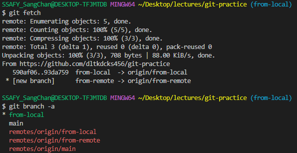

## 1. 로컬에서 브랜치 만들어 원격에 push 해보기

1. `from-local` 브랜치 만들기


2. 아래 명령어로 원격에 push

아래와 같이 하면 대상을 명시하라는 메시지 나타남


> `--set-upstream`은 `-u`로 축약이 가능하다

아래 명령어로 원격의 브랜치 명시 및 기본설정

```python
git push -u origin from-local
```


> github의 branch에 추가됨

3. 브랜치 목록 살펴보기

- GitHub에서 목록 보기
- 아래 명령어로 로컬과 원격의 브랜치들 확인

```python
# 로컬 영역만 확인하려면
git branch

# 원격과 로컬을 함께 확인하려면
git branch --all
git branch -a
```


> remotes라는 원격들 중에서 origin이라는 원격의 branch들


> 소스트리는 원격 탭에서 branch바로 확인이 가능!!!


---


## 2. 원격의 브랜치 로컬에 받아오기

1. GitHub에서 `from-remote` 브랜치 만들기
   - `git branch -a`에서 현재는 보이지 않음


> github에서도 바로 생성 가능!!
>
> local의 Git이 원격의 변화들을 업데이트 받지 않으면 확인이 불가능하므로 `git fetch`를 해야 함

2. 아래 명령어로 원격의 변경사항 확인

```
git fetch
```

>  `git branch -a`로 확인



3. 아래 명령어로 로컬에 같은 이름의 브랜치를 생성하여 연결하고 switch

```python
git switch -t origin/from-remote
```

> t는 원격의 `from-remote`를 복사하여 가져온 뒤 로컬과 원격을 계속 연결하겠다는 의미


- `from-local`의 변경사항은 `git pull`을 통해서 업데이트해준다.


## 3. 원격의 브랜치 삭제

```
git push (원격 이름) --delete (원격의 브랜치명)
```

