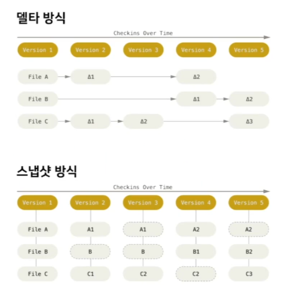
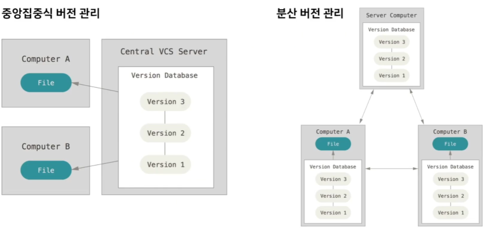

# Git을 특별하게 만드는 것

### 1. Snapshot

> SVN에서 사용하는 델타 방식, Git에서 사용하는 스냅샷 방식

- 델타 방식
  - version1에는 초기 파일들이 저장되고 그 이후에는 변경점들이 저장
  - 예를 들어 ver5의 C 변화는 그 이전 버전들의 누적된 변화로 생성

- 스냅샷 방식

  - 새로운 버전이 만들어질 때 해당 버전에서의 각 파일이, 최종 상태 그대로 저장이 되어 있음

  - ver5의 경우 A파일은 변화가 없으니 ver4에서의 A 파일을 그대로 연결해서 가져오고 B, C는 변경된 최종 파일 내용이 그대로 저장

  - 저장 공간을 많이 차지하지 않는 효율적인 방식으로 관리

> 델타 방식은 브랜치에서 변경이 일어날 때 각 파일의 처음 만들어진 시점부터 변경사항들을 모두 확인하고 현재 내용을 계산해야해서 관리 역사가 길어질수록 느려진다.
>
> 반면, 스냅샷 방식은 현 시점의 각 파일들이 풀(full)로 저장되어 있어서 바로 확인이 가능.

### 2. 분산 버전 관리

- CVS나 Subversion 등의 VCS는 원격 서버에 모든 관리 내역들이 저장
  - 로컬은 현 버전에서 다운 받은 파일들로만 작업이 가능
  - 원격 저장소에 의존적(인터넷에 문제가 생기면 로컬에서 할 수 있는 것들이 제한됨.)

- 반면, Git은 clone으로 받아오면 파일들 뿐만 아니라 전체 Git 커밋이랑 브랜치들까지 함께 받아진다.
  - 인터넷 연결상태와 상관 없이 로컬에서 자유롭게 작업 가능
  - 모든 구성원들이 Git의 상태까지 공유하기 때문에 원하는 때에 push와 pull로 동기화 하면서 협업이 가능하다