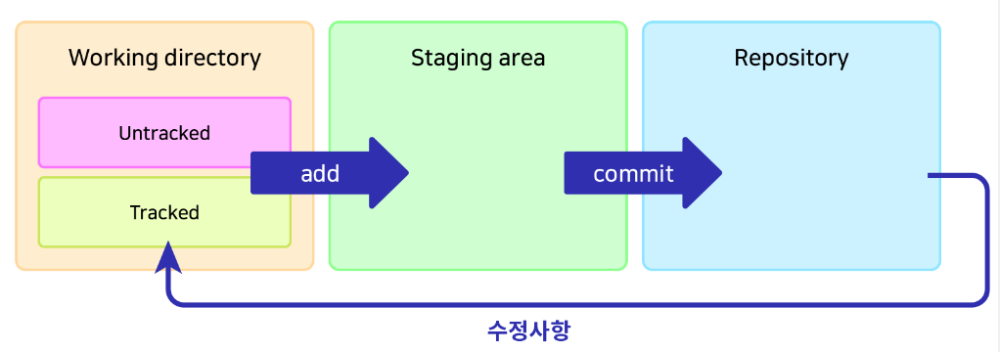
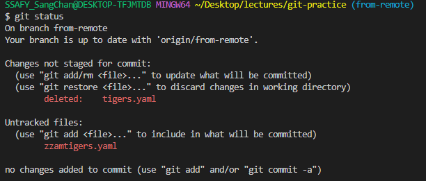
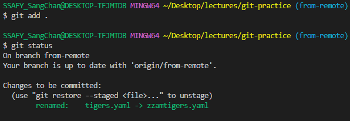
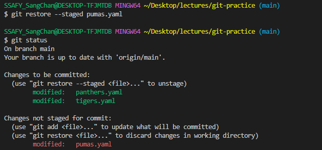

# Git의 3가지 공간



> 버전 안에 들어가 있는 상태를 Repository라고 부름. 즉, `commit`들이 저장되는 곳.

⛔ **수정사항** 화살표

- `commit`되어 레포지토리에 들어간 후 수정사항이 발생하면 `tracked` 파일로써 스테이징을 기다리게 됩니다.


### Working directory

- untracked: Add된 적 없는 파일, ignore 된 파일
- tracked: Add된 적 있고 변경내역이 있는 파일
- `git add` 명령어로 Staging area로 이동


### Staging area

- 커밋을 위한 준비 단계
  - 예시: 작업을 위해 선택된 파일들
- `git commit` 명령어로 repository로 이동


### Repository

- `.git directory`라고도 불림
- 커밋된 상태

---

위의 개념을 어려워하시는 분들이 계서서 아래 내용을 추가합니다.
어떤 파일을 **그릇**으로 비유해보겠습니다.

| 상태                 | 설명                                                         |
| -------------------- | ------------------------------------------------------------ |
| untracked            | 식기세척기에 들어가 본 적이 없거나 식기세척기 사용이 불가(ignored)한 그릇 |
| tracked              | 식기세척기에 들어가 본 적이 있고 식기세척기 사용이 가능한 그릇 |
| add                  | 식기세척기에 넣는 행위                                       |
| staging area         | 식기세척기 안(에 들어간 상태)                                |
| commit               | 세척(식기세척기 가동)                                        |
| repository           | 세척되어 깨끗해진 상태                                       |
| 파일에 수정이 가해짐 | 그릇이 사용되어 이물질(커밋되지 않은 변경사항)이 묻음        |
| working directory    | 세척되어야 하는 상태                                         |

**tracked**가 된다는 건, Git의 관리대상에 정식으로 등록됨을 의미합니다.
새로 추가되는 파일은 반드시 **add**해줌으로써, 해당 파일이 tracked될 것임을 명시해야 하는 이유입니다.
*(Git이 새 파일들을 무조건 다 관리해버리는 것을 방지)*

---


## 파일의 삭제와 이동

### git **rm**

- `tigers.yaml`를 삭제해본 뒤 `git status`로 살펴보기
  - 파일의 삭제가 `working directory`에 있음
  - `git reset --hard`로 복원


- `git rm tigers.yaml`로 삭제하고 `git status`로 살펴보기
  - 파일의 삭제가 `Staging area`에 있음
    - `add`가 자동적으로 적용됨
  - `git reset --hard`로 복원


### git **mv**

- `tigers.yaml`를 `zzamtigers.yaml`로 이름변경 뒤 `git status`로 살펴보기
- 복원 후 `git mv tigers.yaml zzamtigers.yaml`로 실행 뒤 비교





> `add` 하고 나서 `git`이 `rename`된 것을 알아차림

---


### 파일을 `staging area`에서 `working directory`로

```
git restore --staged (파일명)
```

- `--staged`를 빼면 `working directory`에서도 제거
  - `git restore`를 해주면 `commit`된 상태로 되돌아감
- 예전: `git reset HEAD (파일명)`



---


## **reset**의 세 가지 옵션

- --soft: `repository`에서 `staging area`로 이동
- --mixed (default): `repository`에서 `working directory`로 이동
- --hard: 수정사항 완전히 삭제