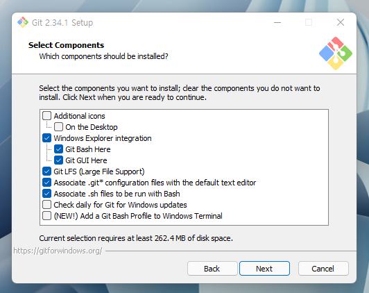

# Git의 설치와 세팅

### 1. Git 설치

- https://git-scm.com/ 로 이동해서 Git을 다운로드합니다.

- ⭐ 설치과정에서 **Git Bash**를 반드시 포함
  - Git 사용에 적합한 터미널(윈도우에서 사용하는 터미널은 다른 곳과 명령 체계가 다름)
  - 리눅스/맥(유닉스)에서 사용되는 CLI 명령어들을 윈도우에서 사용 가능 - 타 프로그래밍에도 유용
  - 기본 설정된 그대로 설치 진행



설치 후 Git Bash에서 아래 명령어 테스트 진행

```console
git --version
```

📌 **추가사항!!!**

```
git config --global core.autocrlf true
```

- 협업시 윈도우와 맥에서 엔터 방식 차이로 인한 오류를 방지

---

✅ Windows에서는 line ending으로 **CR(Carriage-Return, \r)**과 **LF(Line Feed, \n)**을 사용

✅ Unix는 **LF(LineFeed, \n)**만 사용한다.

✅  Mac OS는 **CR(Carriage-Return, \r)**만 사용한다.

> LF: 커서를 한 칸 아래로 이동한다.
>
> CR: 커서를 맨 왼쪽으로 이동한다.

❓ 변경 사항이 없어도 코드의 CR / LF 때문에 변경으로 착각하여 commit을 하게 되어 변경 로그를 보거나 merge마다 문제가 될 소지가 있다.


#### 📌 core.autocrlf

`git`은 저장소 메타 데이타 디렉터리인 `.git`폴더에 모든 이력 데이터를 가진다. 이력 데이터는 `key/value` 형식의 데이터베이스이며 `core.autocrlf`는 `text file`을 `git object database`에 `checkin`, `checkout`할 때 어떻게 처리할지를 설정하는 변수


다음 세가지 설정이 가능하다.

1. `core.autocrlf = false` 기본 설정이며 파일에 `CRLF`를 썼든 `LF`를 썼든 `git`은 상관하지 않고 파일 그래도  `checkin/checkout`을 한다. 이 설정은 `line ending`이 다른 OS에서는 text file이 변경되었다고 나오므로 여러 가지 문제가 발생할 수 있다.
2. `core.autocrlf = true` text file을 `git object database`에 넣기 전에 CRLF를 LF로 변경한다.
3. `core.autocrlf = input` LF를 `line ending`으로 사용한다.

---


### 2. SourceTree 설치

- https://www.sourcetreeapp.com/ - Git을 GUI로 다룰 수 있도록 해주는 툴
  - 기타: GitHub Desktop, GitKraken 등 (https://git-scm.com/downloads/guis 참조)
  - GitHub Desktop은 기능이 많지 않아 비추천!!


- 설치시 BitBucket 계정 관련은 건너뛰기해도 좋다.


### 3. VS Code 설치

- https://code.visualstudio.com/ - 가장 인기있는 코드 에디터 중 하나

- `터미널` 메뉴에서 새 터미널 열어보기

  - 프로그래밍 중 바로 Git 명령어 사용
  - 대부분의 타 에디터/IDE에서도 터미널 기능 제공

  - `Ctrl` + `로 터미널 열기 가능


### 4. VS Code의 기본 터미널을 Git Bash로 설정

Git뿐 아니라 다른 프로그래밍 작업에 있어서도 유용

- VS Code에서 `Ctrl` + `Shift` + `P`

- `Select Default Profile` 검색하여 선택
- **Git Bash** 선택
- 터미널에서 +로 새 창을 열어서 기본으로 Git Bash가 설정된 것 확인