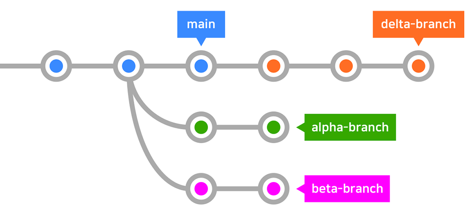
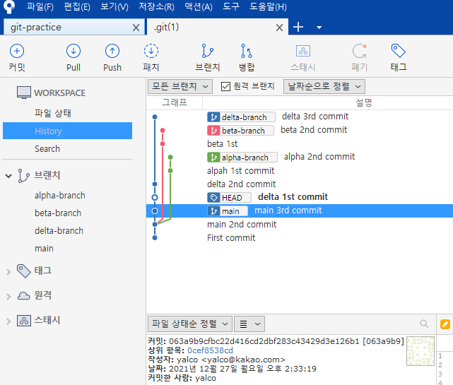
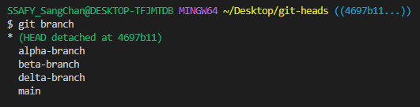
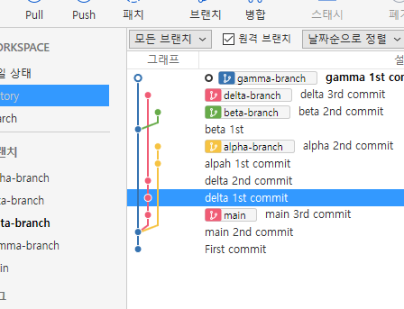
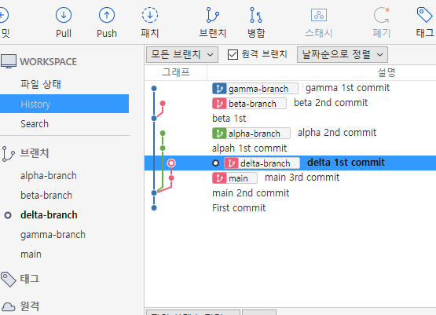

# HEAD



## Git의 **HEAD**

현재 속한 브랜치의 가장 최신 커밋

- switch로 브랜치 이동해보기
  - `main`과 `delta-branch`

> ✅ `reset`은 그 이후 내역들을 다 지워버리고, `revert`는 해당 부분을 지워서 앞으로 옮기는 것이다
>
> ✔`checkout`은 단순히 파일 상태를 되돌리는 것



### `checkout`으로 앞뒤 이동해보기

```
git checkout HEAD^
```

- `^` 또는 `~`: 갯수만큼 이전으로 이동
  - `git checkout HEAD^^^`, `git checkout HEAD~5`


- ⭐️ **커밋 해시**를 사용해서도 이동 가능
  - `git checkout (커밋해시)`


- `git checkout -` : (이동을) 한 단계 되돌리기


### 💡 이전으로 checkout된 상태에서 소스트리로 HEAD 상태 보기

익명의 브랜치에 위치함을 알 수 있음

- `checkout`으로 이전으로 돌아간 뒤
  - 기존 브랜치로 돌아오기: `git switch (브랜치명)`
    - `HEAD`도 결국엔 또 다른 `branch`이기 때문에 가능
  - 새 브랜치 만들어보기
  - 새 커밋 만들어보기

>`HEAD`의 의미는 위치하고 있는 `commit`내역에서의 이름이 없는 `branch`이다



### ⭐ HEAD 사용하여 reset하기

```
git reset HEAD(원하는 단계) (옵션)
```

> `git reset --hard HEAD~2`를 입력해서 뒤로 두 단계 간다.



