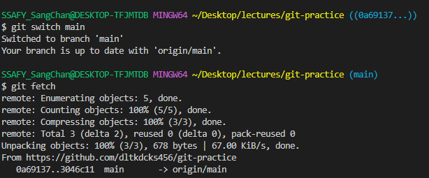

# fetch vs pull

## **fetch**와 **pull**의 차이

- `fetch`: 원격 저장소의 최신 커밋을 로컬로 가져오기만 함
  - 임의의 브랜치를 하나 생성
- `pull`: 원격 저장소의 최신 커밋을 로컬로 가져와 `merge` 또는 `rebase`

### `fetch`한 내역 적용 전 살펴보기

1. 원격의 `main` 브랜치에 커밋 추가
   \* `git checkout origin/main`으로 확인해보기

> commit hash 넘버가 생성됨

1. 원격의 변경사항 `fetch`

- `git checkout origin/main`으로 확인해보기
  - 원격의 branch로 이동

* `pull`로 적용

### 원격의 새 브랜치 확인

- `git checkout origin/(브랜치명)`

- `git switch -t origin/(브랜치명)`

  - -t는 trace

  - 복습! 원격의 브랜치를 지울 때에는 `git push origin --delete (브랜치명)`이다