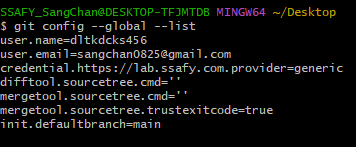
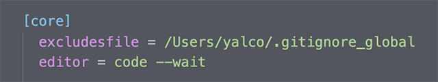

## 1. **global** 설정과 **local** 설정

config를 **--global**과 함께 지정하면 전역으로 설정됩니다.

- 특정 프로젝트만의 `user.name`과 `user.email` 지정해보기

```
git config user.name (이름)
git config user.email (이메일)
```

> ✅ `global` 설정을 빼면서 `local`이 설정된다. 해당 `git`의 관리 영역으로 가서 설정해주면 된다. 예시로 다른 사람이 와서 작업하게 되면 저렇게 `local`로 설정

------


## 2. 설정값 확인

#### 현재 모든 설정값 보기

```
git config (global) --list
```



#### 에디터에서 보기 *(기본: vi)*

```
git config (global) -e
```

> VIM 에디터는 `CLI`상에서 열리는 에디터이다.


#### 기본 에디터 수정

```
git config --global core.editor "code --wait"
```

- 또는 `code` 자리에 원하는 편집 프로그램의 .exe파일 경로 연결
  - 해당 에디터로 연결해주고 (VS Code는 `code`입력, `--wait`는 해당 에디터를 꺼야 `CLI`가 진행됨을 의미한다.)
- `--wait` : 에디터에서 수정하는 동안 CLI를 정지
- 💡 `git commit` 등의 편집도 지정된 에디터에서 열게 됨


#### 위의 에디터 설정을 되돌리려면

`git config --global -e`로 편집기를 연 뒤 아래 부분을 삭제하고 저장




### ⭐️ **맥**에서 `code`로 VS Code가 실행되지 않을 시

- VS Code에서 `command` + `shift` + `p`
- `shell`로 검색하여 `셸 명령: PATH에 code 명령 설치` 선택
  - 영문: `Shell Command: Install 'code' command in PATH`


------


## 3. 유용한 설정들

#### 줄바꿈 호환 문제 해결

```
git config --global core.autocrlf (윈도우: true / 맥: input)
```


#### `pull` 기본 전략 `merge` 또는 `rebase`로 설정

```
git config pull.rebase false
```

```
git config pull.rebase true
```


#### 기본 브랜치명

```
git config --global init.defaultBranch main
```


#### push시 로컬과 동일한 브랜치명으로

```
git config --global push.default current
```

> `git push -u`는 현재의 로컬 브랜치를 원격의 어떤 브랜치와 연결할지 처음 세팅하기 위해서 사용

------


## 4. 단축키 설정

[📄 관련 문서 보기](https://git-scm.com/book/ko/v2/Git의-기초-Git-Alias)

```
git config --global alias.(단축키) "명령어"
```

- 예시: `git config --global alias.cam "commit -am"`