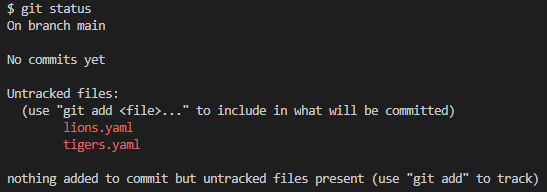
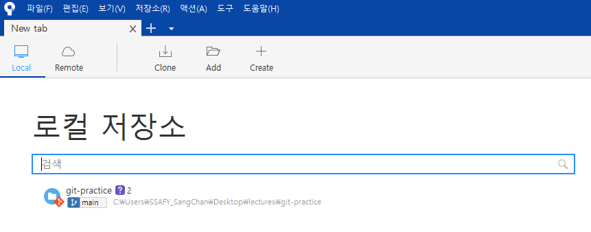
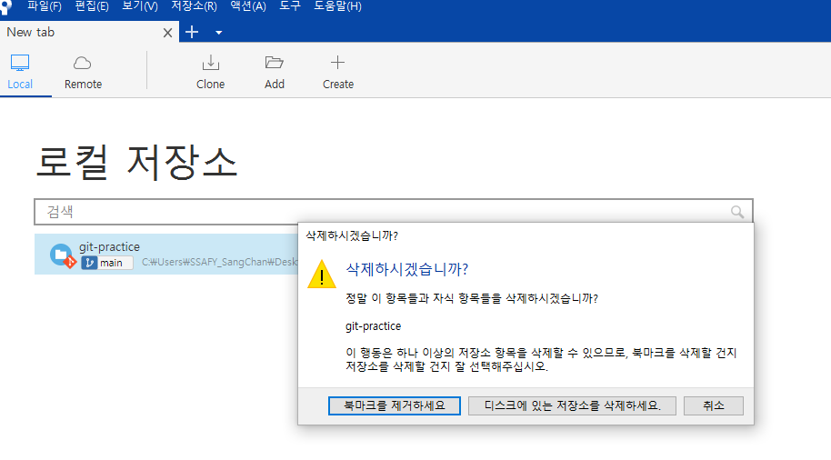
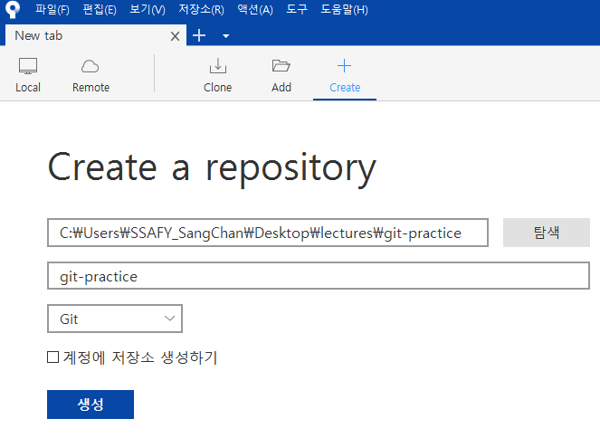

## 1. Git 최초 설정

### Git 전역으로 사용자 이름과 이메일 주소를 설정

- <u>GitHub 계정과는 별개</u>
- 협업 할 때 누가 작업을 했고, 어떻게 연락을 할 수 있는지를 나타내 준다.


터미널 프로그램 (Git Bash, iTerm2)에서 아래 명령어 실행

```python
# global은 컴퓨터에 전반적으로 세팅된다는 의미
# 프로젝트마다 다르게 설정할 수도 있다.

git config --global user.name "(본인 이름)"
git config --global user.email "(본인 이메일)"
```

아래의 명령어들로 잘 입력되었는지 확인 가능

```python
git config --global user.name
git config --global user.email
```

기본 브랜치명 변경

> master와 slave로 사용되어 왔는데 이것은 주인과 노예를 연상시키므로 최근에는 main을 사용한다

```
git config --global init.defaultBranch main
```


## 2. 프로젝트 생성 & Git 관리 시작

적당한 위치에 원하는 이름으로 폴더를 생성하고 **VS Code**로 열람

```
git init
```

폴더에 숨김모드로 **.git** 폴더 생성 확인

- 🛑 이 폴더를 지우면 Git 관리내역이 삭제됩니다. (현 파일들은 유지)
- 맥에서 숨김 파일 보기: `command` + `shift` + `.`


```
git status
```

- 현재 폴더에서 현재 폴더의 상황을 Git의 관점으로 보는 것




## 3. 소스트리로 해보기

### 현존하는 저장소 추가

- 소스트리에 폴더를 드래그하거나, `로컬 저장소 추가`



### Git이 관리하는 저장소 새로 만들기

- .git 폴더 삭제 후 진행
- 소스트리에 폴더를 드래그하거나, `로컬 저장소 생성`

- 삭제 시 북마크만 제거



