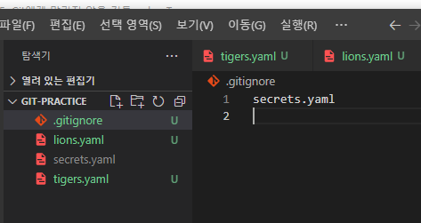
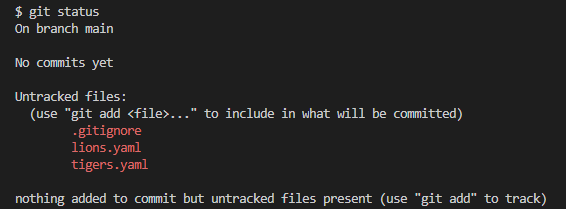

## Git의 관리에서 특정 파일/폴더를 배제해야 할 경우

#### a. 포함할 **필요가 없을** 때

- 자동으로 생성 또는 다운로드되는 파일들 (빌드 결과물, 라이브러리)
  - .java가 .class로 다시 만들어질 경우와 Node.js가 라이브러리에 자동 저장되는 경우

#### b. 포함하지 **말아야 할** 때

- 보안상 민감한 정보를 담은 파일


### **.gitignore** 파일을 사용해서 배제할 요소들을 지정할 수 있습니다.


`.gitignore` 파일 생성

- 에디터가 이를 알아보고 파일 이미지도 변경해줌
- 해당 파일 내부에 배제할 파일 이름을 기입



- git status로 상태를 확인하면 배제된 것을 알 수 있다.




## .gitignore 형식

https://git-scm.com/docs/gitignore 참조

```python
# 이렇게 #을 사용해서 주석

# 모든 file.c
file.c

# 최상위 폴더의 file.c
/file.c

# 모든 .c 확장자 파일
*.c

# .c 확장자지만 무시하지 않을 파일
!not_ignore_this.c

# logs란 이름의 파일 또는 폴더와 그 내용들
logs

# logs란 이름의 폴더와 그 내용들
logs/

# logs 폴더 바로 안의 debug.log와 .c 파일들
logs/debug.log
logs/*.c

# logs 폴더 바로 안, 또는 그 안의 다른 폴더(들) 안의 debug.log
logs/**/debug.log

# 와일드카드 **를 활용해서 그 안의 모든 폴더들의 또 다른 폴더들도 미관리
```

