### 1. 프로젝트의 변경사항들을 버전에 담기

변경사항 확인

```
git status
```

- 추적하지 않는(untracked) 파일: Git의 관리에 들어간 적 없는 파일
- commit은 쉽게 말해서 버전이라고 생각하면 된다.


파일 하나 담기

```
git add tigers.yaml
```

- `git status`로 확인(U -> A로 변화함)

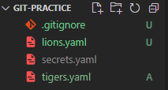

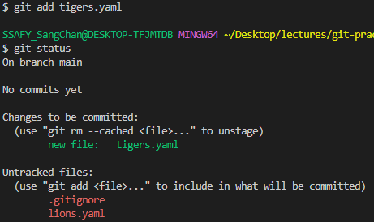

모든 파일 담기

```
git add .
```


### 2. 버전 담기

아래 명령어로 **commit**

```python
git commit
```

- 옛날 마우스가 없던 시절 VIM이라는 모드이다

| 작업                | Vi 명령어 | 상세                                         |
| ------------------- | --------- | -------------------------------------------- |
| 입력 시작           | **i**     | 명령어 입력 모드에서 텍스트 입력 모드로 전환 |
| 입력 종료           | `ESC`     | 텍스트 입력 모드에서 명령어 입력 모드로 전환 |
| 저장 없이 종료      | **:q**    |                                              |
| 저장 없이 강제 종료 | **:q!**   | 입력한 것이 있을 때 사용                     |
| 저장하고 종료       | **:wq**   | 입력한 것이 있을 때 사용                     |
| 위로 스크롤         | **k**     | `git log`등에서 내역이 길 때 사용            |
| 아래로 스크롤       | **j**     | `git log`등에서 내역이 길 때 사용            |

- `FIRST COMMIT` 입력한 뒤 저장하고 종료

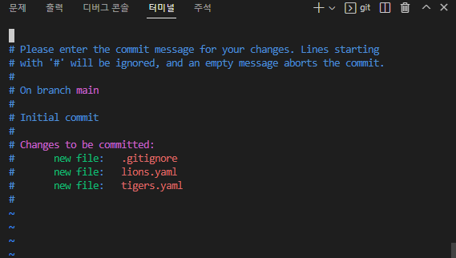

```python
i누른 후 FIRST COMMIT을 입력하고 ESC를 누른다음 :q / :q! / :wq 중에 하나를 실행
```

- Vi 모드를 사용하지 않고도 진행 가능

```
git commit -m "FIRST COMMIT"
```

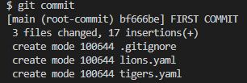

- VSCODE에서 Git의 상태를 보고 알려줌

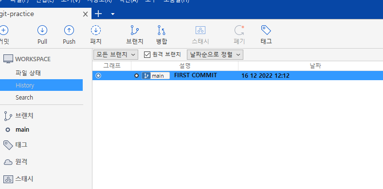

- 소스트리에서는 History 탭에 들어가면 커밋 내역을 볼 수 있다.

```
git log
```

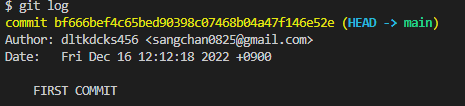

- 모든 commit마다 고유의 일련 번호가 존재한다.


### 3. 다음 변경사항들을 만들고 버전에 담기

### 변경사항

- `lions.yaml` 파일 삭제
- `tigers.yaml`의 manager를 `Donald`로 변경
- `leopards.yaml` 파일 추가

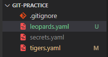

- `git status`로 확인
  - 파일의 추가, 변경, 삭제 모두 내역으로 저장할 대상
- leopards는 git이 버전으로 관리해 본적이 없어서 Untracked 상태이다.

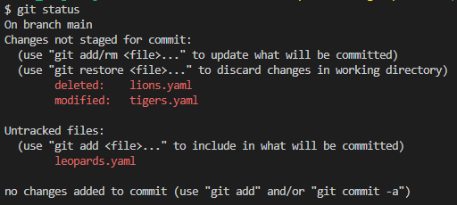

- `git diff`로 확인
  - 변화를 조금 더 세부적으로 확인

| 작업          | Vi 명령어 | 상세                                    |
| ------------- | --------- | --------------------------------------- |
| 위로 스크롤   | **k**     | `git log`등에서 내역이 길 때 사용       |
| 아래로 스크롤 | **j**     | `git log`등에서 내역이 길 때 사용       |
| 끄기          | **:q**    | `:`가 입력되어 있으므로 `q`만 눌러도 됨 |

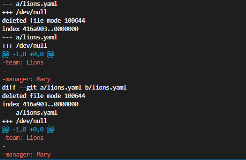

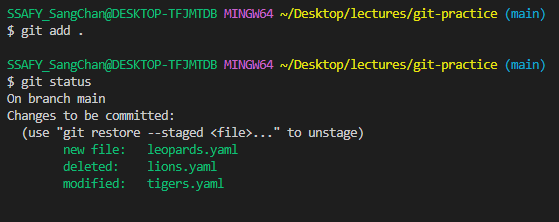

- 다시 `git add` 후 `git status`로 확인을 한 번 하고 `git commit`을 한 후 `git log`를 살펴보면 아래의 변화를 볼 수 있다.

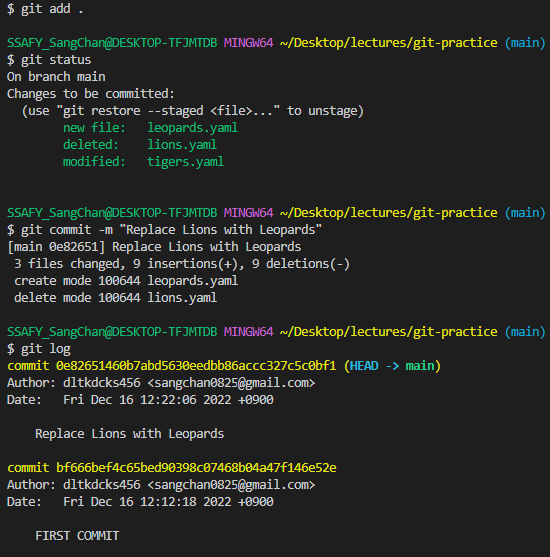

- 소스 트리에서도 해당 사항을 확인할 수 있다.

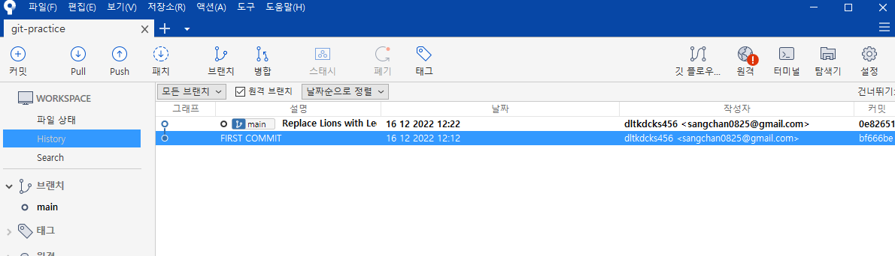

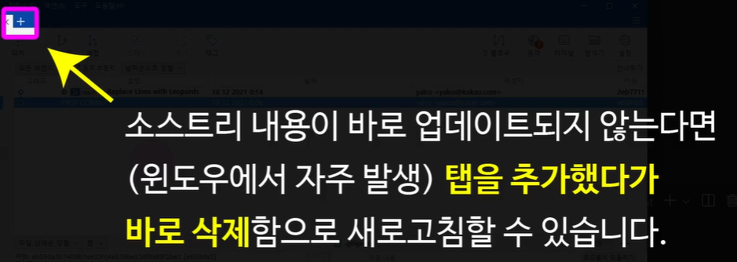


### 💡 **TIP** `add`와 `commit` 한꺼번에

```
git commit -am "(메시지)"
```

- 🛑 **새로 추가된(untracked) 파일이 없을 때 한정**


- `git log`시 그 변경 사항이 너무 많은 vim모드로 자동 전환되므로, `j`와 `k`를 통해 위, 아래로 움직이고 `:q`를 통해 빠져나온다.


- 소스트리에서 변경 내역을 자세히 확인할 수 있다.

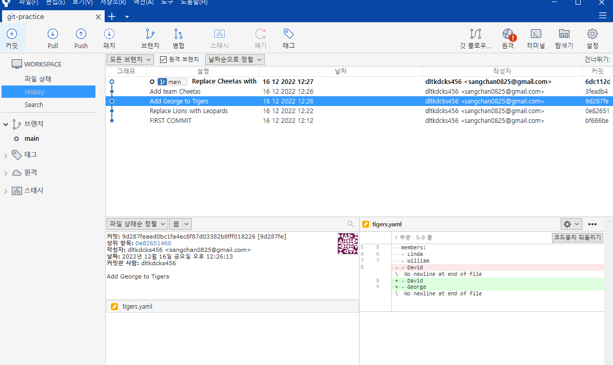