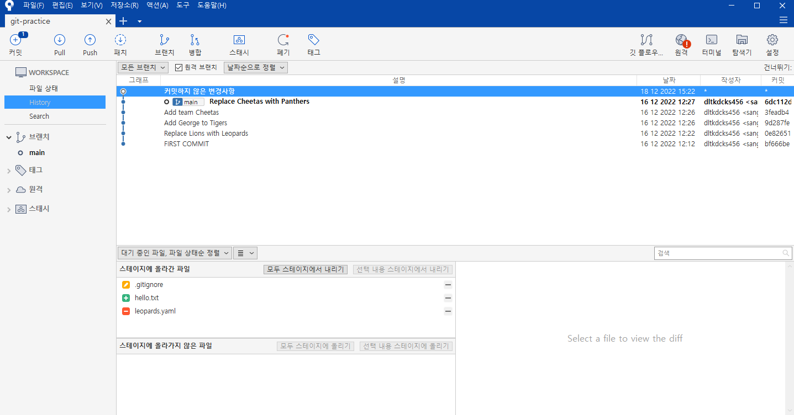
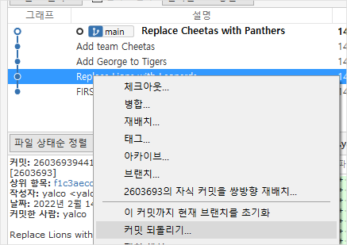
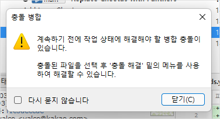
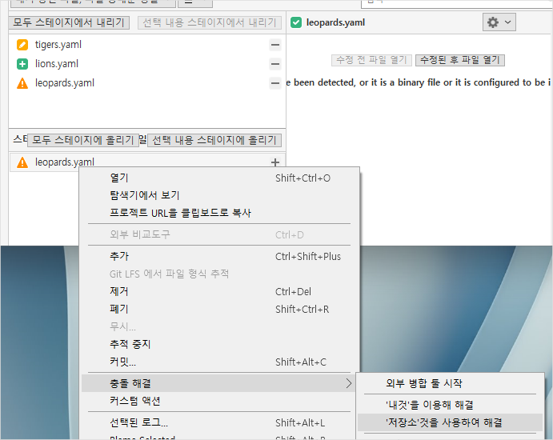
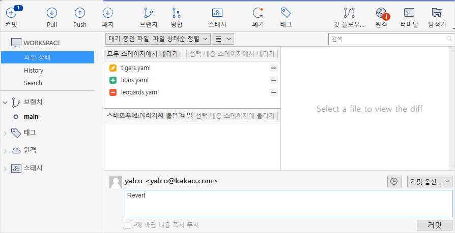

## 1. 변경사항 만들고 커밋하기

- `leopards.yaml` 삭제
- `.gitignore`에 `*.config` 추가
  - 모든 확장자라는 의미이다
- `hello.txt` 추가 (내용 자유)
- 커밋 메시지: `Commit with SourceTree`

> window에서는 스테이지에 올려야 add 처리가 된다.

## 2. **revert**

- `Add George to Tigers`의 수정사항 되돌려보기
- 해당 커밋에 마우스 우클릭 - `커밋 되돌리기`

## 3. **reset**

- `Replace Cheetas with Panthers` 시점으로 되돌려보기
- 해당 커밋에 마우스 우클릭 - `... 이 커밋으로 초기화`
- 선택지에서 `Hard` 선택

##  Revert시 충돌 해결

지난 강에서 revert시 일어났던 충돌을 소스트리에서 해결하는 방법입니다.

### A. **윈도우**의 경우

1. `replace lions with leopards` 커밋을 되돌리기합니다.

2. 충돌이 일어남을 알려주는 경고창이 뜹니다.

3. 스테이지되지 않은 `leopards.yaml`을 우클릭하고 `충돌 해결`에서 저장소 것을 선택합니다.

4. 메시지를 입력하고 커밋을 하면 완료됩니다.

