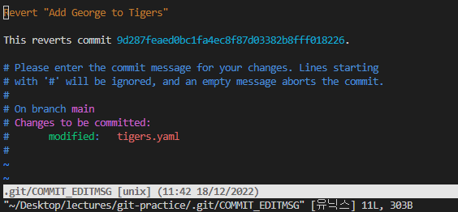
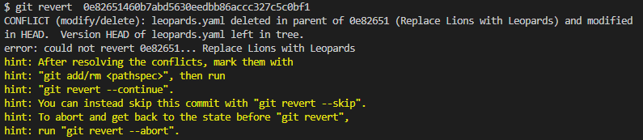
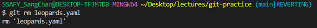
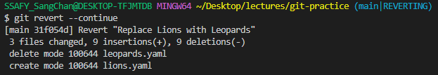

## 1. 실습 전 내역 백업

- `.git` 폴더를 복사해두기
  - 맥에서 숨김 파일 보기: `command` + `shift` + `.`
- `.git` 폴더 없앤 다음 git 상태 확인해보기


## 2. **reset** 사용해서 과거로 돌아가기

아래 명령어로 커밋 내역 확인

```python
git log
```

- 되돌아갈 시점: `Add team Cheetas`의 커밋 해시 복사
- `:q`로 빠져나가기

```python
git reset --hard (돌아갈 커밋 해시)
```

- reset의 옵션(--hard 등)은 섹션 5에서 다룰 것


## 3. **reset** 하기 전 시점으로 복원해보기

백업해 둔 **.git** 폴더 사용

- `.git` 폴더 복원
- `git log`, `git status`로 상태 확인
  - 현 커밋에서 변경된 점을 `git status`로 인식하므로 초기화를 시켜줘야한다.
- 아래 명령어로 현 커밋 상태로 초기화

```
git reset --hard
```

- 💡 뒤에 커밋 해시가 없으면 마지막 커밋을 가리킴
- `lions.yaml` 삭제


## 4. **revert** 로 과거의 커밋 되돌리기

`Add George to Tigers`의 커밋 해시 구하기

아래 명령어로 **revert**

```
git revert (되돌릴 커밋 해시)
```

- `:wq`로 커밋 메시지 **저장**
  - 이미 Revert "Add George to Tigers"라고 커밋 내용이 들어가 있다.




### 🎯 `Replace Lions with Leopards`의 커밋 되돌려보기

- 이후 `leopards.yaml` 수정한 내역 때문에 충돌
  - `leopards.yaml`은 삭제되어야 하는데 수정한 내역이 이후 커밋에서 존재
  - 
  - `git rm leopards.yaml`로 Git에서 해당 파일 삭제
  - 
  - `git revert --continue`로 마무리
  - `:wq`로 커밋 메시지 저장
  - 


### 💡 **커밋해버리지 않고** revert하기

```
git revert --no-commit (되돌릴  커밋 해시)
```

- 원하는 다른 작업을 추가한 다음 함께 커밋
- 취소하려면 `git reset --hard`