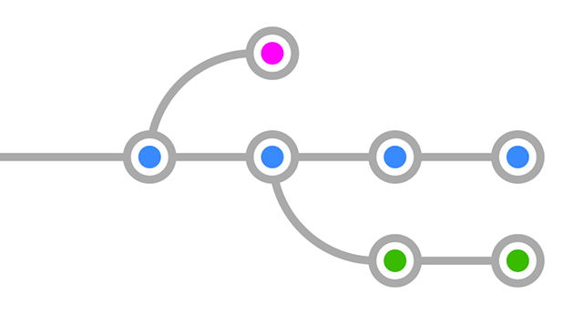
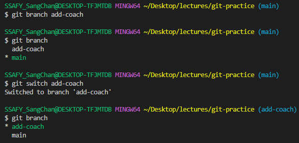

# Branch 만들어보기



## **Branch**: 분기된 가지 (다른 차원)

- 프로젝트를 하나 이상의 모습으로 관리해야 할 때
  - 예) 실배포용, 테스트서버용, 새로운 시도용
- 여러 작업들이 각각 독립되어 진행될 때
  - 예) 신기능 1, 신기능 2, 코드개선, 긴급수정...
  - 각각의 차원에서 작업한 뒤 확정된 것을 메인 차원에 통합


### 🎇이 모든 것을 **하나의 프로젝트 폴더**에서 진행할 수 있도록!


## 1. 브랜치 생성 / 이동 / 삭제하기

`add-coach`란 이름의 브랜치 생성

```
git branch add-coach
```

브랜치 목록 확인

```
git branch
```

`add-coach` 브랜치로 이동

```
git switch add-coach
```

- `checkout` 명령어가 Git 2.23 버전부터 `switch`, `restore`로 분리




### 💡 브랜치 생성과 동시에 이동하기

```python
git switch -c new-teams
```

- 기존의 `git checkout -b (새 브랜치명)`


### 🗑 브랜치 삭제하기

```
git branch -d (삭제할 브랜치명)
```

⛔ **추가사항**

지워질 브랜치에만 있는 내용의 커밋이 있을 경우
즉 다른 브랜치로 가져오지 않은 내용이 있는 브랜치를 지울 때는
`-d` 대신 `-D`(대문자)로 강제 삭제해야 합니다.

```
git branch -D (강제삭제할 브랜치명)
```


### ✏️ 브랜치 이름 바꾸기

```
git branch -m (기존 브랜치명) (새 브랜치명)
```

> m은 move라는 의미임.


## 3. 결과 살펴보기

`git log`: 위치한 브랜치에서의 내역만 볼 수 있음


여러 브랜치의 내역 편리하게 보기

- 소스 트리에서 보는 것을 추천

```
git log --all --decorate --oneline --graph
```


### 소스트리에서 확인

