# Git

### 분산 버전 관리 프로그램

- 코드의 히스토리를 관리하는 도구
- 개발되어온 과정 파악이 가능
- 이전 버전과의 변경 사항 비교 및 분석

- Repository
  - 특정 디렉토리를 버전 관리하는 저장소

```txt
git init: git 생성
touch readme.md: 리드미 생성
ls: 목록 확인
git status: 깃 상태 확인
git add . :모든 파일을 staging area에 올리겠다
git rm --cached readme.md: staging area에 올라간 파일을 제거
git commit -m message: commit 진행해서 repository에 저장
code .: vscode로 띄어진다
mkdir:폴더 만들기
touch a.txt: touch는 폴더 만들기
git restore 파일명: 수정 취소할 때
git log --oneline : 깃의 이력 확인
git log:를 치면 다 알 수 있음.
git remote add origin master: 끝 단어 둘다 개발자가 만들어서 씀. local을 Github과 연결
git push -u origin master: orgin은 repo_name 그리고 master는 local branch이다
git clone 으로 repo를 불러옴
:q -> shift 콜론 q를 하면 나와짐
```

- Working Directory: 내가 작업하고 있는 실제 디렉토리
- Staging Area: 커밋으로 남기고 싶은, 특정 버전으로 관리하고 싶은 파일이 있는 곳
- Repository: 커밋들이 저장되는 곳

- git이 추적되지 않으면 untracked라고 함

- commit을 하면 고유 아이디가 생성된다.

- HEAD는 깃발에 가깝다 --> master는 branch의 의미

  - master로 기본값이 되어있는데 요즘은 main으로 이름을 만듦

  - 어느 commit에 깃발을 꽂고 어떤 branch가 잇는가


### Git Advanced

- Git undoing
  - Git으로 했던 작업들을 되돌리기(Undoing)
  - 되돌리는 단계는 크게 세 가지로 분류
    - Working Directory 작업 단계
    - Staging Area 작업 단계
    - Repository 작업단계
- Working Directory 작업 단계
  - Working Directory에서 수정한 파일 내용을 이전 커밋 상태로 되돌리기
  - git restore
- Staging Area 작업 단계
  - Staging Area에 반영된 파일을 Working Directory로 되돌리기
  - git rm --cached
  - git restore --staged
- Repository 작업 단계
  - 커밋을 완료한 파일을 Staging Area 로 되돌리기
  - git commit --amend


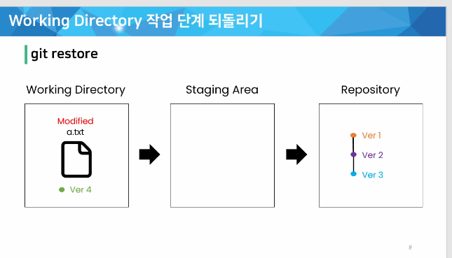


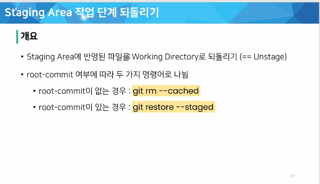

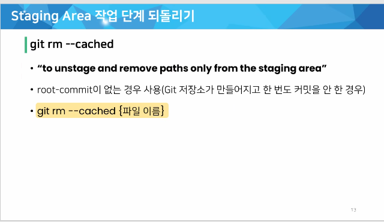

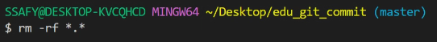


-a는 숨긴 폴더를 보여줌. git까지 없애야 추적이 멈춤.

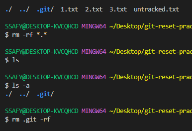

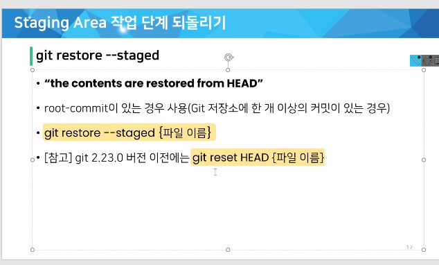

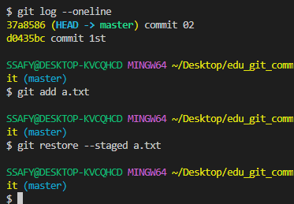

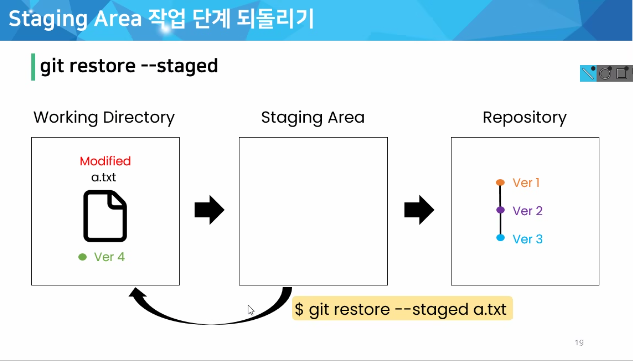

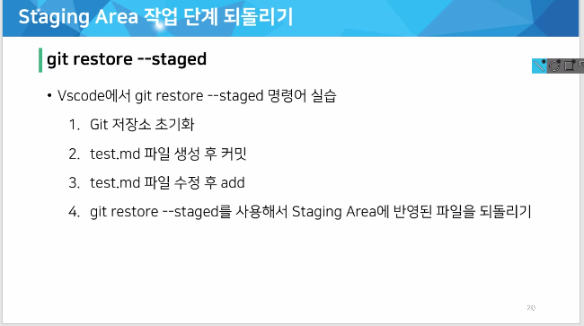

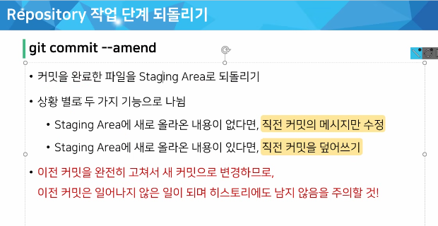

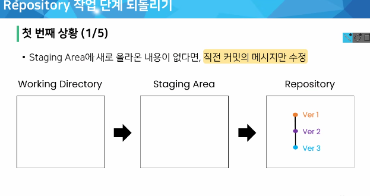

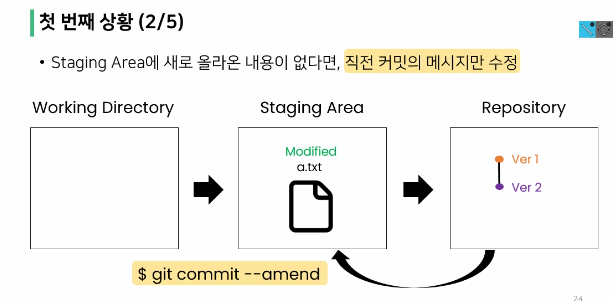

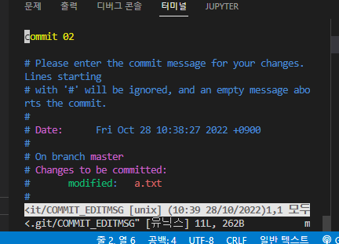

- VIM 에디터, 수정 모드는 i로, 나올때는 ESC, 콜론을 붙이고 명령어 입력
  저장 w 종료 q(:w)
- 직전 커밋을 덮어쓰고 완전 새로운 커밋을 생성(고유 아이디가 다름)

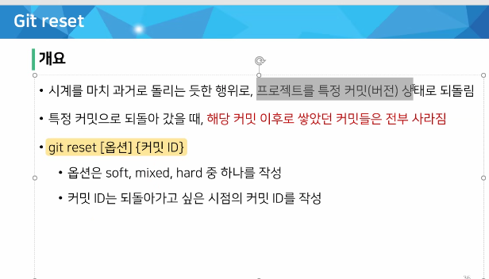

- soft는 staging area로 이동, commit 전 다시 commit 할 수 있다.
- mixed working directory로 이동, add하기 전으로 이동, unstaged 상태
- 모두 working directory에서 삭제한다.

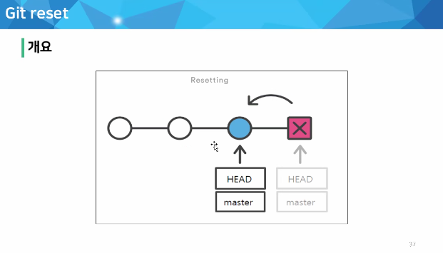

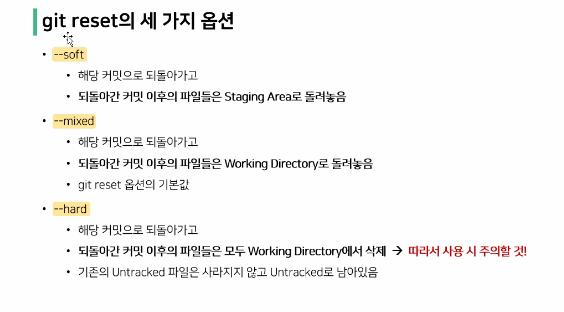

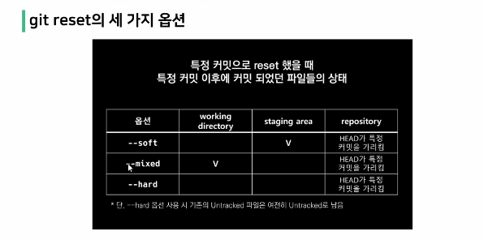

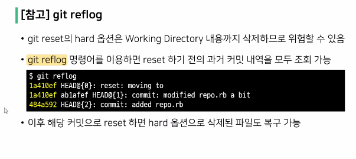

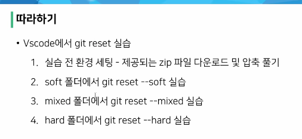

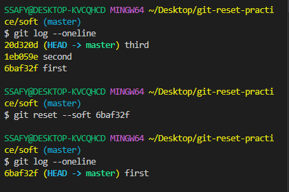

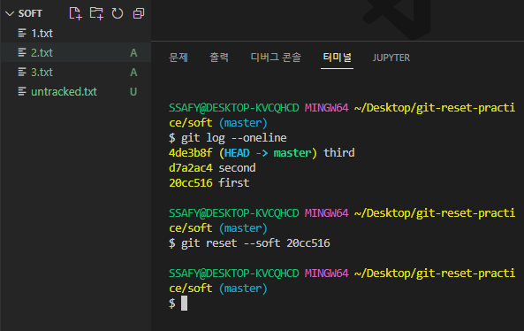

commit이 완료된 파일은 흰색 아니면 초록색이다

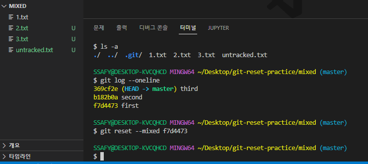

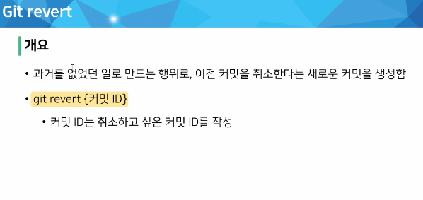

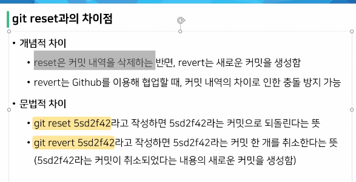

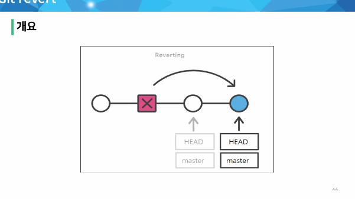

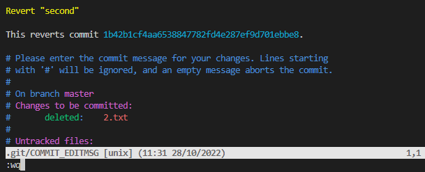

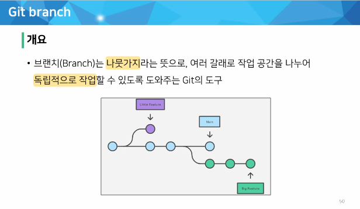

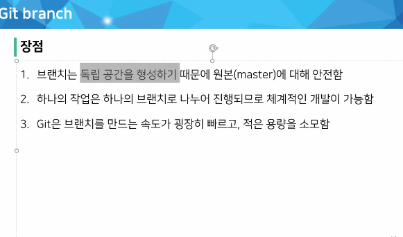


-r은 remote라는 의미


### 📛주의사항: 반드시 커밋해야함


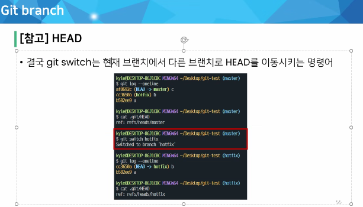

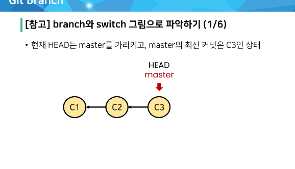

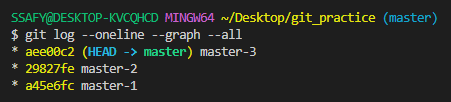

- 그래프를 그려줄 수도 있음

- branch만들고 가지고 있는 branch 확인하기

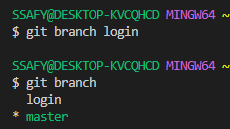

- switch로 HEAD 변경하기
- 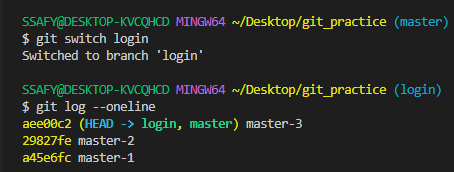

- master branch가 login branch보다 1개 commit 앞서 있음

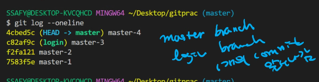


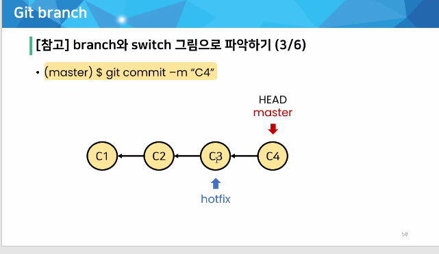

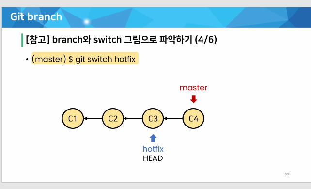


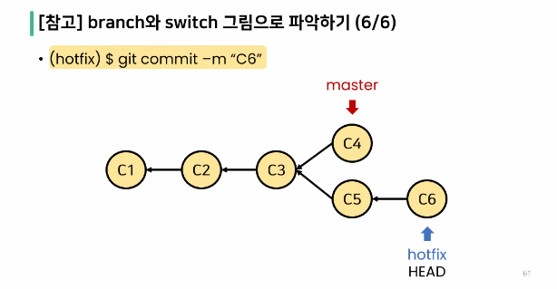

- 모든 브랜치의 모든 커밋을 보고 싶을 때에는 all을 붙여준다.

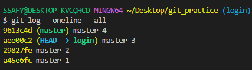

- 3개를 공통으로 가지고 분화

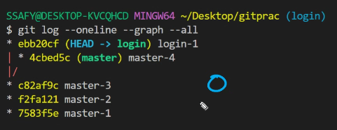

### git Merge

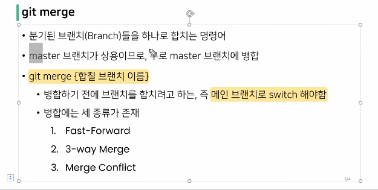

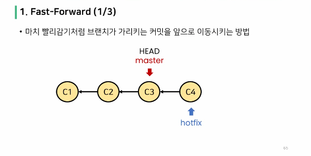

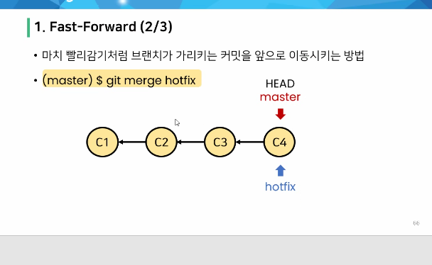

- 커밋의 수는 늘어나지 않는다.

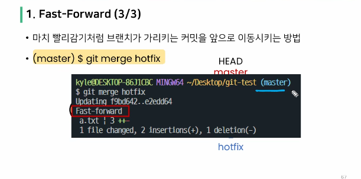

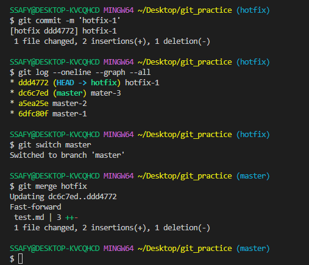

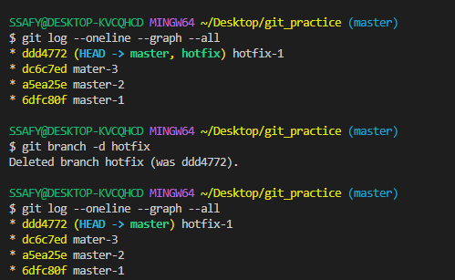

- merge 후에는 병합해준 branch는 삭제해주는 것이 관례

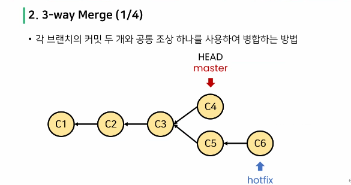

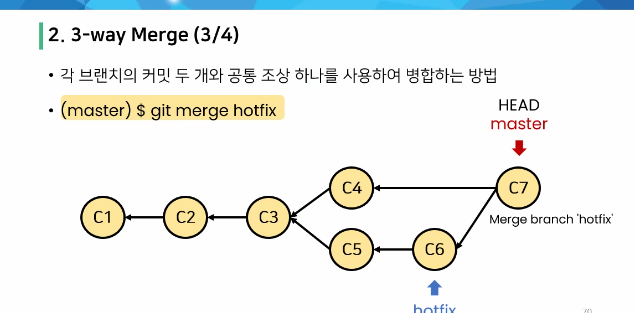

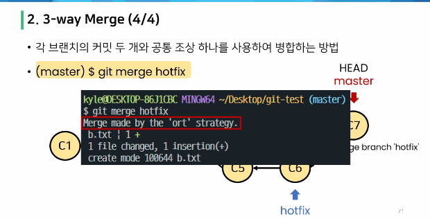

- merge strategy를 search해서 찾아보면 좋음❤
- 새로운 commit을 생성함.

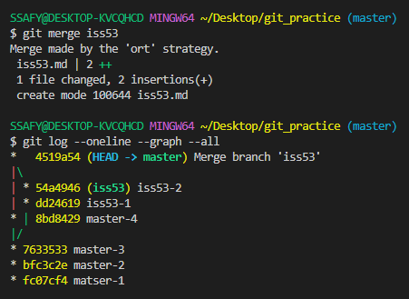

- 완성후 브랜치 삭제

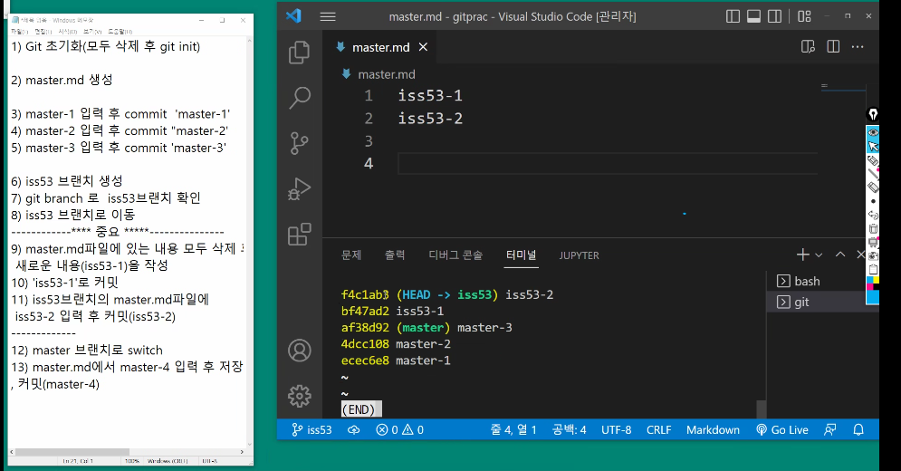


- 대부분 사람이 직접 쳐서 수정을 진행


- 동일한 파일 동일한 코드 수정 시 충돌이 발생


## Git workflow


- django.githup은 클론이 불가능(소유권이 없기 때문에)
- Fork 후 clone은 가능!! → PR로 요청해서 바꿔도 되는지 물어본다.


### 💥<span style = "color:red">github에서 settings에 들어가 collaborator에 아이디를 입력해서 등록 진행!!</span>


### Fork & Pull


