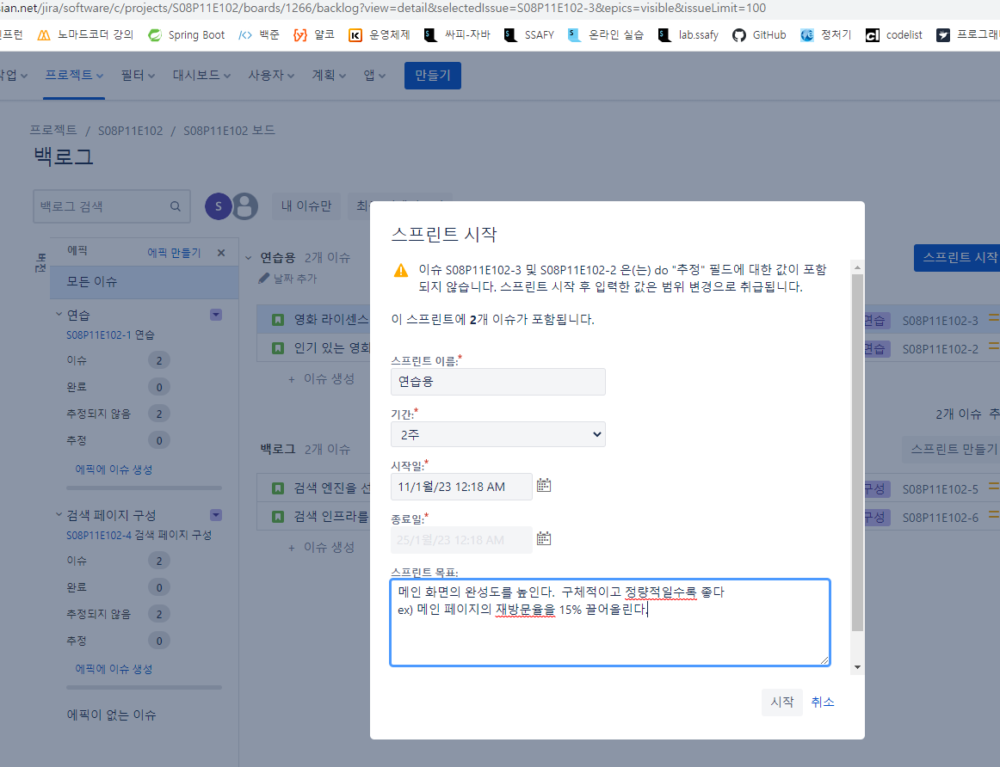
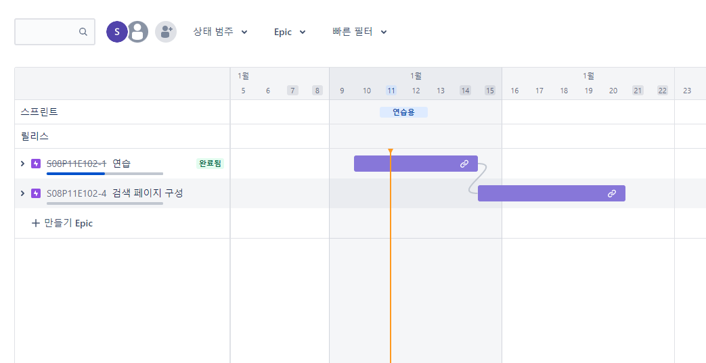
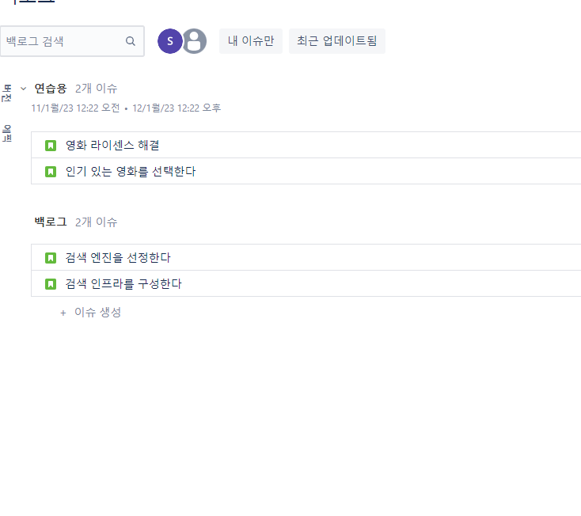
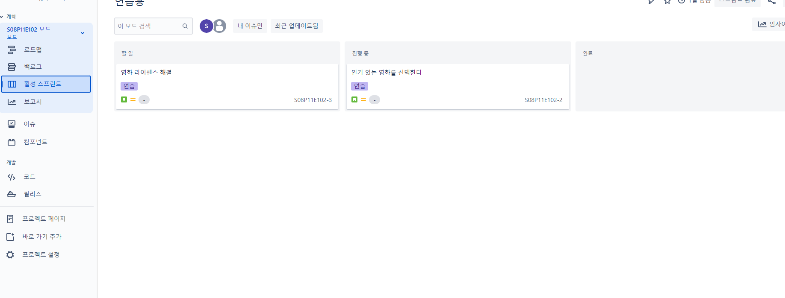
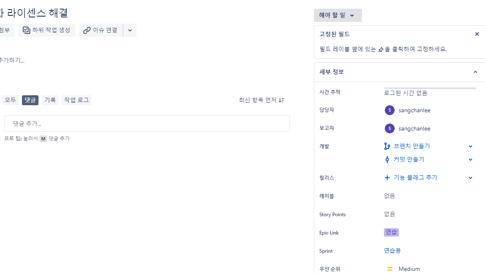
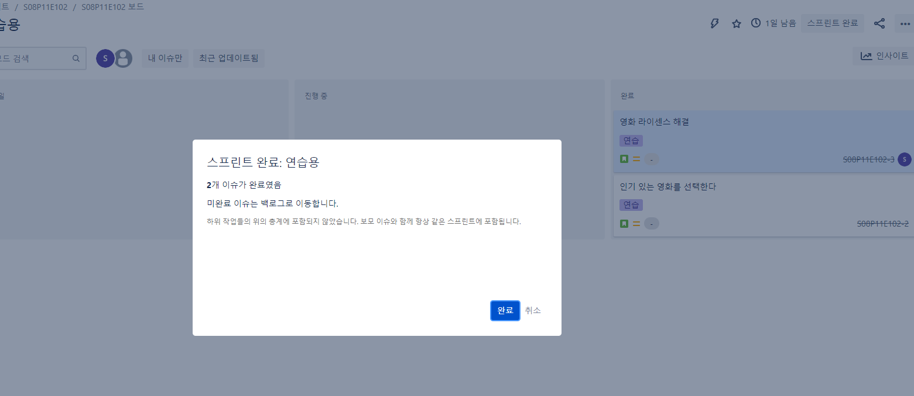
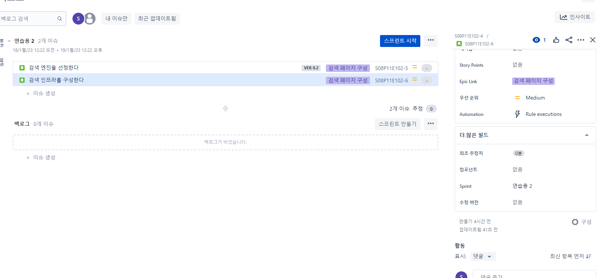

# JIRA 기초

- 종속성 설정은 드래그 앤 드랍을 통해 진행한다.
  - 연습이 끝날 때 까지 검색 페이지는 구성할 수 없다.
  - 간트 차트로 보임
  - `Export`로 이미지 뽑아낼 수 있음.

- 시간은 에픽에 대해서 설정할 수 있고 하위 항목에서는 설정이 불가능하다.

- 백로그에서 드래그 앤 드롭을 통해서 에픽을 수정할 수 있다.

- 스프린트 시작(스프린트 명도 바꿀 수 있음)
  - 시작할 내용들을 위로 올린 뒤에 기간을 정한다.
  - 단, 내용은 구체적이고 정량적일수록 좋다.

- 로드맵은 큰 관점

- 백로그 (현재 스프린트- 목표, 해야할 것들)

- 활성 스프린트는 칸반 보드 스타일로 보여줌

- 담당자 설정 가능

- 완료되면 스프린트 완료 클릭!!

- 버전 설정

