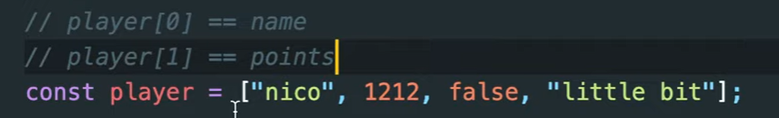
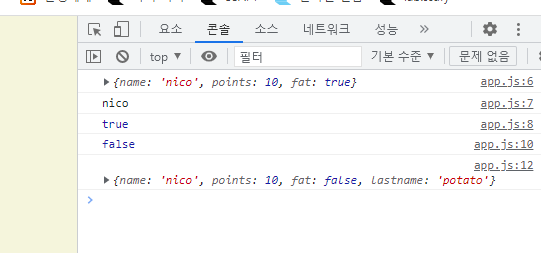
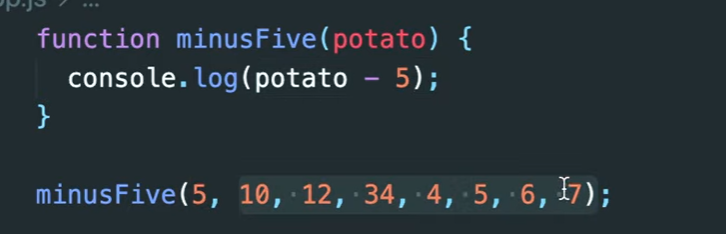
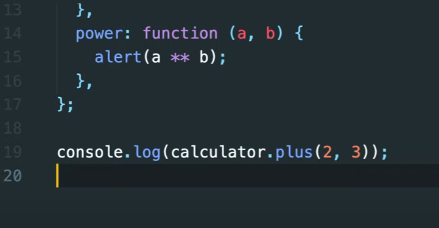
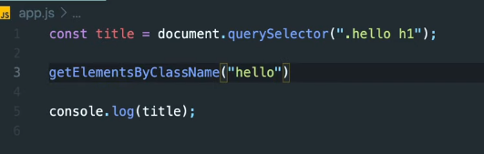
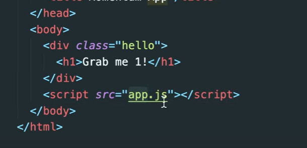

# First JS Project

- 브라우저는 HTML을 열고, HTML은 CSS와 자바스크립트를 연다
- 단순히 JS와 CSS를 드래그로 브라우저에 놓으면 실행이 되는 것이 아니라 그저 코드를 읽은 것 뿐이다.

```html
<!DOCTYPE html>
<html lang="en">
<head>
    <meta charset="UTF-8">
    <meta http-equiv="X-UA-Compatible" content="IE=edge">
    <meta name="viewport" content="width=device-width, initial-scale=1.0">
    <link rel="stylesheet" href="style.css">
    <title>Momentum</title>
</head>
<body>
    
</body>
</html>
```

> `<link rel="stylesheet" href="style.css">`로 `css`파일을 가져올 수 있다.

```html
<!DOCTYPE html>
<html lang="en">
<head>
    <meta charset="UTF-8">
    <meta http-equiv="X-UA-Compatible" content="IE=edge">
    <meta name="viewport" content="width=device-width, initial-scale=1.0">
    <link rel="stylesheet" href="style.css">
    <title>Momentum</title>
</head>
<body>
    <script src="app.js"></script>
</body>
</html>
```

- 브라우저는 HTML을 실행하고 그 다음 CSS를 실행하고 마지막에 자바스크립트를 실행한다.
  - CSS 엔진
  - 자바스크립트 엔진


- type

  - integer(정수)

  - float(소수)

    - 정수 + 소수도 가능

  - string

    - "hi" + "bye"로 합치는 것이 가능

    - "", '' 안에 넣어서 문자를 만들 수 있다. 단 열고 닫는 기호가 같아야한다.

- variable(변수)

  - const -> constant(상수): 바뀌지 않는 값이라는 뜻
  - let은 새로운 것을 생성할 때 사용하고 나중에 변경이 가능함

  - 공백은 사용할 수 없다 -> 대신 대문자를 써야함
  - camelCase를 사용해야 한다
  - 파이썬은 snakecase를 사용한다

  - 이전에 사용하던 var는 변수를 지켜주지 못한다.

- boolean
  - true와 false로 표현됨

- null
  - 변수에 아무것도 없다는 것을 의미

- undefined
  - 변수는 존재하지만 정의되지 않은 것임
  - 컴퓨터 메모리 안에는 존재함. 공간은 있지만 값이 들어가지 않은 것임.

```js
const a = undefined;
let something;
console.log(a)
console.log(something)
```

> `null`과 `undefined`는 다른 타입이고 `null`은 절대로 자연적으로 생겨날 수 없다.
>
> `null`은 변수 안에 어떤 것이 없다는 것을 확실히 하기 위해서 사용한다. `null`은 값은 주어졌지만 비어있음

- array
  - 다양한 타입을 넣을 수 있다.
  - 많은 값들을 변수 하나에 담고 활용할 수 있다.
  - `push` 메서드를 활용하면 요소를 추가할 수 있다
  - `index`로 원소들에 접근 가능
  - 단순한 배열은 각 값이 어떤 의미인지 알 수 없을 때가 있다.

```js
const daysOfWeek = ["a", "b", "c", "d", "e", "f"];
console.log(daysOfWeek)

const nonsense = ["a", 1, 2, null, undefined, true, false];
console.log(nonsense)
```



> 주석으로 설명은 좋지 않다.

- object
  - object에 여러 특성과 값을 줄 수 있다.
  - 내부에 값을 추가하거나 업데이트가 가능하다.

```js
const player = {
    name: 'nico',
    points: 10,
    fat: true,
};
console.log(player);
console.log(player.name);
console.log(player["fat"]);
player.fat = false;
console.log(player["fat"]);
player.lastname = "potato";
console.log(player);
```



- function
  - 반복되는 부분들을 캡슐화하여 재활용성과 유지 보수가 쉽도록 한다
  - function 함수명() {} 코드블럭 내에 명령어들을 집어 넣는다.
  - `()`괄호가 함수를 실행시키는 역할을 한다.

```js
function sayHello(nameOfPerson) {
    console.log("Hello" + nameOfPerson);
}

sayHello(1212);
```

```js
//NAN 결과값이 발생한다.
function add(a, b) {
    console.log(a + b)
}
add();
```

> 인자를 받을 때 순서가 중요하다. 매개변수는 지역 변수이기 때문에 코드 블럭 바깥에서 접속할 수 없다.

```js
const player = {
    name: "nico",
    sayHello: function(otherPersonName) {
        console.log("hello " + otherPersonName);
    }
};
console.log(player.name)
player.sayHello("lynn");
```

> `object`안에 함수를 넣을 수 있따.



> 많은 인자를 넣어도 `function`이 받을 준비가 되지 않아서 첫번 째만 가져온다.



> 내부에 리턴없이 콘솔만 한 경우 리턴 값을 `undefined`로 받는다


- 조건문
  - `prompt`는 창을 띄울 수 있게 해줌
    - 굉장히 오래된 방법이고, 자바스크립트가 값이 입력될 때까지 멈춤
    - CSS도 적용하지 못하는 고전적인 수단임

```js
const age = prompt("How old are you?");

console.log(age)
```

- typeof
  - 타입을 보기 위해서 `typeof`사용

```js
const age = prompt("How old are you?");

console.log(typeof age)
// string

// 숫자 타입으로 변경 가능
parseInt(age)
// 숫자가 아닌 문자가 들어올 경우에는 NaN반환
```

- isNaN()
  - false가 나오면 숫자임

```js
const age = parseInt(prompt("How old are you?"))
console.log(isNaN(age));
```


- Javascript를 사용하는 이유는 HTML과 상호작용을 하기 위해서

- `document`는 브라우저에 이미 존재하는 `object`이다.
  - 내가 작성한 `HTML`을 가리킨다.

- `JavaScript`는 `Html`에 접근하고 읽을 수 있음. 또 수정도 가능함

```js
document.title = "안녕하세요"
```


- `dir`을 사용하면 `title`에서 사용할 수 있는 속성들을 알 수 있음.

```js
const title = document.getElementById("title")

console.dir(title)
```

> `Javascript`는 `Object`를 가져오지, `HTML`자체를 가져오진 않는다.

```html
<!DOCTYPE html>
<html lang="en">
<head>
    <meta charset="UTF-8">
    <meta http-equiv="X-UA-Compatible" content="IE=edge">
    <meta name="viewport" content="width=device-width, initial-scale=1.0">
    <link rel="stylesheet" href="style.css">
    <title>Document</title>
</head>
<body>
    <h1 autofocus class="hello" id="title">Grab me!</h1>
    <script src="app.js"></script>
</body>
</html>
```

> `autofocus`는 원래 `false`이지만 `true`로 바꿔짐.

```js
const title = document.getElementById("title")

title.innerText = "Got you!";
```

```js
const title = document.querySelector(".hello h1")

console.log(title)
```

> `CSS selector`처럼 사용할 수 있다.



- 여러 개가 포함되어 있을 경우에는 해당 조건을 만족하는 첫 번째 요소만 가져온다.

```html
<!DOCTYPE html>
<html lang="en">
<head>
    <meta charset="UTF-8">
    <meta http-equiv="X-UA-Compatible" content="IE=edge">
    <meta name="viewport" content="width=device-width, initial-scale=1.0">
    <link rel="stylesheet" href="style.css">
    <title>Momentum</title>
</head>
<body>
    <div class="hello">
        <h1>Grab me 1!</h1>
    </div>
    <div class="hello">
        <h1>Grab me 2!</h1>
    </div>
    <div class="hello">
        <h1>Grab me 3!</h1>
    </div>
    <script src="app.js"></script>
</body>
</html>
```

```js
const title = document.querySelector(".hello h1")
console.log(title)
```

> `querySelector`를 주로 사용할 수 있다. `id`도 가능


- document가 HTML이 app.js를 load하기 때문에 존재하는 것




- `addEventListener`를 통해 동작을 실행시킬 수 있다.(함수 + `Javascript`)

```js
const title = document.querySelector("div.hello:first-child h1");
console.log(title)
function handleTiltleClick() {
    console.log(title.style.color == "")
    if (title.style.color == "red") {
        title.style.color = "black"
    } else {
        title.style.color = "red"
    }
}

function handleMouseEnter() {
    title.innerText = "Mouse is here";    
}

function handleMouseLeave() {
    title.innerText = "Mouse is gone";  
}

title.addEventListener("click", handleTiltleClick);
//같은 방식으로 다음과 같이 표현이 가능하다
// title.onclick = handleTiltleClick;
title.addEventListener("mouseenter", handleMouseEnter);
title.addEventListener("mouseleave", handleMouseLeave);
```

> 노마드코더 강의 에서는 `addEventListner`방식을 선호한다. 나중에 `removeEvente`같은 것들로 이벤트를 제거할 수 있기 때문이다. 지금 위쪽의 `title`은 `HTML element`이다.

- `document`는 `body`, `head`, `title`이 중요하기 때문에 존재한다. 나머지 `div`와 같은 것들은 찾을 수 없다.
  - 나머지는 `querySelector`나 `getElementById`를 사용해야 한다.


```js
const h1 = document.querySelector("div.hello:first-child h1");
console.log(h1)
function handleTiltleClick() {
    console.log(h1.style.color == "")
    if (h1.style.color == "red") {
        h1.style.color = "black"
    } else {
        h1.style.color = "red"
    }
}

function handleMouseEnter() {
    h1.innerText = "Mouse is here";    
}

function handleMouseLeave() {
    h1.innerText = "Mouse is gone";  
}

function handleWindowResize() {
    document.body.style.backgroundColor = "tomato"
;}

function handleWindowCopy() {
    alert("copier!");
}

function handleWindowOffline() {
    alert("SOS no WIFI")
}

function handleWindowOnline() {
    alert("ALL GOOOD")
}

h1.addEventListener("click", handleTiltleClick);
h1.addEventListener("mouseenter", handleMouseEnter);
h1.addEventListener("mouseleave", handleMouseLeave);

// 윈도우 창 변경 시
window.addEventListener("resize",handleWindowResize);
// 복사할 경우
window.addEventListener("copy", handleWindowCopy);
// wifi가 끊겼을 때
window.addEventListener("offline", handleWindowOffline)
// wifi에 연결했을 때
window.addEventListener("online", handleWindowOnline)
```


- 코드는 간결하고 직관적이며 논리정연하게 한다
  - 변수를 정해주고 활용해서 어떤 흐름이 있는지 적는다
  - 단순히 로직을 위한 raw string은 좋지 않음

```js
const h1 = document.querySelector("div.hello:first-child h1");

// 변수에 "active"를 넣어주었고, 추후에 밑에서 변수 이름을 잘못적으면 console에 에러가 발생해서
// 어디가 문제인지 알 수 있다.
function handleTiltleClick() {
    const clickedClass = "active"
    if(h1.className===clickedClass) {
        h1.className = "";
    } else {
        h1.className = clickedClass
    }
}

h1.addEventListener("click", handleTiltleClick);

////////////////////////////////////////
const h1 = document.querySelector("div.hello:first-child h1");

function handleTiltleClick() {
    // const clickedClass = "active"
    // 다음과 같이 raw string은 active에 오타가 났어도 에러가 발생하지 않아서 오류 발견이 힘들다.
    if(h1.className==="active") {
        h1.className = "";
    } else {
        h1.className = "actsive"
    }
}

h1.addEventListener("click", handleTiltleClick);
```

> `raw string`은 자제하자

- `className`은 `class` 자체를 바꿔버려서 내부에 속해있는 속성들도 사라지게 된다.

```js
const h1 = document.querySelector("div.hello:first-child h1");

function handleTiltleClick() {
    const clickedClass = "active"
    if(h1.className===clickedClass) {
        h1.className = "";
    } else {
        h1.className = clickedClass
    }
}

h1.addEventListener("click", handleTiltleClick);
```


- `classList`로 바꾼뒤에 내부에 속해있는 메서드를 활용해서 기존 `class`를 건드리지 않고 변경시켜보자.

```js
const h1 = document.querySelector("div.hello:first-child h1");

function handleTiltleClick() {
    const clickedClass = "active"
    if(h1.classList.contains(clickedClass)) {
        h1.classList.remove(clickedClass)
    } else {
        h1.classList.add(clickedClass)
    }
}

h1.addEventListener("click", handleTiltleClick);
```


- `toggle`메서드로 더 간단히 만들 수 있다.

```js
const h1 = document.querySelector("div.hello:first-child h1");

function handleTiltleClick() {
    h1.classList.toggle("active");
}

h1.addEventListener("click", handleTiltleClick);
```

