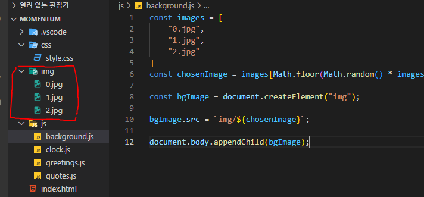

# Let's Make App

- `querySelector`를 사용할 때에는 `classname`과 `tagname`을 인식하므로 `id`임을 명시해주어야 한다.

```js
const loginForm = document.querySelector("#login-form")
// const loginForm = document.getElementById("login-form")
console.log(loginForm)
```

- `HTML element`의 다른 `tag`등을 검색할 때 아래와 같이 두 가지 방법이 있다.

```js
//첫 번째
const loginForm = document.querySelector("#login-form")
const loginInput = loginForm.querySelector("input");
const loginButton = loginForm.querySelector("button");
//두 번째
const loginInput = document.loginForm.querySelector("#login-form input");
const loginButton = document.loginForm.querySelector("#login-form button");
```

- 해당 `element`에 무슨 메서드가 있는지 알고 싶으면 `console.dir`을 활용한다.

```js
const loginInput = document.querySelector("#login-form input");
const loginButton = document.querySelector("#login-form button");


function onLoginBtnClick() {
    console.dir(loginInput)
    console.log(loginInput.value)
    console.log("click")
}

loginButton.addEventListener("click", onLoginBtnClick)
```

- `user`의 유효성 검사는 반드시 필요하다. 다음과 같은 방법들이 있다.
  - `user`들을 믿어선 안된다.

```js
const loginInput = document.querySelector("#login-form input");
const loginButton = document.querySelector("#login-form button");


function onLoginBtnClick() {
    const username = loginInput.value;
    if(username === "") {
        alert("Please write your name")
    } else if (username.length > 15) {
        alert("Your name is too long.")
    }
}

loginButton.addEventListener("click", onLoginBtnClick)
```

- `form`태그를 이용하면 `input`에 더 많은 기능들을 부여할 수 있다. `HTML`에 기능들을 부여한다.
  - `form`태그는 `button`이나 `input`의 `type`이 `submit`인 것을 클릭하거나 엔터를 누르면 해당 값들을 전송하고 페이지를 새로고침한다.
    - 즉, 더 이상 `addEventListenr`가 필요 없어졌다.
    - 이는 추후에 수정이 필요.

```html
<body>
    <form id="login-form">
        <input required maxlength="15" type="text" placeholder="What is your name?">
        <button>Log In</button>
        <script src="app.js"></script>
    </form>
</body>
```

- `event`가 발생하면 `JS`가 자동적으로 실행에 필요한 정보들을 넘겨준다. 우리는 이것을 받아서 사용할 수 있음.

```js
const loginForm = document.querySelector("#login-form");
const loginInput = document.querySelector("#login-form input");

function onLoginSubmit(tomato) {
    tomato.preventDefault();
    console.log(tomato)
}

loginForm.addEventListener("submit", onLoginSubmit);
```

> `preventDefault()`는 `event`의 기본 동작이 브라우저에 의해 수행되지 않도록 막는다. `event`는 `object`이다.

- `click` 이벤트에는 어디를 클릭했는지의 위치 정보도 담고 있다.
  - 다양한 이벤트들의 정보를 활용해 사용할 수 있다는 의미임.

```js
const loginForm = document.querySelector("#login-form");
const loginInput = document.querySelector("#login-form input");
const link = document.querySelector("a")

function onLoginSubmit(event) {
    event.preventDefault();
    console.log(event)
}

function handleLinkClick(event) {
    event.preventDefault();
    console.log(event)
}

loginForm.addEventListener("submit", onLoginSubmit);
link.addEventListener("click", handleLinkClick);
```


- `string`만 포함된 변수는 대문자로 표기하고 `string`을 저장하고 싶을 때 사용한다.

```java
const loginForm = document.querySelector("#login-form");
const loginInput = document.querySelector("#login-form input");
const greeting = document.querySelector("#greeting");

const HIDDEN_CLASSNAME = "hidden"

function onLoginSubmit(event) {
    event.preventDefault();
    loginForm.classList.add("hidden");
    const username = loginInput.value;
    // greeting.innerText = "Hello " + username;
    greeting.innerText = `Hello ${username}`;
    greeting.classList.remove("hidden");
}

loginForm.addEventListener("submit", onLoginSubmit);
```


- 브라우저의 `localStorage`에 데이터를 저장하거나, 읽거나, 쓸 수 있다.

```js
const loginForm = document.querySelector("#login-form");
const loginInput = document.querySelector("#login-form input");
const greeting = document.querySelector("#greeting");

const HIDDEN_CLASSNAME = "hidden"
const USERNAME_KEY = "username"

function onLoginSubmit(event) {
    event.preventDefault();
    loginForm.classList.add(HIDDEN_CLASSNAME);
    const username = loginInput.value;
    localStorage.setItem(USERNAME_KEY, username);
    // greeting.innerText = "Hello " + username;
    paintGreetings(username);
}

function paintGreetings(username) {
    greeting.innerText = `Hello ${username}`;
    greeting.classList.remove(HIDDEN_CLASSNAME);
}

const savedUsername = localStorage.getItem(USERNAME_KEY);

if (savedUsername === null) {
    loginForm.classList.remove(HIDDEN_CLASSNAME);  
    loginForm.addEventListener("submit", onLoginSubmit);
} else {
    paintGreetings(savedUsername)
}
```

> ✅ 반복되는 문자열은 상수 변수로 만들어서 활용한다
>
> ✅ 반복되는 명령문들도 함수로 최대한 묶어서 사용하자.


- 시계 만들기
- `new Date()`라는 `object`를 만들고 여기에 들어있는 `getHours`, `getMinutes`, `getSeconds`를 활용한다
- `setInterval`은 정해진 시간마다 함수를 실행시킨다
- `setTimeOut`은 일정 시간이 지난 후에 함수를 실행시킨다.
- `padStart`는 문자 타입을 받으며 자리수와 빈 자리수에 채울 값을 넣을 수 있다.

```js
const clock = document.querySelector("h2#clock");

function getClock() {
    const date = new Date();
    const hours = String(date.getHours()).padStart(2, "0");
    const minutes = String(date.getMinutes()).padStart(2, "0");
    const seconds = String(date.getSeconds()).padStart(2, "0");
    clock.innerText = `${hours}:${minutes}:${seconds}`
}
getClock()
setInterval(getClock,1000);
```

- 명언 랜덤하게 뽑기
- `Math` 모듈을 활용하여 구현한다.
- `Math.round()`, `Math.floor()`, `Math.ceil()` 을 활용할 수 있다.
- `Math.random`은 0~1까지의 숫자를 랜덤하게 보여준다.

```js
const quotes = [
    {quote: "삶이 있는 한 희망은 있다",
    author: "키케로"
},
    {quote: "하루에 3시간을 걸으면 7년 후에 지구를 한바퀴 돌 수 있다.",
    author: "사무엘존슨"
},
    {quote: "산다는것 그것은 치열한 전투이다",
    author: "로망로랑"
},
    {quote: "언제나 현재에 집중할수 있다면 행복할것이다.",
    author: "파울로 코엘료"
},
    {quote: "진정으로 웃으려면 고통을 참아야하며 , 나아가 고통을 즐길 줄 알아야 해",
    author: "찰리 채플린"
},
    {quote: "우리를 향해 열린 문을 보지 못하게 된다",
    author: "헬렌켈러"
},
    {quote: "피할수 없으면 즐겨라",
    author: "로버트 엘리엇"
},
    {quote: "먼저핀꽃은 먼저진다 남보다 먼저 공을 세우려고 조급히 서둘것이 아니다",
    author: "채근담"
},
    {quote: "행복한 삶을 살기위해 필요한 것은 거의 없다",
    author: "마르쿠스 아우렐리우스 안토니우스"
},
    {quote: "한번의 실패와 영원한 실패를 혼동하지 마라",
    author: "F.스콧 핏제랄드"
}
]

const quote = document.querySelector("#quote span:first-child")
const author = document.querySelector("#quote span:last-child")
const todaysQuote = quotes[Math.floor(Math.random() * quotes.length)]

quote.innerText = todaysQuote.quote;
author.innerText = todaysQuote.author;
// Math.round()
// Math.ceil()
// Math.floor()
```


- `img`삽입하기
- `img`폴더를 따로 두고 사진을 넣어 둔 다음에, 상대경로로 불러와서 사용한다.
- `createElement`로 태그를 만들어주고 다양한 속성들을 추가한 뒤에 `document.body.appendChild()`를 통해서 `HTML` 내부에 추가시킨다.
- `prepend`는 가장 앞에 추가시킨다.

```js
const images = [
    "0.jpg",
    "1.jpg",
    "2.jpg"
]
const chosenImage = images[Math.floor(Math.random() * images.length)];

const bgImage = document.createElement("img");

bgImage.src = `img/${chosenImage}`;

document.body.appendChild(bgImage);
```

