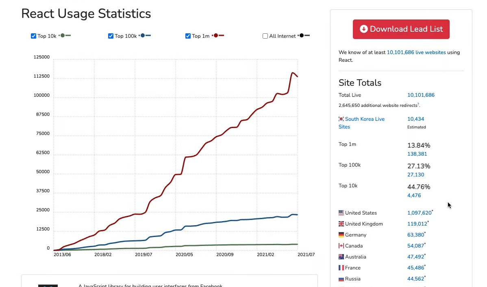

# 왜 React인가?

- 신기술 배울 때 유의할 점

1. 누가 이 기술을 사용하는지, 그들의 규모가 얼마나 큰지 살펴보기, 이 기술이 그들에게 얼마나 중요한지

> 에어비엔비, 인스타그램, 페이스북, 넷플릭스

2. 페이스북이 React JS를 만들고 현재도 계속 투자하면서 개발을 진행 중이다.
3. `React JS`는 큰 커뮤니티를 가지고 있다.

- `Javascript`와 친하다.

- `library`, 가이드, `package`, 가르쳐 줄 사람, 직업 고용 등 모두 좋다

- 해당 기술에 대한 생태계가 있다는 것은 중요하다.