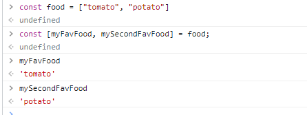
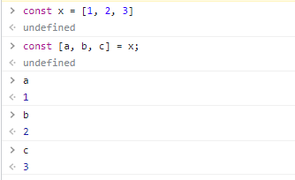

# State


> 이 방식에서 단 한번 랜더링이 일어나고 counter에 대해서는 리렌더링이 일어나지 않는다.

- `React JS`는 리랜더링을 진행할 때 바뀐 부분만 알아차리고 바꿔준다.
  - 즉, 기존의 태그들이 다시 업데이트 되지 않고 변경된 부분만 랜더링을 시킨다
- `React JS`에는 변수를 넣어줄 때 달러 표시 없이 중괄호만 `{}`넣어준다.
- 아래 코드는 데이터에 변화가 일어난 후에 항상 `render()`를 붙여야하기 때문에 번거로운 면이 있다.

```js
<!DOCTYPE html>
<html>
  <body>
    <div id="root"></div>
  </body>
  <script src="https://unpkg.com/react@17.0.2/umd/react.production.min.js"></script>
  <script src="https://unpkg.com/react-dom@17.0.2/umd/react-dom.production.min.js"></script>
  <script src="https://unpkg.com/@babel/standalone/babel.min.js"></script>
  <script type="text/babel">
    const root = document.getElementById("root");
    let counter = 0;
    function countUp() {
      counter += 1;
      render();
    }
    function render() {
      ReactDOM.render(<Container />, root);
    }
    const Container = () => (
      <div>
        <h3>Total: clicks: {counter}</h3>
        <button onClick={countUp}>Click me</button>
      </div>
    );
    render();
  </script>
</html>
```


- `React.useState()`를 생성하면서 이전에 길게 풀어쓴 것을 한 줄로 표현이 가능하다.


- `const [사용할 변수명들]`을 활용하면 `const 변수명 = food[0]`식으로 쭈우우욱 적지 않아도 된다. 조금 더 간편하다.





```js
<!DOCTYPE html>
<html>
  <body>
    <div id="root"></div>
  </body>
  <script src="https://unpkg.com/react@17.0.2/umd/react.production.min.js"></script>
  <script src="https://unpkg.com/react-dom@17.0.2/umd/react-dom.production.min.js"></script>
  <script src="https://unpkg.com/@babel/standalone/babel.min.js"></script>
  <script type="text/babel">
    const root = document.getElementById("root");
    function App() {
      const [counter, modifier] = React.useState(0);
      return (
        <div>
          <h3>Total: clicks: 0</h3>
          <button>Click me</button>
        </div>
      );
    }

    ReactDOM.render(<App />, root);
  </script>
</html>
```

- `setCounter`는 `counter`가 리렌더링하도록 도와주는 함수이다.

```js
<!DOCTYPE html>
<html>
  <body>
    <div id="root"></div>
  </body>
  <!-- ReactJS ReactDOM Babel(JSX사용하기 위해서)  -->
  <script src="https://unpkg.com/react@17.0.2/umd/react.production.min.js"></script>
  <script src="https://unpkg.com/react-dom@17.0.2/umd/react-dom.production.min.js"></script>
  <script src="https://unpkg.com/@babel/standalone/babel.min.js"></script>
  <script type="text/babel">
    const root = document.getElementById("root");

    // 하나의 컴포넌트가 생성된 것이다. 항상 첫 글자는 대문자로 시작하기
    function App() {
      const [counter, setCounter] = React.useState(0);
      const plusCounter = () => {
        setCounter(counter + 1);
      };
      return (
        <div>
          <h1>Total clicks : {counter}</h1>
          <button onClick={plusCounter}>Click me</button>
        </div>
      );
    }
    ReactDOM.render(<App />, root);
  </script>
</html>
```

> `modifier`함수로 `state`를 바꿀 때,새로운 값을 가지고 컴포넌트 전체가 재생성된다. 


### `State`세팅 방법 2가지

1. 직접 값을 설정해주는 방법 `setCounter(counter + 1);`
2. 함수를 전달하기 `setCounter((current) => current + 1);`

- 현재의 `state`로 다음 `state`를 추출해내고 싶을 때에는 아래와 같이 함수 형태를 사용해야만 안전하다
  - 예상치 못한 업데이트가 어디선가 일어났다고 하더라도, 혼돈을 주는 것을 방지해준다.
  - 항상 현재 `state`를 반영해준다.


### JSX 문법 익히기

- `for`나 `class`와 같은 단어들은 `javascript`용어이기 때문에 사용해서는 안되고, `jsx`의 규칙에 따라 용어를 써야 한다.
  - 현재는 `production.min`이어서 괜찮지만, `development`로 변경되면 에러가 발생한다.


- 다음과 같이 `className`과 `htmlFor`로 용어를 바꿔주어야 한다.


- `event`는 `React JS`에서 가짜로 만들어주는데 최적화?!를 하기 위해서이다. 내부에 `Native Event`로 진짜 `Event`가 존재한다.

```js
function App() {
      const [minutes, setMinutes] = React.useState();
      const onChange = (event) => {
        setMinutes(event.target.value);
      };
      return (
        <div>
          <h1 className="converter">Super Converter</h1>
          <label htmlFor="minutes">Minutes</label>
          <input
            value={minutes}
            id="minutes"
            placeholder="Minutes"
            type="number"
            onChange={onChange}
          />
          <h4>You want to convert {minutes}</h4>
          <label htmlFor="hours">Hours</label>
          <input id="hours" placeholder="Hours" type="number" />
        </div>
      );
    }
```


- `hours`의 경우에 `value`가 `minutes`에 묶여 있어서 `input`에 값 변경을 할 수가 없다.


- 다음과 같이 컴포넌트 안에 컴포넌트를 배치한 것을 분할 정복(divide and conquer)라고 한다.


- `modifier`의 함수를 실행하면 모든 컴포넌트들이 다시 렌더링 된다.
- `{}`안에는 `js` 사용하듯이 쓰면 된다.
- `isolation`과 `capsulation`을 통해서 `JSX`를 분리된 컴포넌트로 만들었다.

```js
<!DOCTYPE html>
<html>
  <body>
    <div id="root"></div>
  </body>
  <script src="https://unpkg.com/react@17.0.2/umd/react.production.min.js"></script>
  <script src="https://unpkg.com/react-dom@17.0.2/umd/react-dom.production.min.js"></script>
  <script src="https://unpkg.com/@babel/standalone/babel.min.js"></script>
  <script type="text/babel">
    const root = document.getElementById("root");
    function MinutesToHours() {
      const [amount, setAmount] = React.useState(0);
      const [inverted, setInverted] = React.useState(false);
      const onChange = (event) => {
        setAmount(event.target.value);
      };
      const reset = () => {
        setAmount(0);
      };
      const onFlip = (event) => {
        reset();
        setInverted((current) => !current);
      };
      return (
        <div>
          <div>
            <label htmlFor="minutes">Minutes</label>
            <input
              value={inverted ? amount * 60 : amount}
              id="minutes"
              placeholder="Minutes"
              type="number"
              onChange={onChange}
              disabled={inverted}
            />
          </div>
          <div>
            <label htmlFor="hours">Hours</label>
            <input
              disabled={!inverted}
              value={inverted ? amount : Math.round(amount / 60)}
              id="hours"
              placeholder="Hours"
              type="number"
              onChange={onChange}
            />
          </div>
          <button onClick={reset}>Reset</button>
          <button onClick={onFlip}>{inverted ? "Turn back" : "Invert"}</button>
        </div>
      );
    }
    function KmToMiles() {
      const [distance, setDistance] = React.useState(0);
      const [invert, setInvert] = React.useState(false);
      const onChange = (event) => {
        setDistance(event.target.value);
      };
      const reset = () => {
        setDistance(0);
      };
      const flip = () => {
        reset();
        setInvert((current) => !current);
      };
      return (
        <div>
          <div>
            <label htmlFor="Km">Km</label>
            <input
              value={!invert ? distance : distance / 0.621371}
              id="Km"
              type="number"
              placeholder="Please enter the Km"
              onChange={onChange}
              disabled={invert}
            ></input>
          </div>
          <div>
            <label htmlFor="Mile">Miles</label>
            <input
              value={!invert ? distance * 0.621371 : distance}
              id="Mile"
              type="number"
              placeholder="Please enter the Miles"
              onChange={onChange}
              disabled={!invert}
            ></input>
          </div>
          <button onClick={reset}>Reset</button>
          <button onClick={flip}>{!invert ? "Invert" : "Turn back"}</button>
        </div>
      );
    }
    function App() {
      const [index, setIndex] = React.useState("1");
      const onSelect = (event) => {
        setIndex(event.target.value);
      };
      return (
        <div>
          <h1>Super Converter</h1>
          <select value={index} onChange={onSelect}>
            <option value="xx">Select your units</option>
            <option value="0">Minutes & Hours</option>
            <option value="1">Km & Miles</option>
          </select>
          <hr />
          {index === "xx" ? <h3>Please selet your units</h3> : null}
          {index === "0" ? <MinutesToHours /> : null}
          {index === "1" ? <KmToMiles /> : null}
        </div>
      );
    }

    ReactDOM.render(<App />, root);
  </script>
</html>
```

