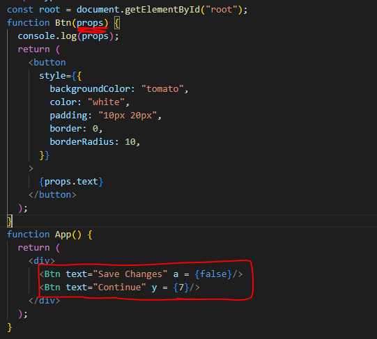

# Props

- 부모 컴포넌트로부터 자식 컴포넌트에 데이터를 보낼 수 있게 해주는 방법

- 우리는 함수형 컴포넌트를 사용하고, `return` 내부를 `JSX`의 내부라고 부른다.
- 컴포넌트에 원하는 값을 아무 형태로든 보낼 수 있음.
  - `Object`타입으로 전송이 된다.

- `props.text`와 같이 적어야 하지만, 단순히 중괄호를 사용해서 속성만 받아올 수 있다.
  - `shortcut`을 주로 사용한다.
- 인자를 여러 개 넣을 수도 있고, `style` 안에 `if else`도 `prop`기반으로 사용할 수 있다.
  - 인자를 받지 못하면 `undefined`으로 나타난다.

- 컴포넌트에 넣는 값들은 `eventListner`가 아니라, 그저 `prop`이다.
  - 직접 넣어주고 사용해주어야 한다.
  - `prop`은 `boolean`, `text`, `함수` 등이 모두 들어갈 수 있다.

- `ReactJS`의 규칙에 따르면 부모의 상태가 변하면 모든 컴포넌트들이 다시 랜더링 된다.
  - 만약, 수천 개의 컴포넌트를 가지고 있다면 효율 저하가 발생할 수 있다.
  - `memo`기능을 활용하여 `prop`으로 변하는 컴포넌트만 재호출 하게 변경할 수 있다.

- `cdn` 버전이 잘 맞아야 한다.
  - `production`버전 때문에 에러가 발생하지 않았다.
- `javascript`의 문법으로 매개변수에 `기본값`을 설정할 수 있다.
- `propTypes`에 조건들을 정하면서 `warning`뜰 수 있게 한다.
  - `cdn`으로 받아야 한다.
  - `isRequired`를 쓰면 해당값이 없으면 에러가 발생하도록 해준다.

