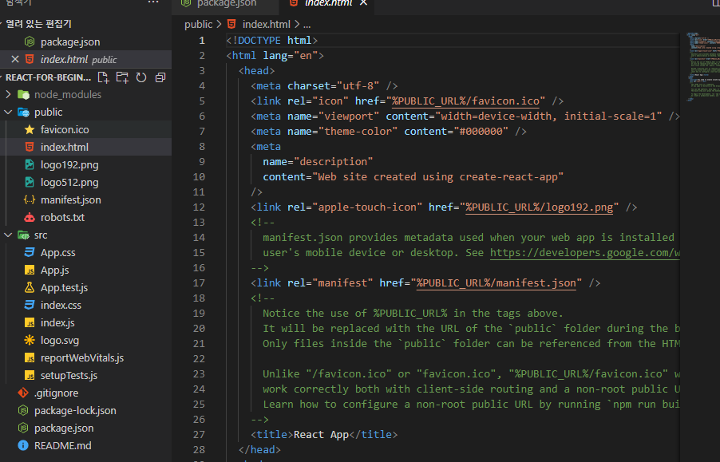

# Create React App

- `package.json`에는 실행시킬 수 있는 `script`들이 존재한다.

- `cmd`에서 `node -v`로 노드가 깔려있는지 확인하고, `npx`로도 해당 터미널로 들어갈 수 있는지 확인한다.
- 그 후 `npx create-react-app my-app`을 통해 `create-react-app`을 다운받는다
- `src`에 모든 파일이 들어갈 예정이고 중요한 것은 `index.js`이다
- `public/index.html`에 해당 내용들이 적용된다.



- `npm start`를 하면 초기 페이지가 뜬다.


- 랜더링해줄 `index.js`와 `App.js`를 빼곤 다 삭제하기
  - 추후에는 하나의 컴포넌트가 하나의 파일이 될 예정이다

### 연습하기

- `Button.js`파일을 만든 뒤 다음과 같이 코드를 작성 후 `export default Button`을 적어준다.
  - `App.js`에서 `Button`을 가져올 수 있게 할 예정

```js
function Button({text}) {
    return <button>{text}</button>
}
export default Button
```

```js
import Button from "./Button";

function App() {
  return (
    <div>
      <h1>Welcome back!</h1>
      <Button />
    </div>
  );
}

export default App;
```


- `create-react-app`은 `css`코드를 `javascript` 오브젝트로 변환시켜 준다.
  - `javascript` 오브젝트는 `btn`을 안에 갖고 있다.
- `style`들도 `modular`모듈러가 될 수 있다.

```css
.btn {
  color: white;
  background-color: tomato;
}
```

```js
import PropTypes from "prop-types";
import styled from "./Button.module.css";

function Button({ text }) {
  return <button className={styled.btn}>{text}</button>;
}

Button.propTypes = {
  text: PropTypes.string.isRequired,
};
export default Button;
```


> `create-react-app`은 랜덤하게 보이는 클래스 이름을 만들어낸다.


- 컴포넌트들이나 스타일들을 독립적이게 유지시켜주고 있다.