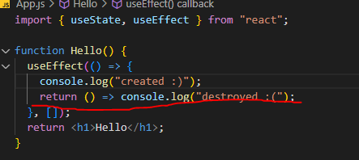

# Effects

- 처음 `render`될 때 딱 한 번만 실행하고 더 이상 실행되지 않게 하고 싶을 경우에 `useEffect`를 사용한다.
  - 첫 번째 인자는 우리가 딱 한번만 실행하고 싶은 코드

```js
import { useState, useEffect } from "react";

function App() {
  const [counter, setValue] = useState(0);
  const onClick = () => setValue((prev) => prev + 1);

  console.log("i run all the time");
  const iRunOnlyOnce = () => {
    console.log("i run only once");
  };
  useEffect(iRunOnlyOnce, []);
  return (
    <div>
      <h1>{counter}</h1>
      <button onClick={onClick}>click me</button>
    </div>
  );
}

export default App;

```

- 두 번째 `[]`에는 변화할 때마다 실행시켜줄 변수값을 넣어준다.
  - 아래 예제는 `keyword`가 변화할 때만 해당 함수가 실행되는 것을 알 수 있다.

```js
import { useState, useEffect } from "react";

function App() {
  const [counter, setValue] = useState(0);
  const [keyword, setKeyword] = useState("");
  const onClick = () => setValue((prev) => prev + 1);
  const onChange = (event) => {
    setKeyword(event.target.value);
  };

  useEffect(() => {
    if (keyword !== "" && keyword.length > 5) {
      console.log("Search for", keyword);
    }
  }, [keyword]);
  useEffect(() => {
    console.log("call the api");
  }, []);
  useEffect(() => {
    console.log("counter");
  }, [counter]);
  useEffect(() => {
    console.log("counter and kleyword");
  }, [counter, keyword]);
  return (
    <div>
      <input
        onChange={onChange}
        value={keyword}
        type="text"
        placeholder="Search here..."
      ></input>
      <h1>{counter}</h1>
      <button onClick={onClick}>click me</button>
    </div>
  );
}

export default App;
```

- 아래에서 `Hello` 컴포넌트의 `useEffect` 는 랜더링 될 때 딱 한번 실행된다. 하지만, `{showing ? <Hello /> : null}`에서 해당 컴포넌트가 삭제, 생성이 반복되기 때문에 계속 실행이 된다.

```js
import { useState, useEffect } from "react";

function Hello() {
  useEffect(() => {
    console.log("Im here!");
  }, []);
  return <h1>Hello</h1>;
}

function App() {
  const [showing, setShowing] = useState(false);
  const onClick = () => {
    setShowing((current) => !current);
  };
  return (
    <div>
      {showing ? <Hello /> : null}
      <button onClick={onClick}>{showing ? "Hide" : "Show"}</button>
    </div>
  );
}

export default App;
```

- `Clean up function`으로 해당 컴포넌트가 사라질 때 실행된다.



```js
import { useState, useEffect } from "react";

function Hello() {
  function BbyFn() {
    console.log("bye :(");
  }
  function hiFn() {
    console.log("created :)");
    return BbyFn;
  }
  useEffect(hiFn, []);
  return <h1>Hello</h1>;
}

function App() {
  const [showing, setShowing] = useState(false);
  const onClick = () => {
    setShowing((current) => !current);
  };
  return (
    <div>
      {showing ? <Hello /> : null}
      <button onClick={onClick}>{showing ? "Hide" : "Show"}</button>
    </div>
  );
}

export default App;
```

- 화살표 함수를 주로 사용한다. `return` 뒤에는 컴포넌트가 삭제될 때 나올 함수가 적혀진다.

```js
function Hello() {
  useEffect(function () {
    console.log("hi");
    return function () {
      console.log("bye");
    };
  }, []);
  return <h1>Hello</h1>;
}
```

