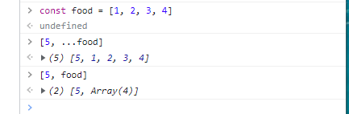
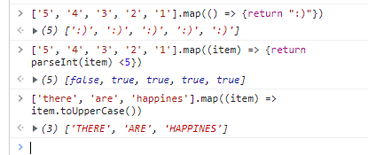
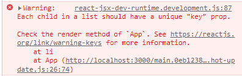
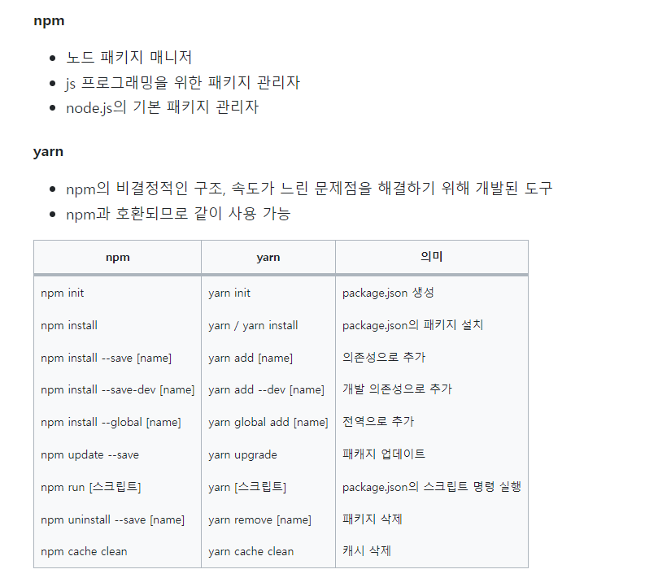
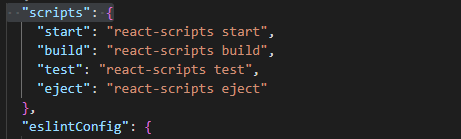
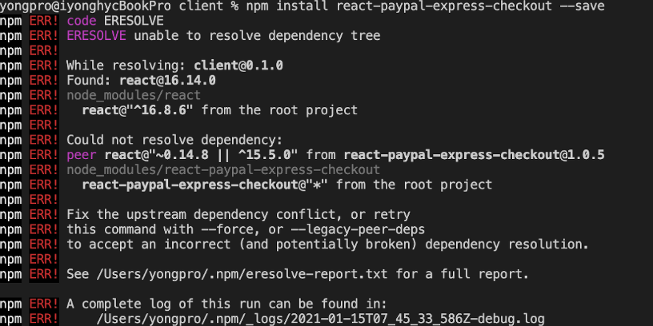
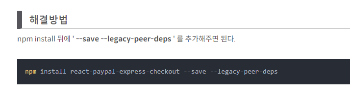
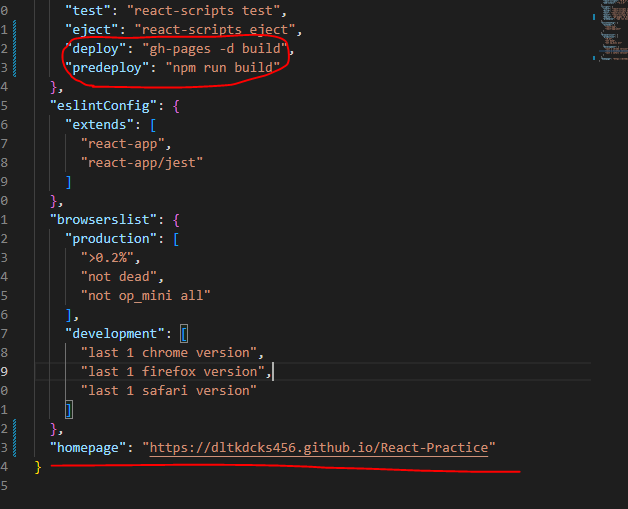

# Practice Movie App

- 우리는 `state`를 직접 변경하지 않고 `modifier`함수를 활용하여 변경한다.



> 리스트의 원소를 나열하여 붙이고 싶을 때에는 리스트 앞에 `...`을 붙여줘야한다.

- `setToDos`에 리스트를 붙여주고, `JSX`에서는 `{}`만 사용해주면 바로 자바스크립트를 활용할 수 있다.

```js
import { useState, useEffect } from "react";

function App() {
  const [toDo, setToDo] = useState("");
  const [toDos, setToDos] = useState([]);
  const onChange = (event) => {
    setToDo(event.target.value);
  };
  const onSubmit = (event) => {
    event.preventDefault();
    if (toDo === "") {
      return;
    }
    setToDos((currentArray) => [toDo, ...currentArray]);
    setToDo("");
  };
  console.log(toDos);
  return (
    <div>
      <h1>My To Dos ({toDos.length})</h1>
      <form onSubmit={onSubmit}>
        <input
          onChange={onChange}
          type="text"
          placeholder="Write your to do..."
          value={toDo}
        />
        <button>Add To Do</button>
      </form>
    </div>
  );
}

export default App;
```

> `modifier`의 첫 인자로는 현재의 `State`가 불러진다.


- `map`은 `array`의 각 요소들을 순회하고 함수 내부의 로직을 수행한 후에 새로운 `array`를 탄생시킨다.





> 단, `key`를 입력하지 않으면 다음과 같은 에러가 발생하게 된다.
>
> `map`의 두 번째 인자는 `index`가 온다.

```js
import { useState, useEffect } from "react";

function App() {
  const [toDo, setToDo] = useState("");
  const [toDos, setToDos] = useState([]);
  const onChange = (event) => {
    setToDo(event.target.value);
  };
  const onSubmit = (event) => {
    event.preventDefault();
    if (toDo === "") {
      return;
    }
    setToDos((currentArray) => [toDo, ...currentArray]);
    setToDo("");
  };
  return (
    <div>
      <h1>My To Dos ({toDos.length})</h1>
      <form onSubmit={onSubmit}>
        <input
          onChange={onChange}
          type="text"
          placeholder="Write your to do..."
          value={toDo}
        />
        <button>Add To Do</button>
      </form>
      <hr />
      <ul>
        {toDos.map((item, index) => (
          <li key={index}>{item}</li>
        ))}
      </ul>
    </div>
  );
}

export default App;
```


- `useEffect`를 활용해서 딱 한번만 실행하도록 해주고, 해당값을 `State`에 넣은 후 `map`으로 표현하였다. 이쁘게 보이지 않는 부분은 삼항 연산자를 활용해서 숨겨주었다.

```js
import { useState, useEffect } from "react";

function App() {
  const [loading, setLoading] = useState(true);
  const [conins, setCoins] = useState([]);
  useEffect(() => {
    fetch("https://api.coinpaprika.com/v1/tickers")
      .then((response) => response.json())
      .then((data) => {
        setCoins(data);
        setLoading(false);
      });
  }, []);
  return (
    <div>
      <h1>The Coins! {loading ? "" : `(${conins.length})`}</h1>
      {loading ? (
        <strong>Loading...</strong>
      ) : (
        <select>
          {conins.map((coin, idx) => (
            <option kye={idx}>
              {coin.name} ({coin.symbol}:${coin.quotes.USD.price} USD)
            </option>
          ))}
        </select>
      )}
    </div>
  );
}
export default App;
```

- 영화 관련된 내용 불러오기
  - `async`와 `await`를 사용했는데 나중에 학습 필요

```js
import { useState, useEffect } from "react";

function App() {
  const [loading, setLoading] = useState(true);
  const [movies, setMovies] = useState([]);
  const getMovies = async () => {
    const response = await fetch(
      `https://yts.mx/api/v2/list_movies.json?minimum_rating=8.8&sort_by=year`
    );
    const json = await response.json();
    setMovies(json.data.movies);
    setLoading(false);
  };
  useEffect(() => {
    getMovies();
  }, []);
  console.log(movies);
  return (
    <div>
      {loading ? (
        <h1>Loading...</h1>
      ) : (
        <div>
          {movies.map((movie) => (
            <div key={movie.id}>
              
              <h2>{movie.title}</h2>
              <p>{movie.summary}</p>
              <ul>
                {movie.genres.map((genre, index) => (
                  <li key={index}>{genre}</li>
                ))}
              </ul>
            </div>
          ))}
        </div>
      )}
    </div>
  );
}
// "api.lcoinpaprika.com/v1/tickers"
export default App;
```

> 위쪽 코드는 컴포넌트로 나눠서 사용하는 것이 조금 더 좋다.

- `npm install react-router-dom`을 다운 받아서 `router`기능을 사용한다.

- `route`, `page`, `screen`등으로 부를 수 있다.

```js
npm i react-router-dom@6
```



- `route`할 때 아래와 같이 작성해준다...

```js
import Home from "./routes/Home.js";
import Detail from "./routes/Detail.js";
import {
  createBrowserRouter,
  createRoutesFromElements,
  RouterProvider,
  Route,
} from "react-router-dom";

const router = createBrowserRouter(
  createRoutesFromElements(
    <Route>
      <Route path="/" element={<Home />} />,
      <Route path="/movie" element={<Detail />} />
    </Route>
  )
);
function App() {
  return <RouterProvider router={router} />;
}

export default App;
```

- 다른 `router`로 페이지 이동을 하고 싶을 때 `a`태그를 활용하면 페이지 전체가 다시 렌더링 되어서 느리다.
  - `Link`는 브라우저 새로고침 없이도 유저를 다른 페이지로 이동시켜주는 컴포넌트이다.

- `variable routing`을 활용할 수 있다
  - `Router path`에는 `:`와 같이 들어가고
  - `useParams`를 통해 넘어오는 파라미터를 확인할 수 있다.

```js
import { useParams } from "react-router-dom";

function Detail() {
  const x = useParams();
  console.log(x);
  return <h1>Detail</h1>;
}
export default Detail;
```

```js
import PropTypes from "prop-types";
import { Link } from "react-router-dom";

function Movie({ id, MidImage, title, summary, genres }) {
  return (
    <div>
      </img>
      <h2>
        <Link to={`/movie/${id}`}>{title}</Link>
      </h2>
      <p>{summary}</p>
      <ul>
        {genres.map((genre) => (
          <li key={genre}>{genre}</li>
        ))}
      </ul>
    </div>
  );
}

Movie.propTypes = {
  id: PropTypes.number.isRequired,
  MidImage: PropTypes.string.isRequired,
  title: PropTypes.string.isRequired,
  summary: PropTypes.string.isRequired,
  genres: PropTypes.arrayOf(PropTypes.string).isRequired,
};
export default Movie;

```

```js
import Home from "./routes/Home.js";
import Detail from "./routes/Detail.js";

import {
  createBrowserRouter,
  createRoutesFromElements,
  RouterProvider,
  Route,
} from "react-router-dom";

const router = createBrowserRouter(
  createRoutesFromElements(
    <Route>
      <Route path="/" element={<Home />} />
      <Route path="/movie/:id" element={<Detail />} />
    </Route>
  )
);
function App() {
  return <RouterProvider router={router} />;
}

export default App;
```

- `npm i gh-pages`다운해주기
  - `github pages`에 업로드 할 수 있게 해주는 패키지



> `build`를 실행하면 우리 웹사이트의 `production ready code`를 생성한다.
>
> `production ready`란 코드가 압축되고 모든게 최적화 된다는 의미





- `homepage`를 설정하고, `deploy`와 `predeploy`를 설정해준다. 
  - `npm run deploy`를 실행하면 `predeploy`가 실행된 후에 `deploy`가 실행되고, `gh-pages`가 실행되면서 완료된다.
  - `github`에서 확인하려면 5분 이상 걸린다.

