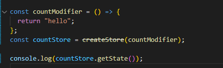
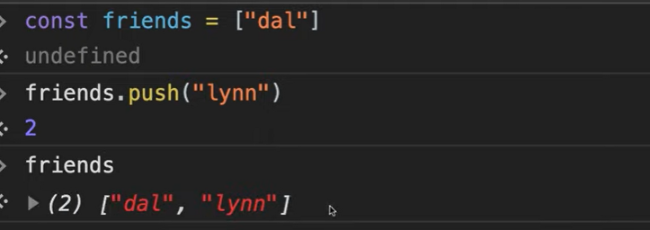

# Redux

- `React`와 관련없이 다른 언어에서도 모두 사용할 수 있는 `js`의 문법이다

- `store`는 `data`를 넣는 곳 -> `state`를 여기에 넣는다
  - `state`는 `application`에서 바뀌는 `data`를 말한다.
- 리덕스는 우리가 `data`를 관리하는 것을 도와준다.

- `reducer`는 `function`(함수) 이다.
  - `data`를 `modify`한다.

- 여기서는 `countModifier`가 유일하게 데이터를 바꿀 수 있는 곳이 된다.



> `state`에 값이 없으면 기본값으로 `default`를 가진다.

- 수정할 수 있는 것은 `countModifier`뿐이다.
  - 명령 수행은 `dispatch`를 통해 `action`에 전달되고 `count`가 증가된다.
  - 내부 코드 진행 후 반환되는 값이 전달된다.

```js
import { createStore } from "redux";

const countModifier = (count = 0, action) => {
  if (action.type === "ADD") {
    return count + 1;
  } else if (action.type === "MINUS") {
    return count - 1;
  } else {
    return count;
  }
};
const countStore = createStore(countModifier);

countStore.dispatch({ type: "ADD" });
countStore.dispatch({ type: "ADD" });
countStore.dispatch({ type: "ADD" });
countStore.dispatch({ type: "ADD" });
countStore.dispatch({ type: "MINUS" });
console.log(countStore.getState());
```


- `countStore.subscribe`를 통해서 변화를 집어넣을 수 있다.

```js
import { createStore } from "redux";

const add = document.getElementById("add");
const minus = document.getElementById("minus");
const number = document.querySelector("span");

const countModifier = (count = 0, action) => {
  if (action.type === "ADD") {
    return count + 1;
  } else if (action.type === "MINUS") {
    return count - 1;
  } else {
    return count;
  }
};
const countStore = createStore(countModifier);

const onChange = () => {
  number.innerText = countStore.getState();
};

countStore.subscribe(onChange);
add.addEventListener("click", () => countStore.dispatch({ type: "ADD" }));
minus.addEventListener("click", () => countStore.dispatch({ type: "MINUS" }));
```

> `action`은 `Object`가 되어야 하고, 리듀서가 `dispatch`에 의해 불려지고 현재 `state`가 `action`에 의해 변한다.


- `switch ~ case`를 활용하고, 문자열은 변수로 만들어서 활용한다.
  - 변수 사용 이유는 에러 발생을 확인할 수 있고 유지 보수가 좋다.

```js
import { createStore } from "redux";

const add = document.getElementById("add");
const minus = document.getElementById("minus");
const number = document.querySelector("span");

const ADD = "ADD";
const MINUS = "MINUS";

const countModifier = (count = 0, action) => {
  switch (action.type) {
    case ADD:
      return count + 1;
    case MINUS:
      return count - 1;
    default:
      return count;
  }
};
const countStore = createStore(countModifier);

const onChange = () => {
  number.innerText = countStore.getState();
};

countStore.subscribe(onChange);
add.addEventListener("click", () => countStore.dispatch({ type: ADD }));
minus.addEventListener("click", () => countStore.dispatch({ type: MINUS }));

```

- `Mutate`(변형)을 해서는 안되고 새로운 `objects`를 리턴해야 한다.
  - 새로운 `state`(상태)를 리턴 -> 수정이 아닌 새로운 객체를 주는 것



- `array`에서 요소를 삭제할 때에도 `splice`같은 것 말고 `filter`를 사용해서 새로운 `array`가 반환되도록 해야한다.

```js
import { createStore } from "redux";

const form = document.querySelector("form");
const input = document.querySelector("input");
const ul = document.querySelector("ul");

const ADD_TODO = "ADD_TODO";
const DELETE_TODO = "DELETE_TODO";

const addToDo = (text) => {
  return {
    type: ADD_TODO,
    text,
  };
};

const deleteToDo = (id) => {
  return { type: DELETE_TODO, id };
};

const reducer = (state = [], action) => {
  console.log(action);
  switch (action.type) {
    case ADD_TODO:
      return [...state, { text: action.text, id: Date.now() }];
    case DELETE_TODO:
      return state.filter((toDo) => toDo.id !== parseInt(action.id));
    default:
      return state;
  }
};

const store = createStore(reducer);

store.subscribe(() => {
  console.log(store.getState());
});

const paintToDos = () => {
  const toDos = store.getState();
  ul.innerHTML = "";
  toDos.forEach((toDo) => {
    const li = document.createElement("li");
    const btn = document.createElement("button");
    btn.innerText = "DEL";
    btn.addEventListener("click", dispatchDeleteToDo);
    li.id = toDo.id;
    li.innerText = toDo.text;
    li.appendChild(btn);
    ul.appendChild(li);
  });
};

const dispatchDeleteToDo = (e) => {
  const id = e.target.parentNode.id;
  store.dispatch(deleteToDo(id));
};

store.subscribe(paintToDos);
// const createToDo = (toDo) => {
//   const li = document.createElement("li");
//   li.innerText = toDo;
//   ul.appendChild(li);
// };

const dispatchAddTodo = (text) => {
  store.dispatch(addToDo(text));
};

const onSubmit = (e) => {
  e.preventDefault();
  const toDo = input.value;
  input.value = "";
  dispatchAddTodo(toDo);
  // createToDo(toDo);
};

form.addEventListener("submit", onSubmit);

```

