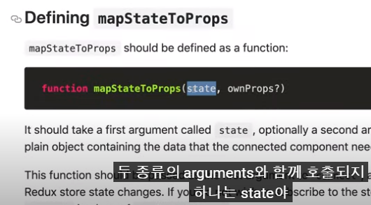

# mapStateToProps



```js
import { createStore } from "redux";

const ADD = "ADD";
const DELETE = "DELETE";

export const addToDo = (text) => {
  return {
    type: ADD,
    text,
  };
};

export const deleteToDo = (id) => {
  return {
    type: DELETE,
    id,
  };
};

const reducer = (state = [], action) => {
  switch (action.type) {
    case ADD:
      return [{ text: action.text, id: Date.now() }, ...state];
    case DELETE:
      return state.filter((toDo) => toDo.id !== action.id);
    default:
      return state;
  }
};

const store = createStore(reducer);

export default store;

```

- `connect`는 `Home`으로 보내주는 `props`에 추가될 수 있게 허용해준다.

```js
import { useState } from "react";
import { connect } from "react-redux";

function Home(props) {
  console.log(props);
  const [text, setText] = useState("");
  const onChange = (event) => {
    setText(event.target.value);
  };
  const onSubmit = (event) => {
    event.preventDefault();
    console.log(text);
    setText("");
  };
  return (
    <div>
      <h1>To Do</h1>
      <form onSubmit={onSubmit}>
        <input
          onChange={onChange}
          type="text"
          placeholder="Write"
          value={text}
        ></input>
        <button>Add</button>
      </form>
      <ul></ul>
    </div>
  );
}

// onProps는 Home에게 준 props이다.
// props에 { sexy: true }가 추가되어진다.
function getCurrentState(state, onProps) {
  return { sexy: true };
}

export default connect(getCurrentState)(Home);
```


- 

```js
import { createStore } from "redux";

const ADD = "ADD";
const DELETE = "DELETE";

const addToDo = (text) => {
  return {
    type: ADD,
    text,
  };
};

const deleteToDo = (id) => {
  return {
    type: DELETE,
    id,
  };
};

const reducer = (state = [], action) => {
  switch (action.type) {
    case ADD:
      return [{ text: action.text, id: Date.now() }, ...state];
    case DELETE:
      return state.filter((toDo) => toDo.id !== action.id);
    default:
      return state;
  }
};

const store = createStore(reducer);

export const actionCreators = {
  addToDo,
  deleteToDo,
};

export default store;

```

```js
import { useState } from "react";
import { connect } from "react-redux";
import { actionCreators } from "../store";

function Home({ toDos, addToDo }) {
  const [text, setText] = useState("");
  const onChange = (event) => {
    setText(event.target.value);
  };
  const onSubmit = (event) => {
    event.preventDefault();
    console.log(text);
    addToDo(text);
    setText("");
  };
  return (
    <div>
      <h1>To Do</h1>
      <form onSubmit={onSubmit}>
        <input
          onChange={onChange}
          type="text"
          placeholder="Write"
          value={text}
        ></input>
        <button>Add</button>
      </form>
      <ul>{JSON.stringify(toDos)}</ul>
    </div>
  );
}

// onProps는 Home에게 준 props이다.
function mapStateToProps(state) {
  return { toDos: state };
}

function mapDispatchToProps(dispatch) {
  return {
    addToDo: (text) => dispatch(actionCreators.addToDo(text)),
  };
}
export default connect(mapStateToProps, mapDispatchToProps)(Home);
// mapState가 필요하지 않을 경우에는 그냥 mapStatToProps부분을 null로 바꿔준다.

```

- 다음과 같이 써서 `params`와 `state`를 활용해서 정보를 구해낼 수 있다.

```js
import { connect } from "react-redux";
import { useParams } from "react-router-dom";

function Detail({ toDos }) {
  const id = useParams();
  console.log(id);
  const todo = toDos.find((todo) => todo.id === id);
  console.log(todo);
  return <h1>Detail</h1>;
}

function mapStateToProps(state) {
  return { toDos: state };
}

export default connect(mapStateToProps)(Detail);

```

- 새로고침하면 `state`가 모두 사라짐
  - 에러가 자주 발생하니까 `?`를 뒤에 넣어준다

```js
import { connect } from "react-redux";
import { useParams } from "react-router-dom";

function Detail({ toDos }) {
  const id = useParams().id;
  console.log(id);
  const todo = toDos.find((todo) => todo.id === parseInt(id));
  console.log(todo);
  return <h1>{todo?.text}</h1>;
}

function mapStateToProps(state, ownProps) {
  return { toDos: state };
}

export default connect(mapStateToProps)(Detail);
```


