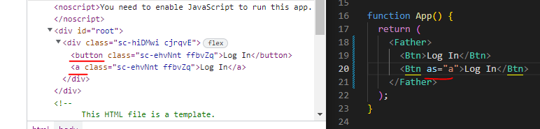
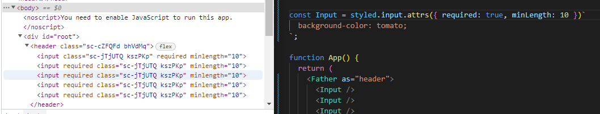
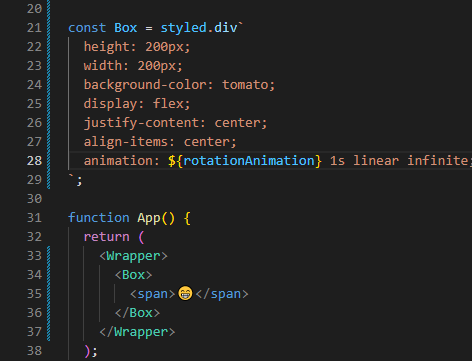
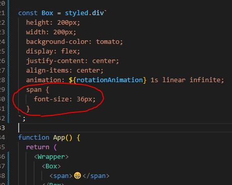
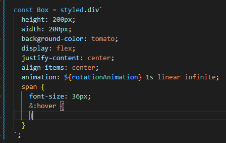
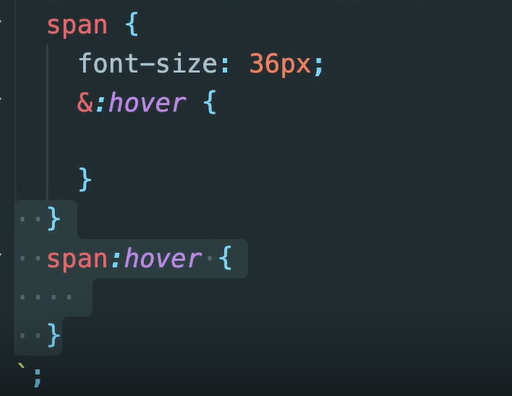
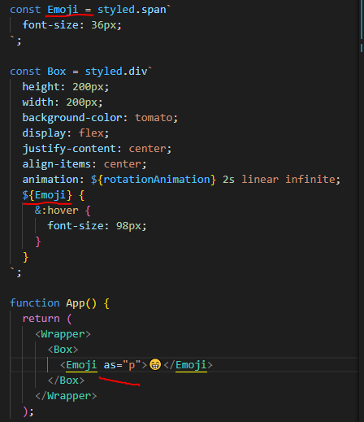

# STYLED COMPONENTS

- `html` 태그 내부에 `style={{}}`를 사용해도 되지만, `hover`와 같은 몇몇 기능들이 작동하지 않는다.
- `Movie.module.css`를 활용해서 사용해도 좋지만 `classname`을 일일이 적어줘야해서 불편하다.
  - 그러니`styled components`를 사용해보자


### 설치

```js
npm i styled-components
```

```js
import styled from "styled-components";
```


### 사용해보기

- `styled components`는 `class`명을 만들어 준다.

- 컴포넌트의 이름을 지정해주어서 훨씬 보기 쉬워진다.

- `HTML`에 사용하는 태그명이 필요하고, 백틱 사이에는 CSS가 들어가야한다.

```js
import styled from "styled-components";

const Father = styled.div`
  display: flex;
`;

const BoxOne = styled.div`
  background-color: teal;
  width: 100px;
  height: 100px;
`;

const BoxTwo = styled.div`
  background-color: tomato;
  width: 100px;
  height: 100px;
`;

const Text = styled.span`
  color: white;
`;

function App() {
  return (
    <Father>
      <BoxOne>
        <Text>Hello</Text>
      </BoxOne>
      <BoxTwo></BoxTwo>
    </Father>
  );
}

export default App;
```


- `props`를 통해 컴포넌트를 설정하는 방법
- 컴포넌트 확장하는 법
  - 기존 컴포넌트의 모든 속성을 들고와서 새로운 속성을 더해준다

```js
import styled from "styled-components";

const Father = styled.div`
  display: flex;
`;

const Box = styled.div`
  background-color: ${(props) => props.bgColor};
  width: 100px;
  height: 100px;
`;

// 컴포넌트 확장이 가능하다
const Circle = styled(Box)`
  border-radius: 50px;
`;

function App() {
  return (
    <Father>
      <Box bgColor="teal" />
      <Circle bgColor="tomato" />
    </Father>
  );
}

export default App;
```


- 스타일은 같게하고 태그를 다르게 하고 싶으면 `as`를 사용하면 된다.




- 다음과 같이 속성을 부여해줄 수도 있다.



```js
import styled from "styled-components";

const Father = styled.div`
  display: flex;
`;

const Input = styled.input.attrs({ required: true, minLength: 10 })`
  background-color: tomato;
`;

function App() {
  return (
    <Father as="header">
      <Input />
      <Input />
      <Input />
      <Input />
      <Input />
    </Father>
  );
}

export default App;
```


- 애니메이션 적용을 위해 `helper function`을 `import`하자
  - `Javascript`의 `string interpolation`을 사용해서 `${}`나타내준다.

```js
import styled, { keyframes } from "styled-components";

const Wrapper = styled.div`
  display: flex;
`;

const rotationAnimation = keyframes`
from {
transform: rotate(0deg);
border-radius:0px;
}
to {
transform:rotate(360deg);
border-radius:100px;
}
`;

const Box = styled.div`
  height: 200px;
  width: 200px;
  background-color: tomato;
  animation: ${rotationAnimation} 1s linear infinite;
`;

function App() {
  return (
    <Wrapper>
      <Box />
    </Wrapper>
  );
}

export default App;
```

```js
import styled, { keyframes } from "styled-components";

const Wrapper = styled.div`
  display: flex;
`;

const rotationAnimation = keyframes`
0% {
transform: rotate(0deg);
border-radius:0px;
}
50% {
border-radius:100px;
}
100% {
  transform: rotate(0deg);
border-radius:0px;
}
`;

const Box = styled.div`
  height: 200px;
  width: 200px;
  background-color: tomato;
  animation: ${rotationAnimation} 1s linear infinite;
`;

function App() {
  return (
    <Wrapper>
      <Box />
    </Wrapper>
  );
}

export default App;
```


- 아래 이모지는 스타일 컴포넌트에 존재하지 않음
  - 하지만 `Box`안의 `span`을 선택해줄 수 있음
  - 모든 것을 스타일 컴포넌트로 만들어주지 않아도 된다.
  - 한 개의 `component`만 `styled` 처리를 해주고 다른 건 `target`처리를 해주면 된다.





- 아래 `&:hover`는 `span:hover`와 동일한 의미를 가진다.





> `&`가 `span`의 의미를 대신하고 있다.

```js
import styled, { keyframes } from "styled-components";

const Wrapper = styled.div`
  display: flex;
`;

const rotationAnimation = keyframes`
0% {
transform: rotate(0deg);
border-radius:0px;
}
50% {
border-radius:100px;
}
100% {
  transform: rotate(360deg);
border-radius:0px;
}
`;

const Box = styled.div`
  height: 200px;
  width: 200px;
  background-color: tomato;
  display: flex;
  justify-content: center;
  align-items: center;
  animation: ${rotationAnimation} 2s linear infinite;
  span {
    font-size: 36px;
    &:hover {
      font-size: 40px;
    }
    &:active {
      opacity: 0;
    }
  }
`;

function App() {
  return (
    <Wrapper>
      <Box>
        <span>😁</span>
      </Box>
    </Wrapper>
  );
}

export default App;

```


- `styled component`자체를 타겟팅할 수 있다.
  - `Emoji`가 `span`이 아닌 다른 태그로 변경되어도 여전히 적용되어 있다.



```js
import styled, { keyframes } from "styled-components";

const Wrapper = styled.div`
  display: flex;
`;

const rotationAnimation = keyframes`
0% {
transform: rotate(0deg);
border-radius:0px;
}
50% {
border-radius:100px;
}
100% {
  transform: rotate(360deg);
border-radius:0px;
}
`;

const Emoji = styled.span`
  font-size: 36px;
`;

const Box = styled.div`
  height: 200px;
  width: 200px;
  background-color: tomato;
  display: flex;
  justify-content: center;
  align-items: center;
  animation: ${rotationAnimation} 2s linear infinite;
  ${Emoji} {
    &:hover {
      font-size: 98px;
    }
  }
`;

function App() {
  return (
    <Wrapper>
      <Box>
        <Emoji as="p">😁</Emoji>
      </Box>
    </Wrapper>
  );
}

export default App;
```


- `theme`은 기본적으로 모든 색상들을 가지고 있는 `object`다

- `ThemeProvider`를 `styled-components`로부터 `import`해야한다.

- `darkmode`와 `lightmode`를 가지고 싶으면 `property`의 이름이 똑같아야 한다.
  - 적용해주고 싶은 곳의 바깥에 `ThemeProvider`를 감싸준다.

```js
import React from "react";
import ReactDOM from "react-dom/client";
import { ThemeProvider } from "styled-components";
import App from "./App";

const darkTheme = {
  textColor: "whitesmoke",
  backgroundColor: "#111",
};

const lightTheme = {
  textColor: "#111",
  backgroundColor: "whitesmoke",
};

const root = ReactDOM.createRoot(document.getElementById("root"));
root.render(
  <React.StrictMode>
    <ThemeProvider theme={darkTheme}>
      <App />
    </ThemeProvider>
  </React.StrictMode>
);

```

```js
import styled, { keyframes } from "styled-components";

const Title = styled.h1`
  color: ${(props) => props.theme.textColor};
`;

const Wrapper = styled.div`
  display: flex;
  height: 100vh;
  width: 100vw;
  justify-content: center;
  align-items: center;
  background-color: ${(props) => props.theme.backgroundColor};
`;

function App() {
  return (
    <Wrapper>
      <Title>Hello</Title>
    </Wrapper>
  );
}

export default App;

```

