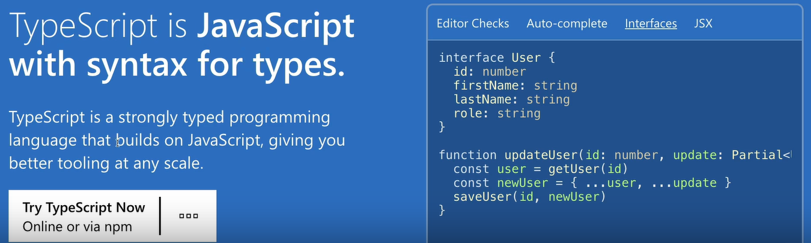
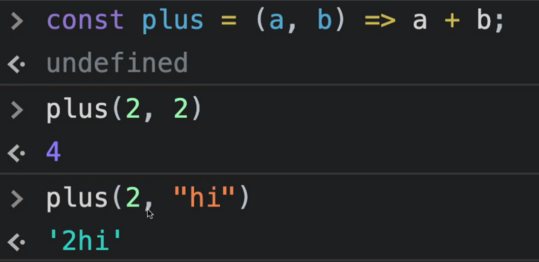
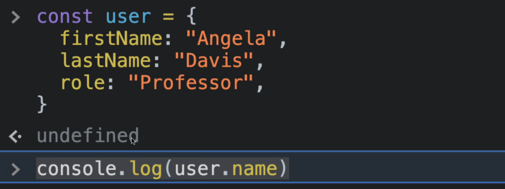
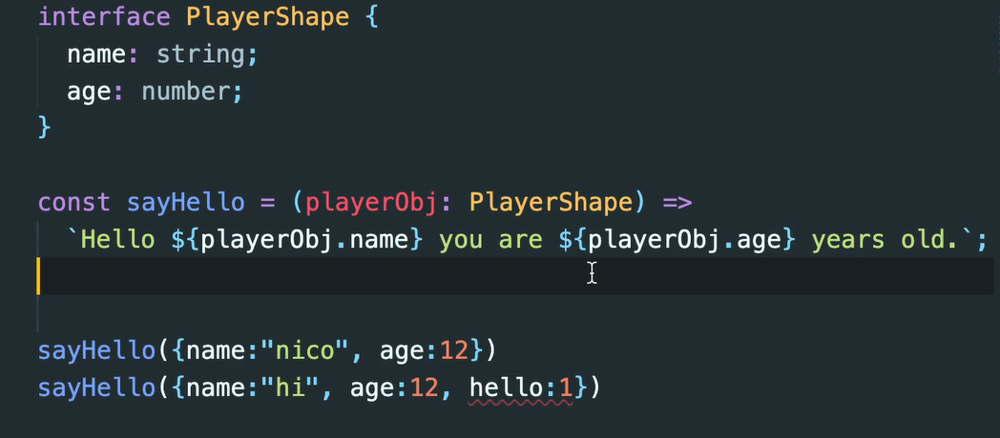
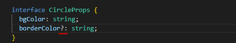
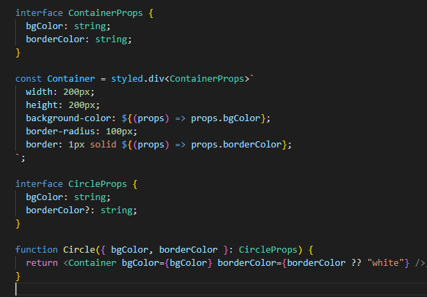
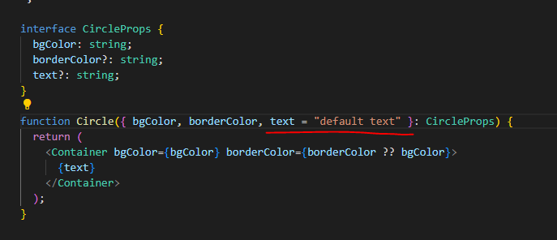
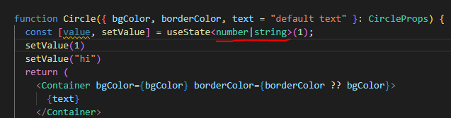

# Type script

- `Javascript`를 기반으로 한 프로그래밍 언어



- `strongly-typed` 언어이다
  - 프로그래밍 언어가 작동하기 전에 `type`을 확인한다.



> 자바스크립트는 타입을 신경 쓰지 않는다.



> undefined로 결론 나서  어디가 문제인지 가르쳐주지 않는다.

```typescript
const plus = (a:number, b:number) => a + b;
```


### 타입스크립트 설치

```typescript
npx create-react-app my-app --template typescript
```

> ⛔오류 발생: tsconfig.json이 제대로 설정되어 있지 않아서 , `package-lock.json`과 `node_modules`를 모두 삭제한 후 `npm i`로 다시 가져옴. `index.tsx`페이지에 여전히 에러가 발생해서 그것은 니꼬 쌤 코드를 복붙해옴. `root`를 가져오는 부분에서 에러 발생함.

```tsx
import React from "react";
import ReactDOM from "react-dom";
import { ThemeProvider } from "styled-components";
import App from "./App";

const darkTheme = {
  textColor: "whitesmoke",
  backgroundColor: "#111",
};

const lightTheme = {
  textColor: "#111",
  backgroundColor: "whitesmoke",
};

ReactDOM.render(
  <React.StrictMode>
    <ThemeProvider theme={darkTheme}>
      <App />
    </ThemeProvider>
  </React.StrictMode>,
  document.getElementById("root")
);
```

```tsx
import styled, { keyframes } from "styled-components";

const Title = styled.h1`
  color: ${(props) => props.theme.textColor};
`;

const Wrapper = styled.div`
  display: flex;
  height: 100vh;
  width: 100vw;
  justify-content: center;
  align-items: center;
  background-color: ${(props) => props.theme.backgroundColor};
`;

function App() {
  return (
    <Wrapper>
      <Title>Hello</Title>
    </Wrapper>
  );
}

export default App;
```


- `Type definition`이란 `styled-component`의 소스코드를 보고 `TypeScript`에게 해 줄 설명을 만들어내는 것이다. `DefinitedlyTyped` 커뮤니티를 활용해서 가르쳐준다. 거기에 대부분의 유명한 패키지가 다 모여있다.


### 타입스크립트 사용하기

- 어떻게 type 하는가 => component를 type한다는 것은 component에게 type을 준다는 뜻이다. 즉, typescript에게 뭐가 뭔지 설명해준다는 의미이다.

- Typescript에게 내 component가 가져야 하는 prop을 설명해주고 싶다.
  - 기존의 `Prop Types`는 브라우저의 콘솔 창에 에러를 표시한다.

- 그럴 때에는 `interface`를 사용해야 한다.
  - `object shape`(객체모양)을 `TypeScript`에게 설명해주는 `TypeScript`의 개념이다.

- `TypeScript`는 `CircleProps` 안에 `bgColor`가 있다는 것을 안다.
  - `Container`도 해당 스타일을 `Prop`받아야하는데 아래와 같이 작성한다.
- 즉, `interface`는 `object`를 설명해주는 것
  - 아래에는 `component`와 `styled-component`가 같은 경우

```tsx
import styled from "styled-components";

interface ContainerProps {
  bgColor: string;
}

const Container = styled.div<ContainerProps>``;

interface CircleProps {
  bgColor: string;
}

function Circle({ bgColor }: CircleProps) {
  return <Container bgColor={bgColor} />;
}

export default Circle;
```



> `interface`는 `TypeScript`와 코드가 실해오디기 전에 확인해준다. `PropTypes`는 브라우저 창에서 확인 시켜줌.


- `optional`적용시키기
  - `?`를 붙이면 `required`로 표기되지 않는다.




### optional Props

- `borderColor`에서 기본값을 주려면 `?? 입력`을 해주어야 한다.
  - `bgColor`와 동일한 값을 주려면 `{borderColor ?? bgColor}` 와 같이 할 수도 있다.



```tsx
import styled from "styled-components";

interface ContainerProps {
  bgColor: string;
  borderColor: string;
}

const Container = styled.div<ContainerProps>`
  width: 200px;
  height: 200px;
  background-color: ${(props) => props.bgColor};
  border-radius: 100px;
  border: 1px solid ${(props) => props.borderColor};
`;

interface CircleProps {
  bgColor: string;
  borderColor?: string;
}

function Circle({ bgColor, borderColor }: CircleProps) {
  return <Container bgColor={bgColor} borderColor={borderColor ?? "white"} />;
}

export default Circle;
```


- 다음과 같이 `ES6`문법으로 기본값을 설정할 수 있다.




- `state`타입을 2가지로 설정할 수 있다.
  - 대부분은 `state` 타입을 한 개로 가져간다.




### Form 작성하기

- 타입스크립트는 이 함수가 `InputElement`에 의해서 실행된다는 것을 알게 된다.
  - `event`의 타입을 `React.FormEvent<HTMLInputElement>`로 설정하고 `event.currentTarget.value`를 읽어들인다.
- `React.FormEvent<HTMLFormElement>` 우리는 `form`태그로부터 가져왔고, 해당 태그는 `formevent`를 발생시킨다.
- 타입스크립트에 의해서 `value`의 타입과 `event`가 모두 보호받고 있다. `value`는 문자열, `event`는 어떤 이벤트인지 알 수 있다
  - 자바스크립트는 테스트를 했을 때야 알 수 있고, 어디서 문제인지는 잘 확인하기 힘들다.

```tsx
import React, { useState } from "react";

function App() {
  const [value, setValue] = useState("");
  const onChange = (event: React.FormEvent<HTMLInputElement>) => {
    const {
      currentTarget: { value },
    } = event;
    setValue(value);
  };

  const onSubmit = (event: React.FormEvent<HTMLFormElement>) => {
    event.preventDefault();
    console.log("hello", value);
  };

  return (
    <div>
      <form onSubmit={onSubmit}>
        <input
          onChange={onChange}
          value={value}
          type="text"
          placeholder="username"
        />
        <button>Log in</button>
      </form>
    </div>
  );
}

export default App;
```


### Themes

- 타입스크립트용 `styled-component`를 설치하고, `declaration`파일을 만들어야한다.

```
https://styled-components.com/docs/api#typescript
```

- `React`에서 사용하는 `Event`들을 모아놓음.
  - 자바스크립트의 실제 이벤트를 불러오는 것은 아니다.

```
https://reactjs.org/docs/events.html
```

```
https://github.com/DefinitelyTyped/DefinitelyTyped
```

- 종종 타입스크립트 선언이 없는 라이브러리를 다운 받게 된다. 
  - 혹시 모르니 `npm i --save-dev @types/라이브러리이름`을 입력해보자
