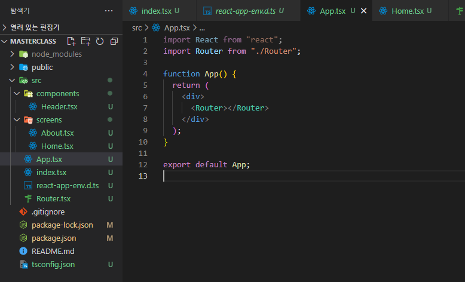

# Router

```
npm i react-router-dom@6.4
```

### 첫 번째 방식(BrowswerRouter)

```tsx
import { BrowserRouter, Route, Routes } from "react-router-dom";
import Header from "./components/Header";
import About from "./screens/About";
import Home from "./screens/Home";

function Router() {
  return (
    <BrowserRouter>
      <Header />
      <Routes>
        <Route path="/" element={<Home />} />
        <Route path="/about" element={<About />} />
      </Routes>
    </BrowserRouter>
  );
}
export default Router;
```

> `Switch`대신 `Routes`가 사용되었고 `Route`안에 `component`가 `prop`되었다. `Header`는 `Nav`의 역할을 대신한다.

```tsx
import { Link } from "react-router-dom";

function Header() {
  return (
    <header>
      <ul>
        <li>
          <Link to={"/"}>Home</Link>
        </li>
        <li>
          <Link to={"/about"}>About</Link>
        </li>
      </ul>
    </header>
  );
}
export default Header;
```

```tsx
import React from "react";
import Router from "./Router";

function App() {
  return (
    <div>
      <Router></Router>
    </div>
  );
}

export default App;
```

