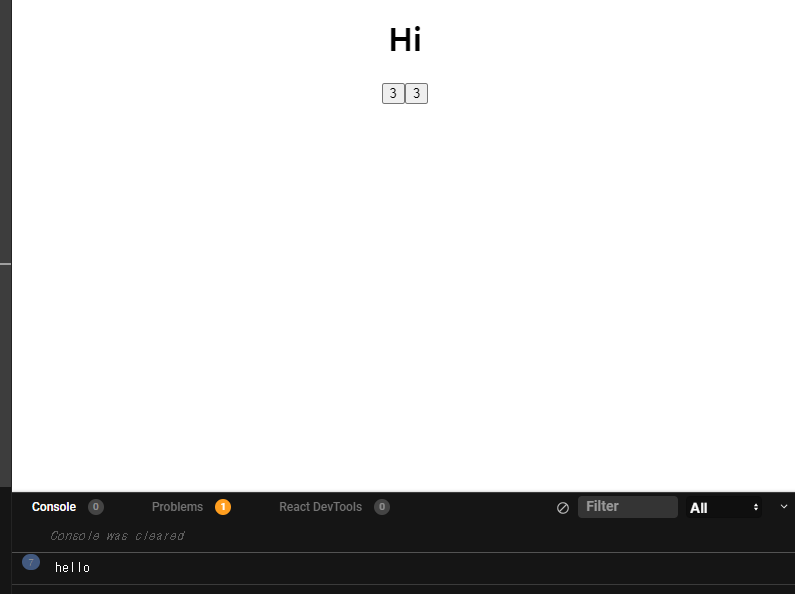
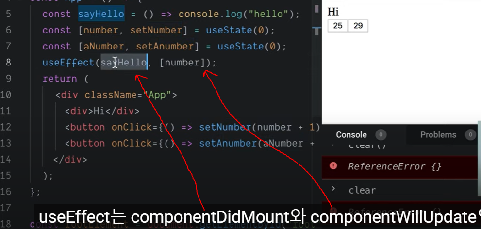

# USEEFFECT

- `UseEffect`는 `componentDidmount`, `componentDidUpdate`의 역할을 한다.
  - 아래 버튼을 누르면 계속해서 `hello`를 출력한다.

```js
import React, { useState, useEffect } from "react";
import "./styles.css";

export default function App() {
  const sayHello = () => {
    console.log("hello");
  };
  useEffect(() => {
    sayHello();
  });
  const [number, setNumber] = useState(0);
  const [anumber, setAnumber] = useState(0);
  return (
    <div className="App">
      <h1>Hi</h1>
      <button onClick={() => setNumber(number + 1)}>{number}</button>
      <button onClick={() => setAnumber(anumber + 1)}>{anumber}</button>
    </div>
  );
}
```



> `useEffect`가 `sayHello`를 `component`가 `mount` 되었을 때 실행 시켰다.




### useTitle

- `componentDidMount`, `componentWillupdate`기능을 가지고 있음

```js
import React, { useState, useEffect } from "react";
import "./styles.css";

const useTitle = (initialTitle) => {
  const [title, setTitle] = useState(initialTitle);
  const updateTitle = () => {
    const htmlTitle = document.querySelector("title");
    htmlTitle.innerText = title;
  };
  useEffect(updateTitle, [title]);
  return setTitle;
};

export default function App() {
  const titleUpdator = useTitle("Loading...");
  setTimeout(() => titleUpdator("Home"), 5000);
  return (
    <div className="App">
      <h1>Hi</h1>
    </div>
  );
}
```


### useClick

- `reference`는 기본적으로 우리의 `component`의 어떤 부분을 선택할 수 있는 방법이다.
  - `document.getElementByID()`를 사용한 것과 동등함

- `react`에 있는 모든 `component`는 `reference element`를 가지고 있다.

```js
import React, { useState, useEffect, useRef } from "react";
import "./styles.css";

export default function App() {
  const potato = useRef();
  setTimeout(() => potato.current.focus(), 5000);
  return (
    <div className="App">
      <h1>Hi</h1>
      <input ref={potato} placeholder="la" />
    </div>
  );
}
```

> 5초 뒤에 `input`창에 커서가 들어온다.


### useConfirm

- 확인 과정을 거쳐서 `true`이면 `callback`함수가 실행되도록 한다.

```js
import React, { useState, useEffect, useRef } from "react";
import "./styles.css";

const useConfirm = (message = "", callback, rejection) => {
  if (typeof callback !== "function") {
    return;
  }
  const confirmAction = () => {
    if (confirm(message)) {
      callback();
    } else {
      rejection();
    }
  };
  return confirmAction;
};

export default function App() {
  const deleteWorld = () => {
    console.log("Deleting the world..");
  };
  const abort = () => {
    console.log("Aborted");
  };
  const confirmDelete = useConfirm("Are you sure", deleteWorld, abort);
  return (
    <div className="App">
      <button onClick={confirmDelete}>Delete the world</button>
    </div>
  );
}

```


### usePreventLeave

- 페이지를 나가려고 할 때 저장하시겠습니까?를 띄워준다.
  - `event.returnValue = "";`이걸 꼭 붙여줘야 크롬이 동작한다.(이유는 모름...)
  - `protect`를 누르고 나가려고 하면 확인 창이 뜨게 된다.

```js
import React, { useState, useEffect, useRef } from "react";
import "./styles.css";

const usePreventLeave = () => {
  const listener = (event) => {
    event.preventDefault();
    event.returnValue = "";
  };
  const enablePrevent = () => window.addEventListener("beforeunload", listener);
  const disablePrevent = () =>
    window.removeEventListener("beforeunload", listener);
  return { enablePrevent, disablePrevent };
};

export default function App() {
  const { enablePrevent, disablePrevent } = usePreventLeave();
  return (
    <div className="App">
      <button onClick={enablePrevent}>Protect</button>
      <button onClick={disablePrevent}>Unprotect</button>
    </div>
  );
}
```


### useBeforeLeave

```js
import React, { useState, useEffect, useRef } from "react";
import "./styles.css";

const useBeforeLeave = (onBefore) => {
  if (typeof onBefore !== "function") {
    return;
  }
  const handle = () => {
    console.log("leaving");
  };
  useEffect(() => {
    document.addEventListener("mouseleave", handle);
    return () => document.removeEventListener("mouseleave", handle);
  }, []);
};

export default function App() {
  const beforeLife = () => console.log("pls don't leave");
  useBeforeLeave(beforeLife);
  return (
    <div className="App">
      <h1>Hello</h1>
    </div>
  );
}

```

