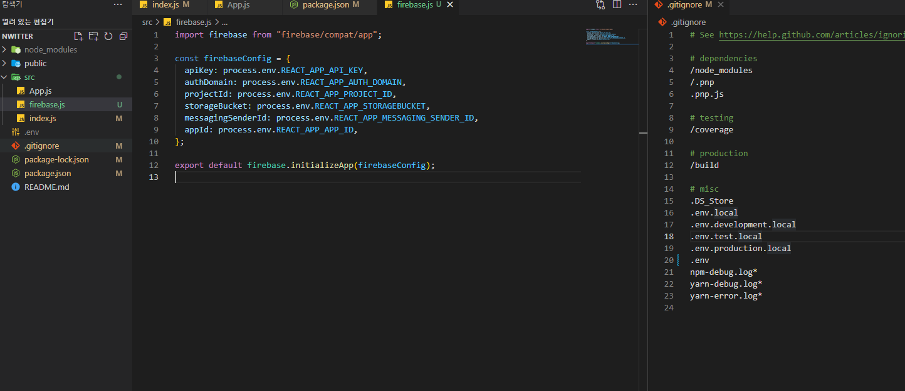

# Firebase

- `Firebase`는 원래 데이터베이스였는데, 구글이 인수하고 확장시켰다.
  - `aws`의 `amplify`는 `Firebase`의 경쟁 상대이다.
  - `amplify`가 최근에 만들어졌고 커뮤니티 양이 적지만, `Rest API`등등 다른 기능들도 지원한다

- `Firebase`와 `amplify`는 단순히 빠른 앱 개발에 사용해야 한다.
  - 모든 정보들이 구글과 아마존에 종속되어 있어서, 나만의 사용자, 서버 등등이 모두 존재하지 않는다
  - 추후에 이 아이디어가 힘을 얻게된다면, 나만의 플랫폼을 가져야 한다

- `Firebase`로부터 프로젝트를 만든 후에는 다양한 기본 설정들을 해준다
  - `API_KEY`같은 것들은 `.env`로 모두 숨겨주면 된다.
  - `REACT_APP`을 앞에 반드시 삭제해야한다.
  - 가장 최상단에 있어야한다.

> 환경 변수 설정으로 중요한 정보들을 숨기는데 이것은 오로지 `github`에 올라가는 것을 방지한다. `App`을 실행하게 되면 저 값들이 어쩔 수 없이 모두 드러나게 되어있다. 서버를 빌드하고 웹사이트를 띄우면 `create-react-app`은 이 코드들을 실제 값들로 변환한다.