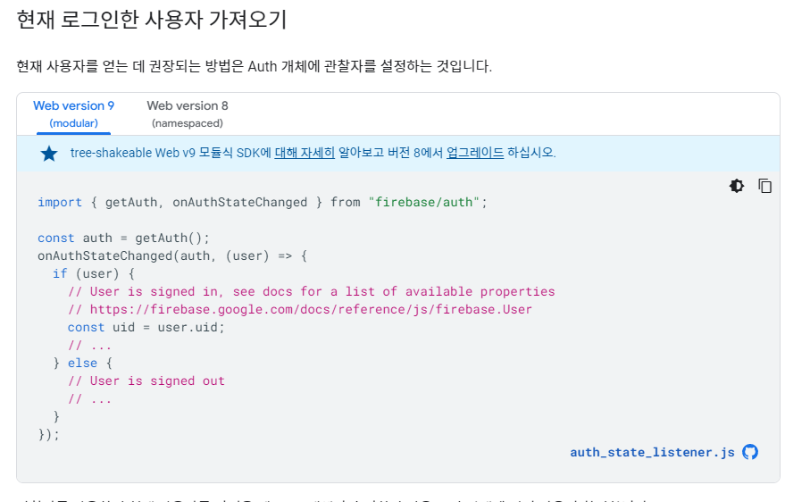

# Authentication

- 기본적으로 `firebase`기반으로 모든 것이 동작한다.

> 공식문서를 활용하자!
>
> https://firebase.google.com/docs/auth/web/password-auth

- 기본적으로 `event listener`이고 유저 상태에 변화가 있을 때 알아차린다.
  - 로그인, 로그아웃, 계정 생성, firbase 초기화 이 모든 것을 알아차린다.



```js
import React, { useEffect, useState } from "react";
import AppRouter from "components/Router";
import { authService } from "fbase";
import { getAuth, onAuthStateChanged } from "firebase/auth";

const App = () => {
  const [init, setInit] = useState(false);
  const auth = getAuth();
  const [isLoggedIn, setIsLoggedIn] = useState(false);
  useEffect(() => {
    onAuthStateChanged(auth, (user) => {
      if (user) {
        setIsLoggedIn(true);
      } else {
        setIsLoggedIn(false);
      }
      setInit(true);
    });
  }, []);
  return (
    <>
      <AppRouter isLoggedIn={isLoggedIn} />
      <footer>&copy; {new Date().getFullYear()}Nwitter</footer>
    </>
  );
};

export default App;

```

> `setinit`은 만약 false라면 router를 숨길 예정이다. 로그인하거나 계정을 생성하거나 이미 로그인 되어서 firebase가 스스로 초기화하는 것을 끝낸 상태.


- 로그인 기능 구현
  - 토글 형식으로 회원 가입이나 로그인으로 버튼이 변경 가능하다
  - 에러 발생시 화면에 표시되도록 진행했다
  - `createUserWithEmailAndPassword`는 회원가입 시
  - `signInWithEmailAndPassword`는 로그인 시 사용한다

```js
import {
  getAuth,
  createUserWithEmailAndPassword,
  signInWithEmailAndPassword,
} from "firebase/auth";
import React, { useState } from "react";

const Auth = () => {
  const [email, setEmail] = useState("");
  const [password, setPassword] = useState("");
  const [newAccount, setNewAccount] = useState(true);
  const [error, setError] = useState("");
  const onChange = (event) => {
    const {
      target: { name, value },
    } = event;
    if (name === "email") {
      setEmail(value);
    } else if (name === "password") {
      setPassword(value);
    }
  };
  const onSubmit = async (event) => {
    event.preventDefault();
    let data;
    const auth = getAuth();
    try {
      if (newAccount) {
        //create account
        data = await createUserWithEmailAndPassword(auth, email, password);
      } else {
        //log in
        data = await signInWithEmailAndPassword(auth, email, password);
      }
      console.log(data);
    } catch (err) {
      console.log(err);
      setError(err.message);
    }
  };

  const toggleAccount = () => {
    setNewAccount((prev) => !prev);
  };
  return (
    <div>
      <form onSubmit={onSubmit}>
        <input
          name="email"
          type="email"
          placeholder="Email"
          required
          value={email}
          onChange={onChange}
        />
        <input
          name="password"
          type="password"
          placeholder="password"
          required
          value={password}
          onChange={onChange}
        />
        <input type="submit" value={newAccount ? "Create Account" : "Log In"} />
        {error}
      </form>
      <span onClick={toggleAccount}>
        {newAccount ? "Sign in" : "Create Account"}
      </span>
      <div>
        <button>Continue with Google</button>
        <button>Continue with Github</button>
      </div>
    </div>
  );
};
export default Auth;
```


- 소셜로그인

```js
const onSocialClick = async (event) => {
    console.log(event.target.name);
    const auth = getAuth();
    let provider;
    const {
      target: { name },
    } = event;
    if (name === "google") {
      provider = new GoogleAuthProvider();
      const result = await signInWithPopup(auth, provider);
      const credential = GoogleAuthProvider.credentialFromResult(result);
      const token = credential.accessToken;
      const user = result.user;
      console.log(result);
      console.log(user);
      console.log(token);
    } else if (name === "github") {
      provider = new GithubAuthProvider();
      const result = await signInWithPopup(auth, provider);
      const credential = GithubAuthProvider.credentialFromResult(result);
      const token = credential.accessToken;
      const user = result.user;
      console.log(result);
      console.log(user);
      console.log(token);
    }
  };
```

> 깃헙과 구글로 연동해서 로그인이 가능하다. 순전히 `firebase`의 기능을 활용한 사례


- 로그아웃
  - `authService`의 `signOut`메서드를 활용하면 된다.
  - `useNavigate`기능을 이용해서 로그아웃이 되면 `home`으로 이동하도록 설정 가능

```js
import { authService } from "fbase";
import React from "react";
import { useNavigate } from "react-router-dom";

const Profile = () => {
  const navigate = useNavigate();
  const onLogOutClick = async () => {
    await authService.signOut();
    navigate("/");
  };
  return (
    <>
      <button onClick={onLogOutClick}>Log Out</button>
    </>
  );
};
export default Profile;
```


- Router 설정
  - `App`에서 `BrowserRouter`로 감싼 다음에 `Routes`로 한번 더 `Route`들을 감싼다
  - `Link`는 기본적으로 `Router`내에서 활동하는 것 같다
    - `a`태그는 페이지를 새로고침 해서 느린편이고, `Link`는 `HTML5`의 `History`를 활용해서 페이지를 이동시켜주기 때문에 빠르다.

```js
///APP.js
<BrowserRouter>
      {isLoggedIn && <Navigation />}
      <Routes>
        {init ? (
          <Route path="*" element={<AppRouter isLoggedIn={isLoggedIn} />} />
        ) : (
          "Initializing..."
        )}
      </Routes>
      <footer>&copy; {new Date().getFullYear()}Nwitter</footer>
    </BrowserRouter>


//Router
    <Routes>
      {isLoggedIn ? (
        <>
          <Route path="/" element={<Home />} />
          <Route path="/profile" element={<Profile />} />
        </>
      ) : (
        <Route path="/" element={<Auth />} />
      )}
    </Routes>

// Nav
    <nav>
      <ul>
        <li>
          <Link to="/">Home</Link>
        </li>
        <li>
          <Link to="/profile">My Profile</Link>
        </li>
      </ul>
    </nav>
```

