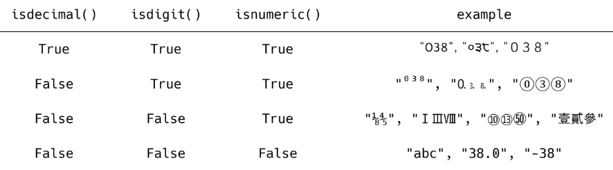

# 데이터 구조 및 활용

- 데이터 구조를 활용하기 위해서는 메서드(method)를 활용
  - 메서드는 클래스 내부에 정의한 함수, 사실상 함수 동일
  - 쉽게 설명하자면 객체의 기능(추후 객체 지향 프로그래밍에서 학습)
  - `데이터구조.메서드()`

- 파이썬 공식 문서의 표기법
  - python 구문이 아니며, 문법을 표현하기 위한 것임
  - 아래 예시에서 `str.replace(old, new[,count])`
    - old, new는 필수 / [,count]는 선택적 인자를 의미함

### 문자열(String Type)

- 문자들의 나열(sequence of characters)
  - 모든 문자는 str타입(변경 불가능한 immutable)

- 문자열은 작은 따옴표(')나 큰 따옴표(")를 활용하여 표기

  - 문자열을 묶을 때 동일한 문장부호를 활용
  - PEP8에서는 소스코드 내에서 하나의 문장부호를 선택하여 유지하도록 함

  - vscode에서 `alt + shift + 방향키`는 코드 복사
  - `alt + 방향키` 코드를 이동

|     문법      |                             설명                             |
| :-----------: | :----------------------------------------------------------: |
|  `s.find(x)`  |          x의 첫 번째 위치를 반환. 없으면, -1을 반환          |
| `s.index(x)`  |          x의 첫 번째 위치를 반환. 없으면, 오류 발생          |
| `s.isalpha()` | 알파벳 문자 여부<br />*단순 알파벳이 아닌 유니코드 상 Letter(한국어도 포함) |
| `s.isupper()` |                         대문자 여부                          |
| `s.islower()` |                         소문자 여부                          |
| `s.istitle()` |                       타이틀 형식 여부                       |

- 문자열 조회/탐색

```python
print('apple'.find('p')) # 1
print('apple'.find('k')) # -1
```

> vscode 실행 시 오류가 나면 `exit()`을 눌러서 나온 뒤 `git besh`에서 실행

- 문자열 관련 검증 메서드
  - .isdecimal() > .isdigit() > .isnumeric()



- 문자열 변경 메서드

| 문법                             | 설명                                                         |
| -------------------------------- | ------------------------------------------------------------ |
| `s.replace(old, new[,count])`    | 바꿀 대상 글자를 새로운 글자로 바꿔서 반환                   |
| `s.strip([chars])`               | 공백이나 특정 문자를 제거                                    |
| `s.split(sep=None, maxsplit=-1)` | 공백이나 특정 문자를 기준으로 분리                           |
| `'separator'.join([iterable])`   | 구분자로 iterable을 합침                                     |
| `s.capitalize()`                 | 가장 첫 번째 글자를 대문자로 변경                            |
| `s.title()`                      | 문자열 내 띄어쓰기 기준으로 각 단어의 첫글자는 대문자로, 나머지는 소문자로 변환 |
| `s.upper()`                      | 모두 대문자로 변경                                           |
| `s.lower()`                      | 모두 소문자로 변경                                           |
| `s.swapcase()`                   | 대<>소문자 서로 변경                                         |

- `.replace(old, new[,count])`
  - 바꿀 대상 글자를 새로운 글자로 바꿔서 반환
  - count를 지정하면, 해당 개수만큼만 시행

```python
print('wooooowoo'.replace('o','!',2)) # w!!ooowoo
```

- `.strip([chars])`
  - 문자열을 지정하지 않으면 공백을 제거함

```python
print('안녕하세요???'.rstrip('?')) # '안녕하세요'
```

- `.split(sep=None, maxsplit=-1)`
  - 문자열을 특정한 단위로 나눠 리스트로 반환

- `'separator'.join([iterable])`
  - 반복가능한(iterable) 컨테이너 요소들을 separator(구분자)로 합쳐 문자열 반환

- 리스트 메서드

| 문법                     | 설명                                                         |
| ------------------------ | ------------------------------------------------------------ |
| `L.append(x)`            | 리스트 마지막에 항목 x를 추가                                |
| `L.insert(i, x)`         | 리스트 인덱스 i에 항목 x를 삽입<br />리스트 길이보다 큰 경우 맨 뒤에 삽입 |
| `L.remove(x)`            | 리스트 가장 왼쪽에 있는 항목(첫 번째)x를 제거<br />항목이 존재하지 않을 경우, ValueError |
| `L.pop()`                | 리스트 가장 오른쪽에 있는 항목(마지막)을 반환 후 제거        |
| `L.pop(i)`               | 리스트의 인덱스 i에 있는 항목을 반환 후 제거                 |
| `L.extend(m)`            | 순회형 m의 모든 항목들의 리스트 끝에 추가 (+=와 같은 기능)   |
| `L.index(x, start, end)` | 리스트에 있는 항목 중 가장 왼쪽에 있는 항목 x의 인덱스를 반환 |
| `L.reverse()`            | 리스트를 거꾸로 뒤집음                                       |
| `L.sort()`               | 리스트를 정렬 (매개변수 이용가능)<br />원본 리스트를 정렬함. None 반환(sorted 함수와 비교할 것) |
| `L.count(x)`             | 리스트에서 항목 x가 몇 개 존재하는지 개수를 반환             |

- 튜플은 여러 개의 값을 순서가 있는 구조로 저장하고 싶을 때 사용

  - 담고 있는 값 변경이 불가(불변 자료형)

  - 튜플은 변경할 수 없기에 값에 영향을 미치지 않는 메서드만 지원

```python
day_name = ('월', '화', '수', '목', '금')
day_name += False, True
day_name = ('월', '화', '수', '목', '금', False, True) <- 새로운 변수 생성
```

- 멤버십 연산자(Membership Operator)
  - 포함 여부 확인
    - in
    - not in
- 리스트, 튜플, 문자열은 산술(+), 반복(*)이 가능함 (-는 안되더라)

### 셋(set)

- set이란 중복되는 요소가 없이, 순서에 상관없는 데이터들의 묶음
- 수학에서의 집합 연산이 가능
- 담고 있는 요소를 삽입 변경, 삭제 가능

| 문법              | 설명                                                         |
| ----------------- | ------------------------------------------------------------ |
| `s.copy()`        | 셋의 얕은 복사본을 반환                                      |
| `s.add(x)`        | 항목 x가 셋 s에 없다면 추가                                  |
| `s.pop()`         | 셋 s에서 랜덤하게 항목을 반환하고, 해당 항목을 제거 set이 비어 있을 경우, KeyError |
| `s.remove(x)`     | 항목 x를 셋 s에서 삭제<br />항목이 존재하지 않을 경우, KeyError |
| `s.discard(x)`    | 항목 x가 셋 s에 있는 경우, 항목 x를 셋 s에서 삭제(에러가 안남) |
| `s.update(t)`     | 셋 t에 있는 모든 항목 중 셋 s에 없는 항목을 추가             |
| `s.clear()`       | 모든 항목을 제거                                             |
| `s.isdisjoint(t)` | 셋 s가 셋 t의 서로 같은 항목을 하나라도 갖고 있지 않은 경우, True 반환(서로소) |
| `s.issubset(t)`   | 셋 s가 셋 t의 하위 셋인 경우, True 반환                      |
| `s.issuperset(t)` | 셋 s가 셋 t의 상위 셋인 경우, True 반환                      |

> a = {}는 빈 set가 아니라 빈 딕셔너리가 추출됨, a = set()

### 딕셔너리(Dictionary)

| 문법                | 설명                                                         |
| ------------------- | ------------------------------------------------------------ |
| `d.clear()`         | 모든 항목을 제거                                             |
| `d.copy()`          | 딕셔너리 d의 얕은 복사본을 반환                              |
| `d.keys()`          | 딕셔너리 d의 모든 키를 담은 뷰를 반환                        |
| `d.values()`        | 딕셔너리 d의 모든 값을 담은 뷰를 반환                        |
| `d.items()`         | 딕셔너리 d의 모든 키-값의 싸을 담은 뷰를 반환                |
| `d.get(k)`          | 키 k의 값을 반환하는데, 키 k가 딕셔너리 d에 없을 경우 None을 반환 |
| `d.get(k, v)`       | 키 k의 값을 반환하는데, 키 k가 딕셔너리 d에 없을 경우 v를 반환 |
| `d.pop(k)`          | 키 k의 값을 반환하고 키 k인 항목을 딕셔너리 d에서 삭제하는데, 키 k가 딕셔너리 d에 없을 경우 KeyError를 발생 |
| `d.pop(k, v)`       | 키 k의 값을 반환하고 키 k인 항목을 딕셔너리 d에서 삭제하는데, 키 k가 딕셔너리 d에 없을 경우 v를 반환 |
| `d.update([other])` | 딕셔너리 d의 값을 매핑하여 업데이트                          |

### 복사 방법

- 할당(assignment)
  - 대입 연산자(=)

```python
orgin_list = [1, 2, 3]
copy_list = origin_list
print(origin_list, copy_list) # [1, 2, 3] [1, 2, 3]

copy_list[0] = 'hello'
print(origin_list, copy_list) # ['hello', 2, 3] ['hello', 2, 3]
# 주소를 공유하는 것, 대입 연산자를 통한 복사는 해당 객체에 대한 객체 참조를 복사
```

- 얕은 복사(shallow copy)
  - Slice 연산자 활용하여 같은 원소를 가진 리스트지만 연산된 결과를 복사(다른 주소)

```python
a = [1, 2, 3]
b = a[:] # 1차원에서만 가능
print(a, b) # [1, 2, 3] [1, 2, 3]
b[0] = 5
print(a, b) # [1, 2, 3] [5, 2, 3]
```

> 주의사항
>
> > 복사하는 리스트의 원소가 주소를 참조하는 경우

```python
a = [1, 2, ['a', 'b']]
b = a[:]
print(a, b) # [1, 2, ['a', 'b']] [1, 2, ['a', 'b']]
b[2][0] = 0
print(a, b) # [1, 2, [0, 'b']] [1, 2, [0, 'b']]
```

- 깊은 복사(deep copy)
  - 리스트를 복사할 때는 `deep copy`를 해주면 좋다

```python
import copy
a = [1, 2, ['a', 'b']]
b = copy.deepcopy(a)
print(a, b) # [1, 2, ['a', 'b']] [1, 2, ['a', 'b']]
b[2][0] = 0
print(a, b) # [1, 2, ['a', 'b']] [1, 2, [0, 'b']]
```

