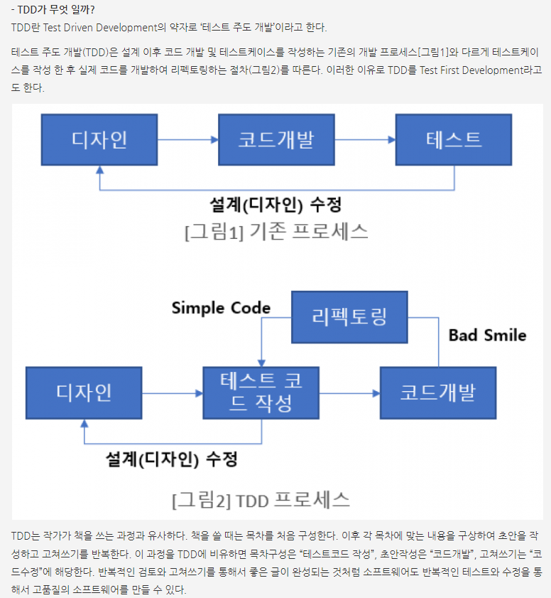
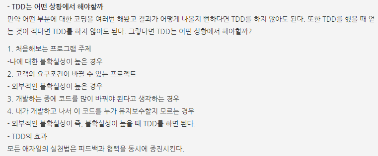
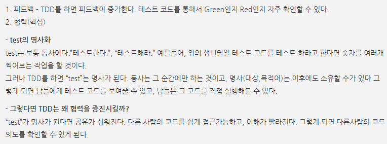

# 회원 리포지토리 테스트 케이스 작성

개발한 기능을 실행해서 테스트 할 때 자바의 main 메서드를 통해서 실행하거나, 웹 애플리케이션의 컨트롤러를 통해서 해당 기능을 실행한다. 이러한 방법은 준비하고 실행하는데 오래 걸리고, 반복 실행하기 어렵고 여러 테스트를 한번에 실행하기 어렵다는 단점이 있다. 자바는 JUnit이라는 프레임워크로 테스트를 실행해서 이러한 문제를 해결한다.

```java
// sout 하고 ctrl + space가 System.out.println();의 단축키 이다.

// shift + tab은 현재 줄에 영향을 주지 않고 줄바꿈

// shift + F6을 누르면 변수명을 동시에 바꿀 수 있다.

// class 레벨에서 돌리거나 폴더를 돌리면 전체 케이스를 테스트할 수 있다.
```


> 실행 순서는 상관이 없다. 메소드 따로 실행이 되도록 해야함
>
> 그래서 테스트가 끝나면 데이터를 지워주어야 한다.(저장소나 공용데이터 삭제)
>
> 테스트끼리 의존성이 없어야 한다.

```java
//Domain
package hello.hellospring.domain;

public class Member {
    // id는 시스템이 구분하기 위해서, name은 사용자 이름
    private Long id;
    private String name;

    public Long getId() {
        return id;
    }

    public void setId(Long id) {
        this.id = id;
    }

    public String getName() {
        return name;
    }

    public void setName(String name) {
        this.name = name;
    }
}
```

```java
//repository
package hello.hellospring.repository;

import hello.hellospring.domain.Member;

import java.util.List;
import java.util.Optional;

public interface MemberRepository {
    // 회원을 저장하면 저장된 회원이 반환
    Member save(Member member);
    // Optional은 자바 8에 들어가 있는 기능, 정보가 없으면 Null 대신 Optional을 감싸서 나옴
    Optional<Member> findById(Long id);
    Optional<Member> findByName(String name);
    List<Member> findAll();
}
```

```java
//repository
package hello.hellospring.repository;

import hello.hellospring.domain.Member;

import java.util.*;

public class MemoryMemberRepository implements MemberRepository{
    private static Map<Long, Member> store = new HashMap<>();
    // sequence는 0, 1, 2와 같이 키값을 만들어주는 것
    private static long sequence = 0L;

    @Override
    public Member save(Member member) {
        member.setId(++sequence);
        store.put(member.getId(), member);
        return member;
    }

    @Override
    public Optional<Member> findById(Long id) {
        //null을 반환하는 게 아니라 Optional을 감싸서 넘겨줌
        // 클라이언트에서 무언가 처리를 할 수 있음
        return Optional.ofNullable(store.get(id));
    }

    @Override
    public Optional<Member> findByName(String name) {
        return store.values().stream()
                .filter(member -> member.getName().equals(name))
                .findAny();
    }

    @Override
    public List<Member> findAll() {
        return new ArrayList<>(store.values());
    }

    public void clearStore() {
        store.clear();
    }
}

```

```java
//test
package hello.hellospring.repository;

import hello.hellospring.domain.Member;
import org.assertj.core.api.Assertions;
import org.junit.jupiter.api.AfterEach;
import org.junit.jupiter.api.Test;

import java.util.List;
import java.util.Optional;

import static org.assertj.core.api.Assertions.*;

class MemoryMemberRepositoryTest {

    MemoryMemberRepository repository = new MemoryMemberRepository();

    // 동작이 끝날때마다 수행하는 것(콜백 메서드)
    @AfterEach
    public void afterEach() {
        repository.clearStore();
    }

    @Test
    public void save() {
        Member member = new Member();
        member.setName("spring");

        repository.save(member);

        //반환값이 Optional임
        Member result = repository.findById(member.getId()).get();
        // 기대하는 것은 find 했을 때 member가 나와야 한다.
//        Assertions.assertEquals(member, result);


        assertThat(member).isEqualTo(result);
    }

    @Test
    public void findByName() {
        Member member1 = new Member();
        member1.setName("spring1");
        repository.save(member1);

        Member member2 = new Member();
        member2.setName("spring2");
        repository.save(member2);


//        Optional<Member> result = repository.findByName("spring1");
        // .get을 하면 Optional을 벗고 나올 수 있다.
        Member result = repository.findByName("spring1").get();
        assertThat(result).isEqualTo(member1);
    }

    @Test
    public void findAll() {
        Member member1 = new Member();
        member1.setName("spring1");
        repository.save(member1);

        Member member2 = new Member();
        member2.setName("spring2");
        repository.save(member2);

        List<Member> result = repository.findAll();

        assertThat(result.size()).isEqualTo(2);

    }
}
```


---

### ✔ 테스트 주도 개발 (TDD)

- 테스트를 먼저 만들고 구현부를 만들어서 진행







