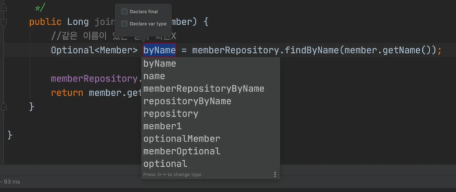
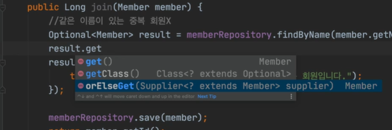

# 회원 서비스 개발

`Ctrl` + `Alt` + `V`를 누르면 변수 자동 완성 생성




- `get`보다는 `orElseGet`을 사용
  - 값이 없으면 안에 있는 메서드를 실행해라는 의미(Default값을 넣어서 꺼내)




- 이와 같이 로직이 있을 경우 메서드로 뽑는 게 좋다
  - 단축키 `Shift `+ `Ctrl` + `Alt`  + `T` 은 리팩토링과 관련된 창이 뜬다. method 입력 후 Extract 클릭

- `Repository`는 데이터를 넣었다, 뺐다 하는 것에 가까운데, `service`는 비지니스에 가까운 로직 구현(서비스는 비지니스에 의존해서 구현)
  - 롤에 맞도록 네이밍을 한다.

```java
package hello.hellospring.service;

import hello.hellospring.domain.Member;
import hello.hellospring.repository.MemberRepository;
import hello.hellospring.repository.MemoryMemberRepository;

import java.util.List;
import java.util.Optional;

public class MemberService {

    private final MemberRepository memberRepository = new MemoryMemberRepository();

    /**
     * 회원 가입
     */
    public Long join(Member member) {

//        // 같은 이름이 있는 중복 회원 X
//        Optional<Member> result = memberRepository.findByName(member.getName());
//
//        // null이 아닌 값이 있으면(Optional이어서 가능)
//        // Optional 안에 멤버 변수가 있는 느낌이어서, Optional의 여러 메서드를 활용할 수 있다.
//        // 이전에는 if null을 썼지만 지금은 null 가능성이 있으면 Optional을 한번 감싸준다
//        result.ifPresent(m -> {
//            throw new IllegalStateException("이미 존재하는 회원입니다.");
//        });

        /*
        위 두 가지를 합쳐서 표현할 수 있다. memberRepository 자체가 Optional이기 때문에
         */
        validateDuplicateMember(member); // 중복 회원 검증
        memberRepository.save(member);
        return member.getId();
    }

    private void validateDuplicateMember(Member member) {
        memberRepository.findByName(member.getName())
                .ifPresent(m -> {
                    throw new IllegalStateException("이미 존재하는 회원입니다.");
                });
    }

    /**
     * 전체 회원 조회
     */
    public List<Member> findMembers() {
        return memberRepository.findAll();
    }

    public Optional<Member> findOne(Long memberId) {
        return memberRepository.findById(memberId);
    }

}
```

