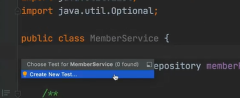
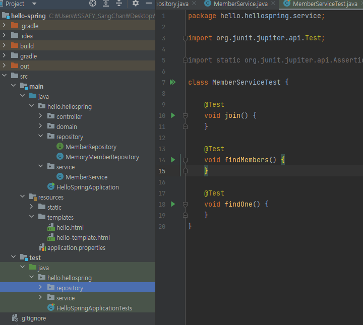

# 회원 서비스 테스트

- `ctrl` + `shit` + `T` 를 누르면Test를 자동으로 만들어주는 탭이 생긴다





> 껍데기도 자동으로 만들어준다.

- Test에서 직관적으로 메서드 명을 한글로도 적어준다.
  - 실제로 코드에 반영이 되지도 않고 가독성이 좋아진다.

- 한 줄 복사 단축키는 `Ctrl` + `D` 이다.
- 회원가입의 경우 예의 상황을 파악하는 것이 중요하기 때문에 일부러 에러를 발생시키는 테스트를 작성한다.
- `try`~`catch`구문이 아니라 `assertThrows`를 쓰면 더 편리함. `IllegalStateException`이  발생해야한다를 의미.
- `shift` + `F10`을 누르면 이전에 실행했던 것을 한 번더 실행해줌.

```java
    @Test
    void 회원가입() {
        //given 무언가가 주어졌는데
        Member member = new Member();
        member.setName("hello");

        //when 이걸로 실행했을 때
        Long saveId = memberService.join(member);

        //then 결과가 이것으로 나와야 한다.(검증)
        Member findMember = memberService.findOne(saveId).get();
        assertThat(member.getName()).isEqualTo(findMember.getName());
    }

    @Test
    public void 중복_회원_예외() {
        //given
        Member member1 = new Member();
        member1.setName("spring");

        Member member2 = new Member();
        member2.setName("spring");

        //when
        memberService.join(member1);
        assertThrows(IllegalStateException.class, () -> memberService.join(member2));


//        try {
//            memberService.join(member2);
//            fail();
//        } catch (IllegalStateException e) {
//            assertThat(e.getMessage()).isEqualTo("이미 존재하는 회원입니다.");
//        }

        //then
    }
```

