# JSP

- Servlet 표준을 기반으로 작성된 웹 어플리케이션 개발 언어
- 요청을 처리하고 응답을 구성하는 방법을 작성. 정적 요소(HTML, XML 등)와 동적 요소(JSP 객체)를 모두 포함하는 텍스트 기반 문서인 JSP 페이지를 개발하기 위한 언어
- 서버측 객체에 접근하기 위한 표현 언어

- HTML 안에 Java 코드를 삽입할 수 있게 해줌
  - 경우에 따라 Servlet도 사용

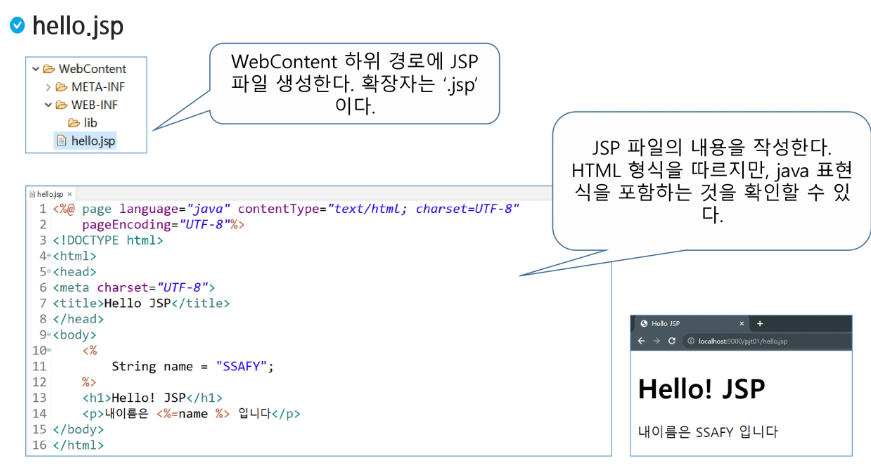

```jsp
<%@ page language="java" contentType="text/html; charset=UTF-8"
    pageEncoding="UTF-8"%>
<!DOCTYPE html>
<html>
<head>
<meta charset="UTF-8">
<title>Hello JSP</title>
</head>
<body>
	<% String name = "SSAFY"; %>
	
	<h1>Hello! JSP</h1>
	<p>내 이름은 <%=name %> 입니다</p>
</body>
</html>
```

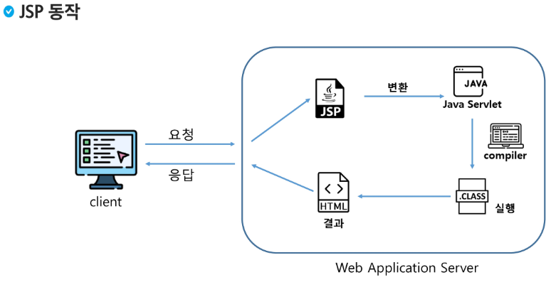

> JSP가 `.java`인 클래스로 변경 -> 컴파일러가 `.class`로 바꿈.

### JSP 구성요소

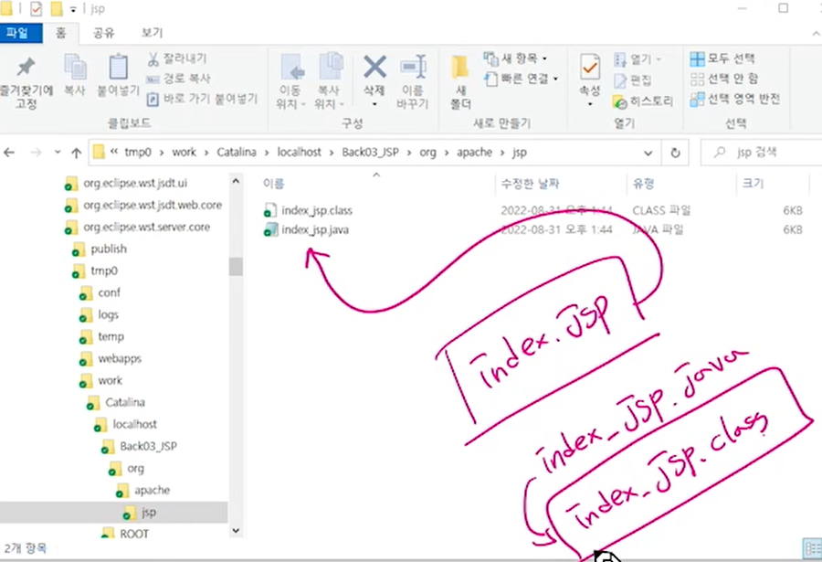

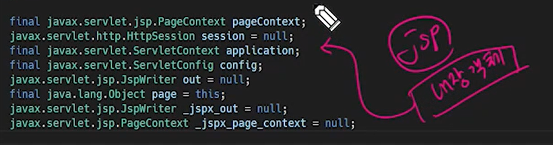

> JSP 내장 객체들이 존재

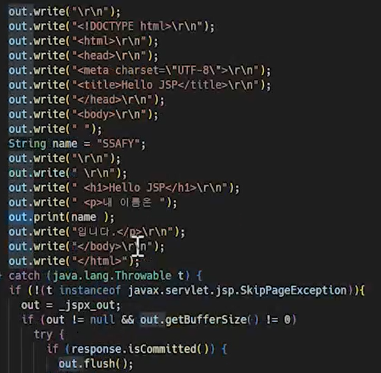

- `JSP`가 `.java`로 만들어진 것을 보면 클래스 내에 사용할 수 있는 여러 객체들이 존재하고, `HTTP` 메서드도 `GET`, `POST` 등을 받을 수 있으며, `request`와 `response`를 모두 사용한다. `response`의 형식도 자동으로 맞춰서 들어가 있음.


### JSP 구성요소

- 지시자(Directive)
  - JSP 페이지에 대한 설정 정보를 지정하기 위해서 사용
- 스크립트 요소: 스크립트릿(Scriptle), 표현식(Expression), 선언부(Declaration)
  - JSP에서 문서의 내용을 동적으로 생성하기 위해서 사용
  - 스크립트릿: `<%  %>`
  - 표현식: `<%=  %>`
  - 선언부: `<%!  %>`
- JSP 기본객체
  - 요청 및 응답 관련 정보를 얻거나, 응답 결과를 만들기 위해서 사용

- 표현언어 (Expression Language)
  - JSP를 좀 더 간결하게 작성하기 위해서 사용
- Action Tag와 JSTL
  - 자주 사용하는 기능을 모아 미리 정의하여 Tag형태로 작성한다.
  - JSP에서 자바코드를 쉽게 작성할 수 있도록 사용


### 지시자(Directive)

- 웹 컨테이너(톰캣)가 JSP를 번역하고 실행하는 방법을 서술
- 대표적으로 page, include, taglib 와 같은 디렉티브가 있다.
- page 지시자
  - JSP 페이지 실행 매개변수를 제어
  - 출력 처리, 오류 처리 등의 내용을 포함
  - 주요 속성으로 language, contentType, import, session, pageEncoding, errorPage, autoFlush 등이 있다.


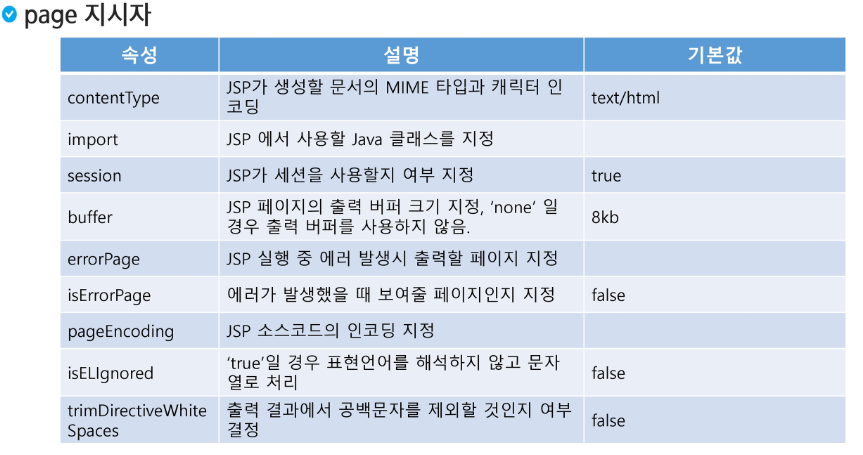

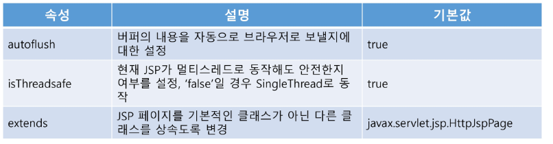

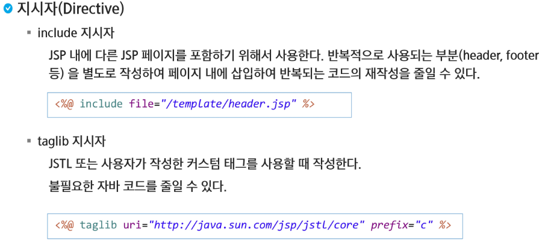

> 변경 사항을 전부 수정할 필요 없이 jsp파일을 만들어서 include로 집어넣는다.
>
> 지시자를 쓰기 위해서 `<%@  %>`를 사용한다.
>
> file에서 첫 `/`는 `Webapp`을 의미한다.


- `header`에는 로그인이나 메뉴 등을 사용

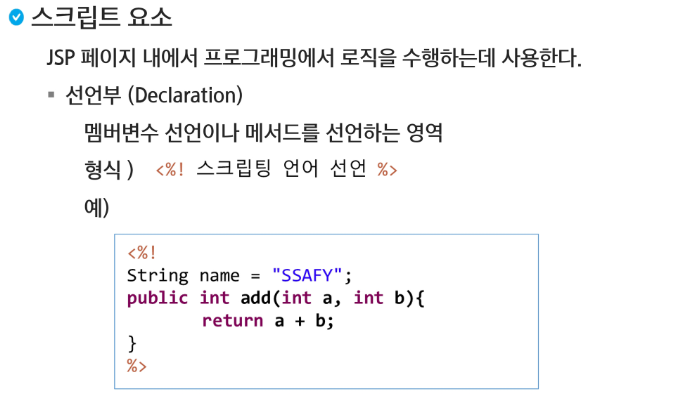

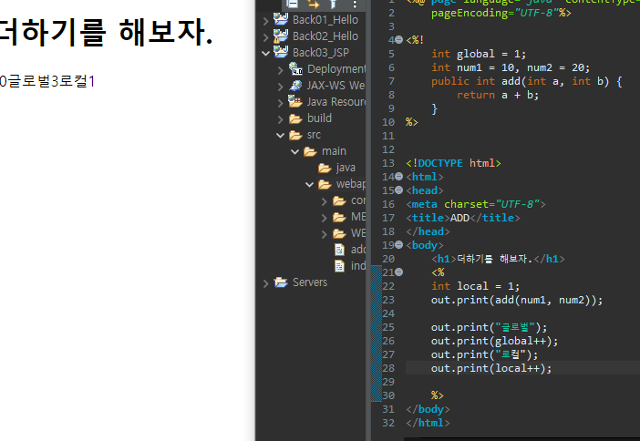

> 글로벌만 계속해서 증가한다. 서블릿은 Lifecycle이 생성되고 나서는 계속 새롭게 갱신되는 것이 아니다.

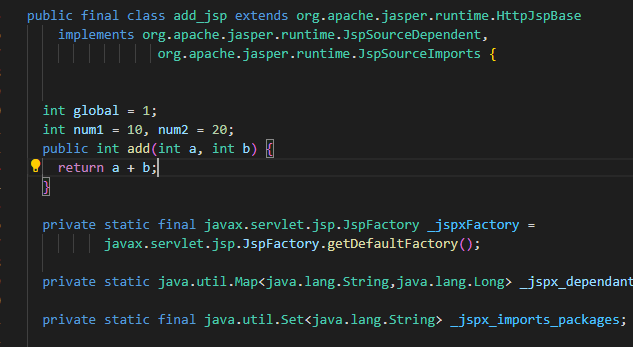

> 멤버 변수로 선언, 인스턴스가 사라지지 않으니 계속 활용.
>
> 스크립트릿은 `Service`라는 메소드 안에 선언이 되어서 멤버 변수가 아닌 지역 변수가 된다.

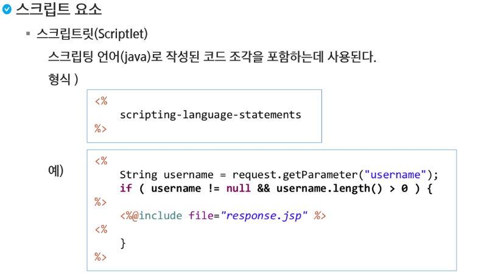

> JSP Service 안에 정의가 됨 -> 매번 초기화가 된다.

