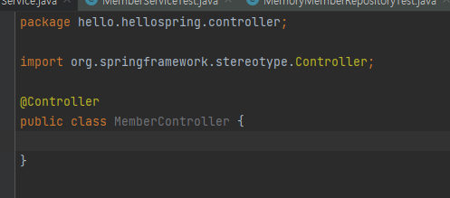
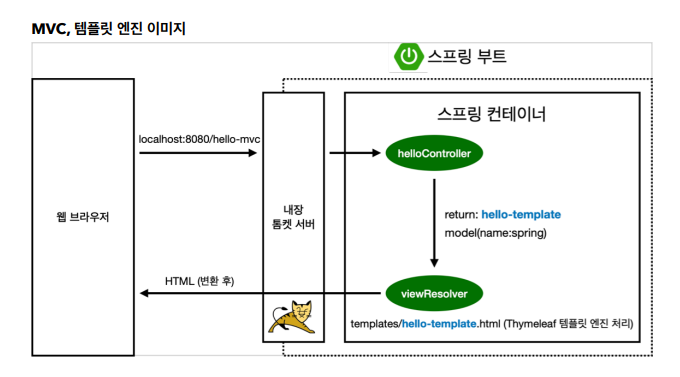
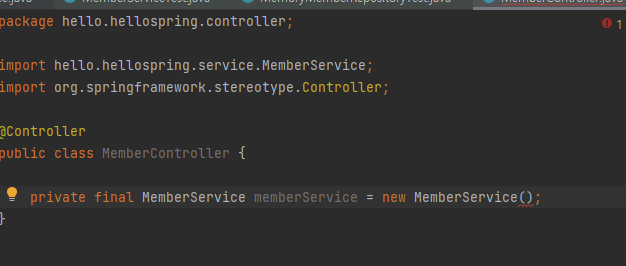
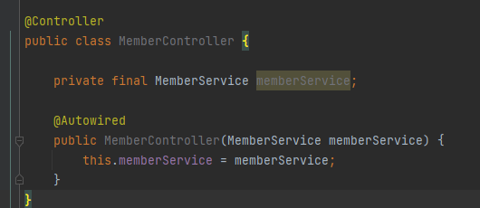
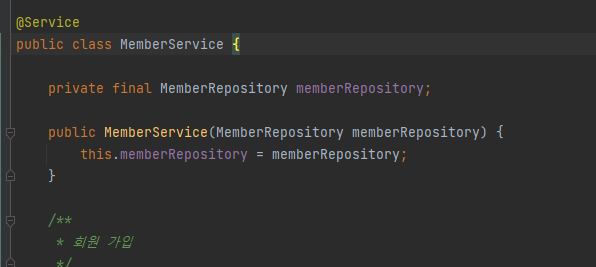
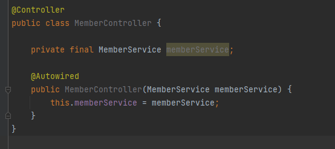
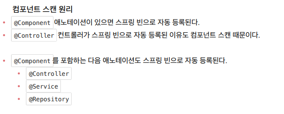
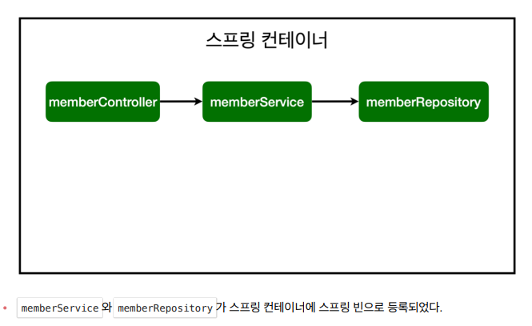
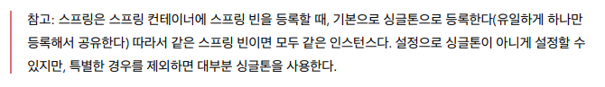
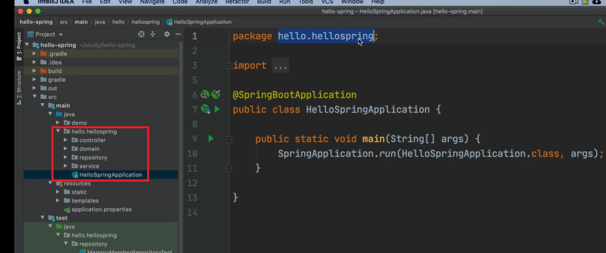

# 컴포넌트 스캔과 자동 의존관계 설정

> 스프링 컨테이너가 처음에 스프링을 뜰 때 Controller annotation이 있으면, 멤버 컨트롤러 객체를 생성해서 넣어둔다. 그리고 스프링이 관리한다. 스프링 컨테이너에서 스프링 빈이 관리된다고 말함.

- 이런 식으로 `MemberService` 객체를 만들면 비효율적이다. 하나만 공유해서 쓰면 되기 때문임. 스프링 컨테이너에 등록시켜서 사용 가능.

- `Autowired`가 스프링 컨테이너에 있는 `memberService`를 연결시켜줌.

- 기존 MemberService는 순수 자바 코드라서 스프링이 알 수 없다. 그래서 @Service를 통해 스프링 컨테이너에 등록시켜준다.

> `Controller`에서 외부 연결을 받고, `Service`에서 비지니스 로직을 만들고, `Repository`에서 데이터를 저장함

> 생성자에 `Autowired`를 쓰면 `MemberController`가 생성이 될 때 스프링 빈에 등록되어 있는 `memberService` 객체를 가져와서 넣어줌.(디펜더시 인젝션) 의존 관계 주입.

> package와 동일 혹은 하위에만 스프링 빈으로 등록하고 그 외에는 등록하지 않는다.(기본적으로)