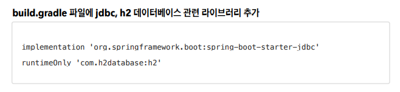
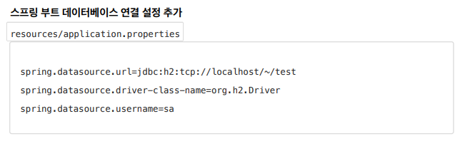
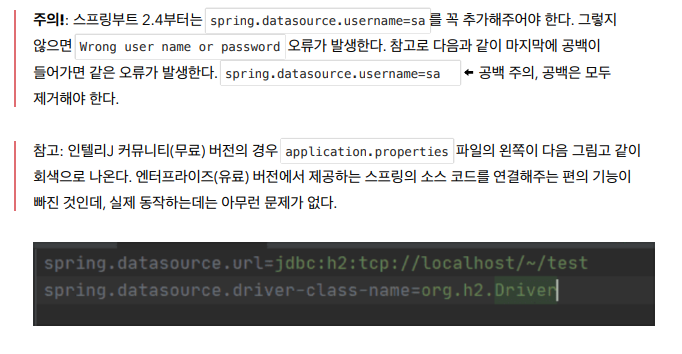
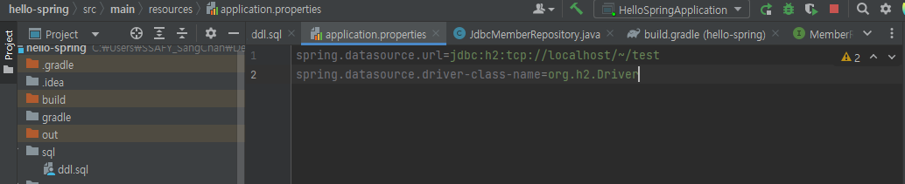
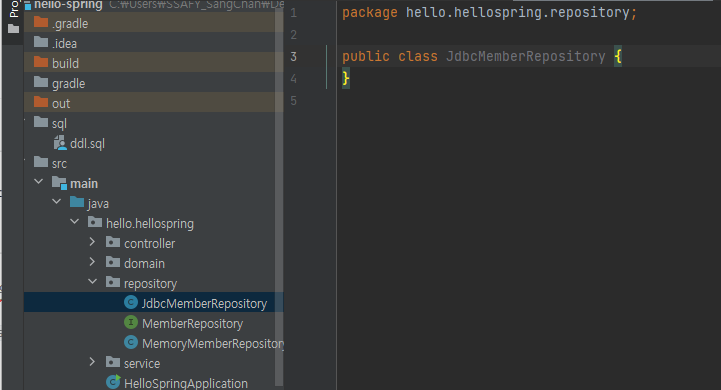
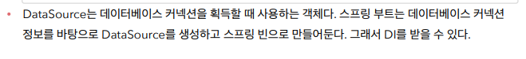
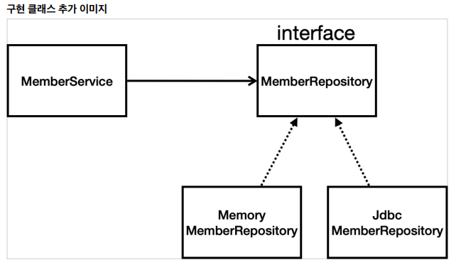
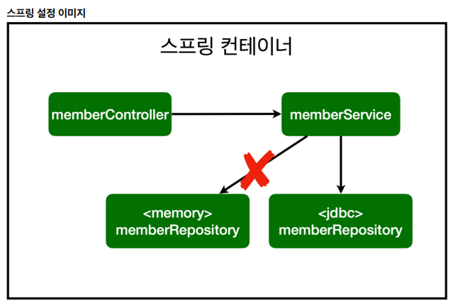
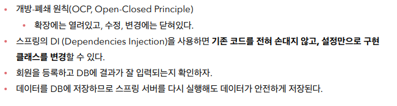

# 순수 JDBC

> 자바는 기본적으로 `DB`와 연결하려면 `JDBC`드라이버가 반드시 존재(윗 줄)
>
> 데이터베이스가 제공하는 클라이언트가 필요한데 거기에 `h2database`를 넣어준다.

> 회원을 저장한다는 역할은 `MemberRepository`가 하지만 구현을 메모리에 할 것인지 데이터베이스에 할 것인지에 차이가 있다.

