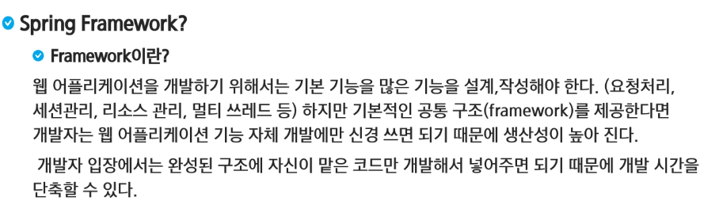
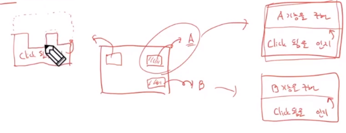
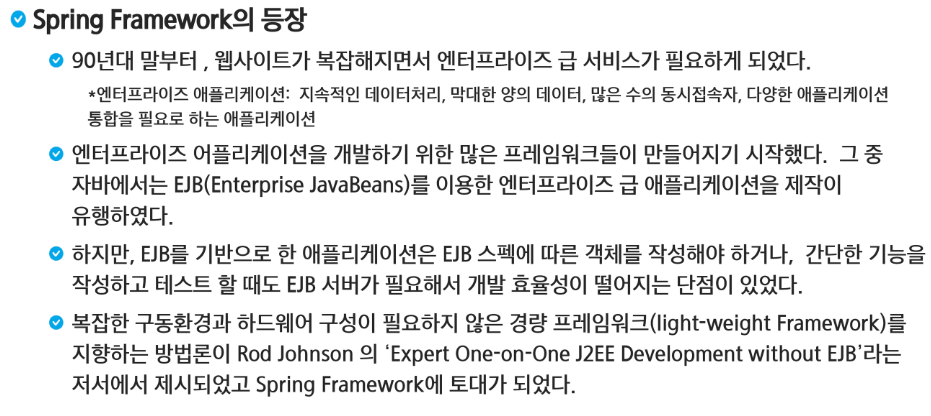
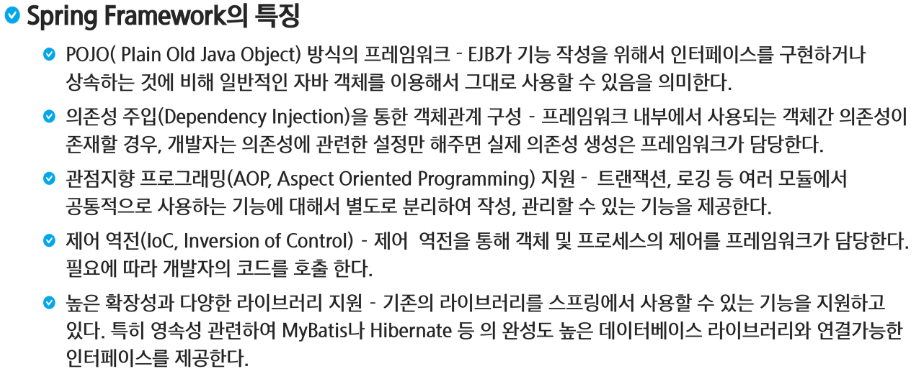
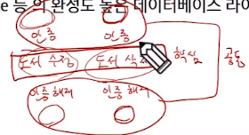
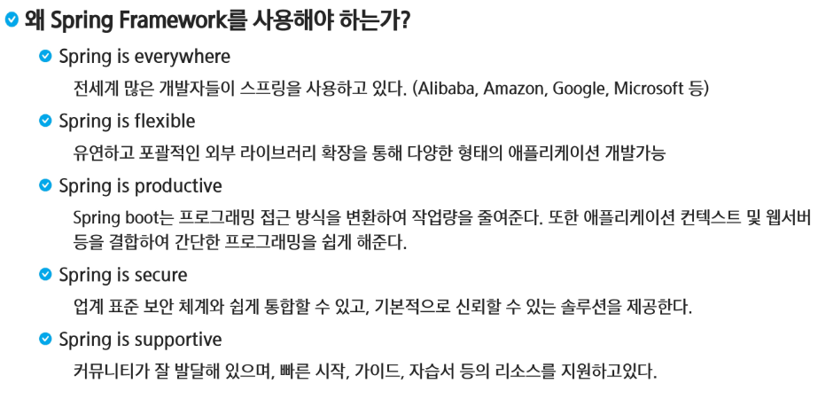
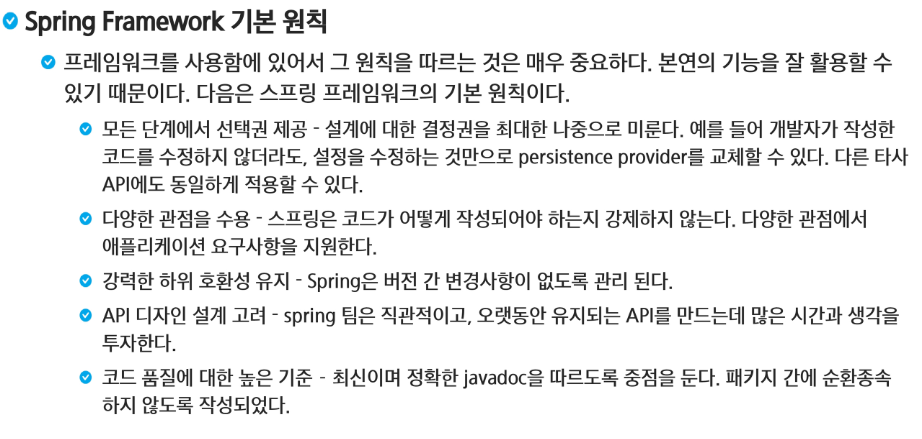
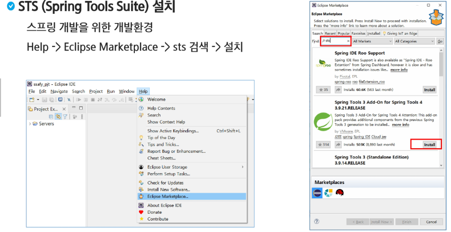

# SpringFramework

> 입출력이 되기를 기다리고 있을 때에도 다른 명령문들을 실행할 수 있다.
>
> MM(Man and Month): 1명의 사람이 몇 달동안 작업하는 단위

> 추상 클래스나 인터페이스로 구현하고 구현체를 다양하게 해서 구현이 가능하다. 규격만 정해놓고 나머지는 개발자가 넣어준다.

> 병원 의료 관리, 학교 학사 관리, 공장 재고 관리 시스템 등등 많은 것들이 필요해짐.
>
> EJB는 공통 구조를 너무 많이 제공해서 자율성이 떨어짐.

> 내가 사용할 객체를 직접 만드는 것이 일반적인데, 다른 객체가 만들어서 넣어주는 것이다. 의존성은 곧 객체 생성이다. 스프링은 객체 관리 컨테이너 역할을 한다. 스프링이 객체를 만들어서 주입시켜 준다. 원래는 내가 의존성을 가져야하는데, 그것을 남한테 넘기는 것을 제어 역전이라고 한다. 제어가 역전 됨에 따라서 남이 나에게 의존성을 넣어주는 행위를 의존성 주입이라고 한다. DI(의존성 주입 + 제어 역전)
>
> 도서 조회, 도서 수정, 도서 삭제를 할 때 수정과 삭제는 인증을 거치고, 인증을 다시 해제한다. 트랜잭션을 생성하고 커밋을 하거나 롤백을 하는 것들은 공통 기능이다.

> 핵심 기능과 공통 기능은 나눠서 하자. 즉 AOP는 공통적으로 사용하는 기능을 분리해서 저장하고 나중에 필요할 때 사용하는 것을 의미한다.
>
> MyBatis: ORM(Object Relation Mapping)
>
> 이름과 타입을 일일이 지정하지 않고 알아서 설정해줌
>
> DTO(Object)와 table(Relation)이 있는데 연결만 시켜주면 알아서 다 넣어줌.

> 다른 어플리케이션과 잘 결합될 수 있어서 `Mabtis`나 `hibernate`와 연결해서 만들 수도 있다.
>
> 스프링 부트가 미리 설정을 해주고 `tomcat`을 임베디드로 넣어주면서 프로그래밍을 간편화 시켜준다.

> 

> `SpringFramework`는 공통 구조를 `EJB`처럼 복잡한 규칙이나 스펙을 떠안지 않은 상태에서 공통 구조를 제공하는 것인데, 