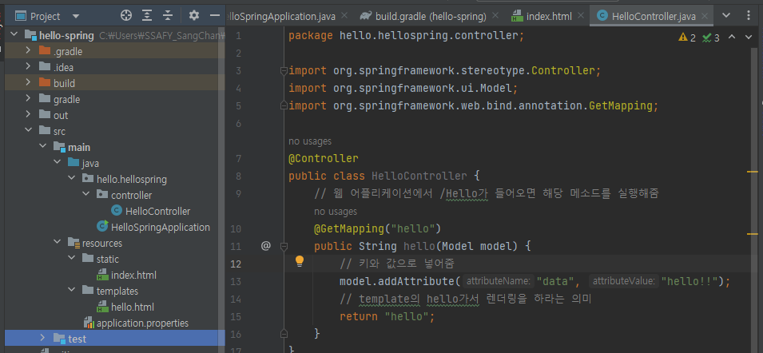
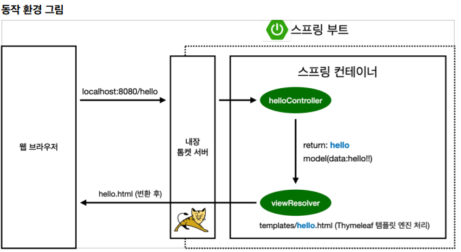
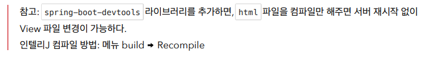

# View 환경설정


### Welcome Page 만들기

```html
<!DOCTYPE HTML>
<html>
<head>
 <title>Hello</title>
 <meta http-equiv="Content-Type" content="text/html; charset=UTF-8" />
</head>
<body>
Hello
<a href="/hello">hello</a>
</body>
</html>
```

- 스프링 부트가 제공하는 Welcome Page 기능 
  - static/index.html 을 올려두면 Welcome page 기능을 제공한다.
  -  https://docs.spring.io/spring-boot/docs/2.3.1.RELEASE/reference/html/spring-boot-features.html#boot-features-spring-mvc-welcome-page


- thymeleaf 템플릿 엔진
  -  thymeleaf 공식 사이트: https://www.thymeleaf.org/
  - 스프링 공식 튜토리얼: https://spring.io/guides/gs/serving-web-content/ 
  - 스프링부트 메뉴얼: https://docs.spring.io/spring-boot/docs/2.3.1.RELEASE/reference/html/spring-boot-features.html#boot-features-spring-mvc-template-engines


```java
package hello.hellospring.controller;

import org.springframework.stereotype.Controller;
import org.springframework.ui.Model;
import org.springframework.web.bind.annotation.GetMapping;

@Controller
public class HelloController {
    // 웹 어플리케이션에서 /Hello가 들어오면 해당 메소드를 실행해줌
    @GetMapping("hello")
    public String hello(Model model) {
        // 키와 값으로 넣어줌
        model.addAttribute("data", "hello!!");
        // template의 hello가서 렌더링을 하라는 의미
        return "hello";
    }
}
```



```html
resources/templates/hello.html

<!DOCTYPE HTML>
<html xmlns:th="http://www.thymeleaf.org">
<head>
 <title>Hello</title>
 <meta http-equiv="Content-Type" content="text/html; charset=UTF-8" />
</head>
<body>
<p th:text="'안녕하세요. ' + ${data}" >안녕하세요. 손님</p>
</body>
</html>
```



- 컨트롤러에서 리턴 값으로 문자를 반환하면 뷰 리졸버(viewResolver)가 화면을 찾아서 처리한다.
  - 스프링 부트 템플릿엔진 기본 viewName 매핑
  - resources:templates/ + {ViewName} +.html




### Devtools란?

- Spirng boot에서 제공하는 개발 편의를 위한 모듈
- 개발을 하다보면 코드 수정시 브라우저에서 보여주는 내용도 수정해야하는데 이 때 어플리케이션을 재시작해야해서 불편한 점이 발생한다. 이를 devtools가 도와준다.

- 5가지 기능 제공
  - Property Defaults
  - Automatic Restart
  - Live Reload
  - Global Settings
  - Remote Applications