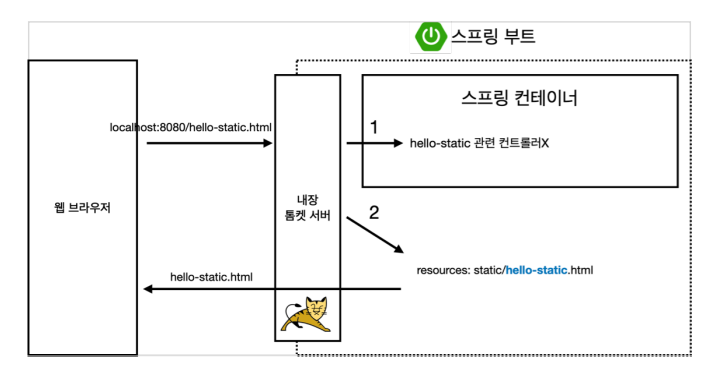

# 정적 컨텐츠

- 파일을 그대로 서버에 내려서 보여주는 것

- 템플릿 엔진: HTML을 서버에서 프로그래밍 해서 HTML을 동적으로 바꿔서 내리는 것

- API: Vue, React로 데이터를 받아서 웹 페이지를 표현하거나 서버와 서버끼리의 통신에도 사용

### 스프링 부트 정적 컨텐츠 기능

- resources의 static 파일에 hello-static.html을 생성하고 만들어준다
- `http://localhost:8080/hello-static.html`으로 들어가면 화면 확인이 가능하다.

> 웹 브라우저에서 URL 요청을 보내면 톰켓 서버가 스프링으로 연결시켜주고, 스프링은 먼저 컨트롤러 쪽에 `hello-static`관련된 것이 있는지 찾아본다. (컨트롤러가 우선순위!!!) 없으면 `resuorces의 static`으로 가서 찾는다.

 