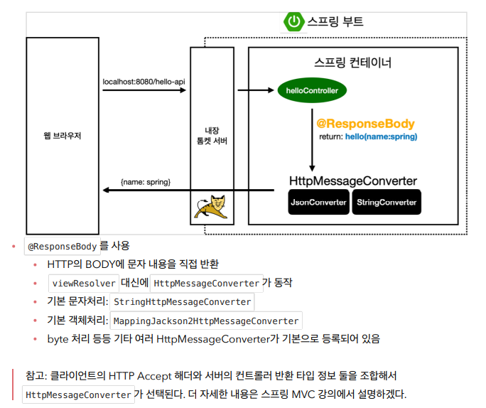

# API

- `ctrl` + `shift` + `enter`를 누르면 닫히는 부분이 자동 완성된다

```java
Hello hello = new Hello(
    //여기서 사용
```

- `alt`+`Insert`를 누르면 접근자, 설정자를 생성할 수 있다.
  - 자바 빈 표준 방식이다. 변수에는 바로 접근할 수 없다.

- 스프링도 객체를 반환하면 json으로 반환하는 게 기본이다.
  - `xml`보다는 `json`을 많이 사용하는 추세



> 객체를 `Json`으로 바꿔주는 유명한 라이브러리가 있다. `Jackson`이라는 라이브러리, 구글의 `GSON`이 있는데 스프링은 `Jackson`을 기본으로 사용


### 참고

#### XML이란?

Extensible Markup Language로서 웹 사이트, 데이터베이스 및 타사 애플리케이션과 같은 컴퓨터 시스템 간의 정보 교환을 지원합니다. 사전 정의된 규칙을 사용하면 수신자가 이러한 규칙을 사용하여 데이터를 효율적으로 정확하게 읽을 수 있으므로 모든 네트워크에서 데이터를 XML 파일로 손쉽게 전송할 수 있습니다.


#### JSON이란?

 JSON**(**제이슨[[1\]](https://ko.wikipedia.org/wiki/JSON#cite_note-Pronunciation-1), JavaScript Object Notation)은 [속성-값 쌍](https://ko.wikipedia.org/w/index.php?title=속성-값_쌍&action=edit&redlink=1)(attribute–value pairs), 배열 자료형(array data types) 또는 기타 모든 시리얼화 가능한 값(serializable value) 또는 "키-값 쌍"으로 이루어진 데이터 오브젝트를 전달하기 위해 인간이 읽을 수 있는 텍스트를 사용하는 [개방형 표준](https://ko.wikipedia.org/wiki/개방형_표준) 포맷이다. 비동기 브라우저/서버 통신 ([AJAX](https://ko.wikipedia.org/wiki/Ajax))을 위해, 넓게는 [XML](https://ko.wikipedia.org/wiki/XML)([AJAX](https://ko.wikipedia.org/wiki/Ajax)가 사용)을 대체하는 주요 데이터 포맷이다.