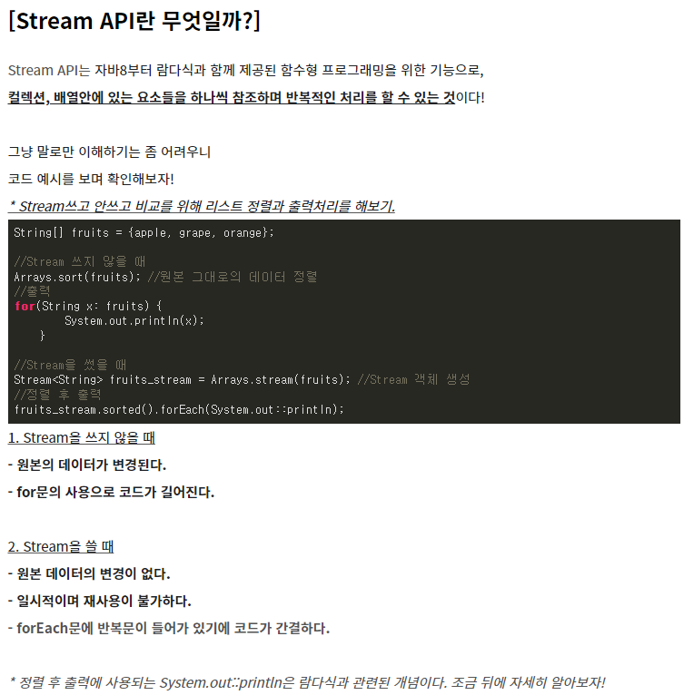
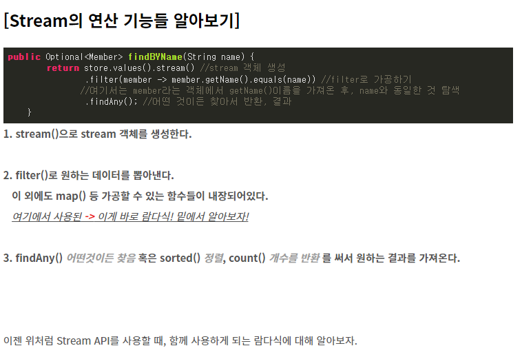
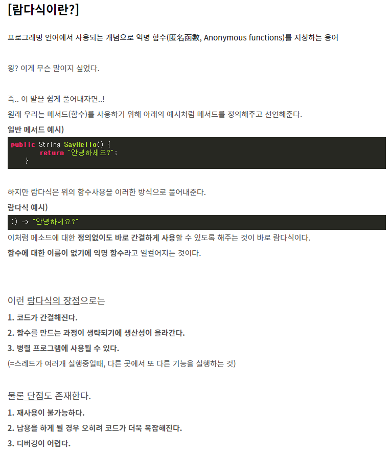
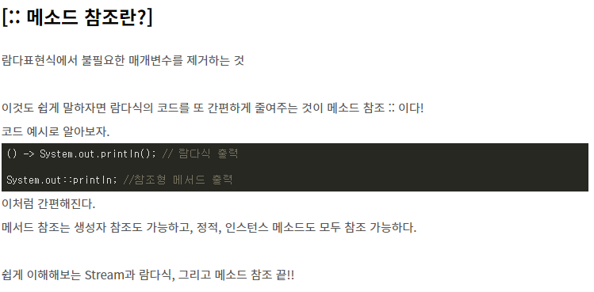

# 회원 도메인과 리포지토리 만들기

- 회원 객체

```java
package hello.hellospring.domain;

public class Member {
    // id는 시스템이 구분하기 위해서, name은 사용자 이름
    private Long id;
    private String name;

    public Long getId() {
        return id;
    }

    public void setId(Long id) {
        this.id = id;
    }

    public String getName() {
        return name;
    }

    public void setName(String name) {
        this.name = name;
    }
}
```


- 회원 리포지토리 인터페이스

```java
package hello.hellospring.repository;

import hello.hellospring.domain.Member;

import java.util.List;
import java.util.Optional;

public interface MemberRepository {
    // 회원을 저장하면 저장된 회원이 반환
    Member save(Member member);
    // Optional은 자바 8에 들어가 있는 기능, 정보가 없으면 Null 대신 Optional을 감싸서 나옴
    Optional<Member> findById(Long id);
    Optional<Member> findByName(String name);
    List<Member> findAll();
}
```


- 회원 리포지토리 메모리 구현체

```java
package hello.hellospring.repository;

import hello.hellospring.domain.Member;

import java.util.*;

public class MemoryMemberRepository implements MemberRepository{
    private static Map<Long, Member> store = new HashMap<>();
    // sequence는 0, 1, 2와 같이 키값을 만들어주는 것
    private static long sequence = 0L;

    @Override
    public Member save(Member member) {
        member.setId(++sequence);
        store.put(member.getId(), member);
        return member;
    }

    @Override
    public Optional<Member> findById(Long id) {
        //null을 반환하는 게 아니라 Optional을 감싸서 넘겨줌
        // 클라이언트에서 무언가 처리를 할 수 있음
        return Optional.ofNullable(store.get(id));
    }

    @Override
    public Optional<Member> findByName(String name) {
        return store.values().stream()
                .filter(member -> member.getName().equals(name))
                .findAny();
    }

    @Override
    public List<Member> findAll() {
        return new ArrayList<>(store.values());
    }
}
```







