# 리뷰 API 생성

### ✅ 전체 순서 요약

1. `ERD`를 통한 테이블 관계 및 속성 확인, `Notion`에서 `request`와 `response` 확인

2. model에서 Entity 생성

3. dto에서 `requestDto`생성

4. dto에서 `responseDto`도 생성 필요할듯

5. Repository에서 Interface 생성 -> 필요하다면 커스텀도

6. Controller 생성(초안)

7. Service 생성

8. model에서 추가적인 생성 메소드 작성(일대다 관계일 때)

9. Service로직 작성

10. Controller 작성

11. Postman으로 확인

---

### ✅ 상세 과정

### 📑 1

- ERD

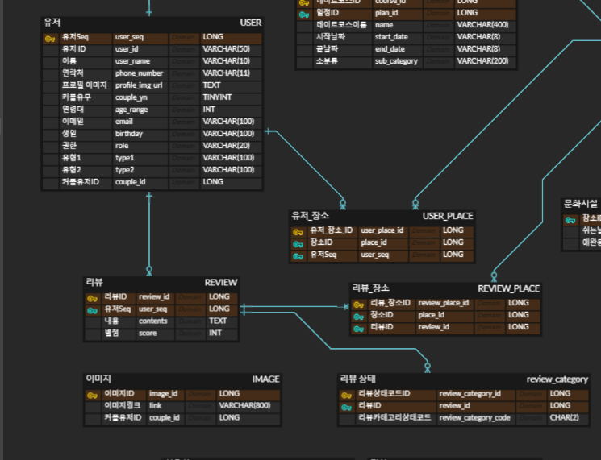

- API 연동 규격서

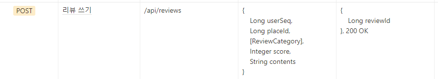

---

### 📑 2

- Review

```java
package com.cosmos.back.model;

import com.cosmos.back.service.UserService;
import lombok.AllArgsConstructor;
import lombok.Builder;
import lombok.Data;
import lombok.NoArgsConstructor;
import net.minidev.json.annotate.JsonIgnore;

import javax.persistence.*;

import java.util.ArrayList;
import java.util.List;

import static javax.persistence.FetchType.LAZY;
import static javax.persistence.GenerationType.IDENTITY;


@Entity
@NoArgsConstructor
@AllArgsConstructor
@Table(name="review")
@Data
@Builder
public class Review {

    @Id
    @GeneratedValue(strategy = IDENTITY)
    @Column(name="review_id")
    private Long id;

    private String contents;

    private Integer score;

    @ManyToOne(fetch = LAZY)
    @JoinColumn(name="user_seq")
    @JsonIgnore
    private User user;

    @OneToMany(mappedBy = "review")
    private List<ReviewPlace> reviewPlaces = new ArrayList<>();

    @OneToMany(mappedBy = "review")
    private List<ReviewCategory> reviewCategories = new ArrayList<>();

    //연관관계 메서드
    public void setUser(User user) {
        this.user = user;
        user.getReviews().add(this);
    }

    //생성 메서드
    public static Review createReviewObject(User user, String contents, Integer score) {
        Review review = new Review();

        review.setUser(user);
        review.setContents(contents);
        review.setScore(score);

        return review;
    }
}
```

- ReviewCategory

```java
package com.cosmos.back.model;

import com.fasterxml.jackson.annotation.JsonIgnore;
import lombok.AllArgsConstructor;
import lombok.Builder;
import lombok.Data;
import lombok.NoArgsConstructor;

import javax.persistence.*;

import static javax.persistence.FetchType.*;
import static javax.persistence.GenerationType.IDENTITY;

@Entity
@NoArgsConstructor
@AllArgsConstructor
@Table(name = "reviewcategory")
@Data
@Builder
public class ReviewCategory {

    @Id
    @GeneratedValue(strategy = IDENTITY)
    @Column(name = "review_category_id")
    private Long id;

    @Column(name = "review_category_code")
    private String reviewCategoryCode; // 리뷰 카테고리 상태 코드

    // 리뷰 상태 - 리뷰
    @ManyToOne(fetch = LAZY)
    @JoinColumn(name = "review_id")
    @JsonIgnore
    private Review review;

    // 연관 관계 메서드
//    public void setReview(Review review) {
//        this.review = review;
//        review.getReviewCategories().add(this);
//    }

    // 생성 메서드
    public static ReviewCategory createReviewCategoryObject(Review review, String reviewCategoryCode) {
        ReviewCategory reviewCategory = new ReviewCategory();

        reviewCategory.setReview(review);
        reviewCategory.setReviewCategoryCode(reviewCategoryCode);

        return reviewCategory;
    }
}
```


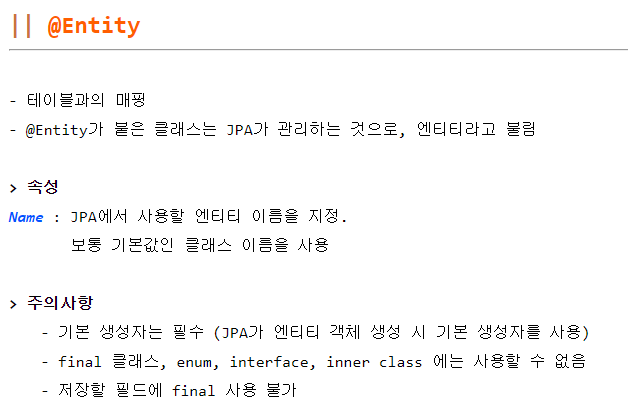

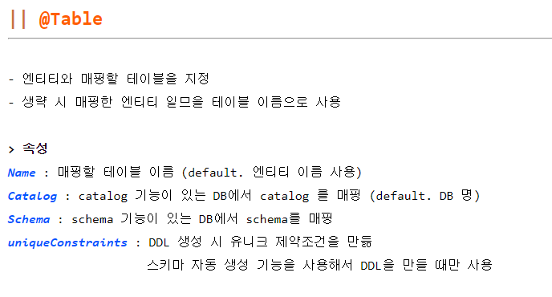

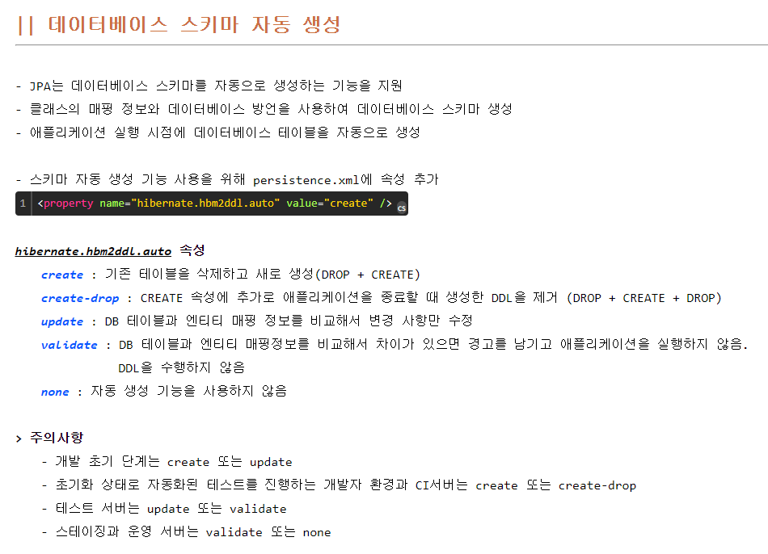

- 우리는 yml 방식으로 작성

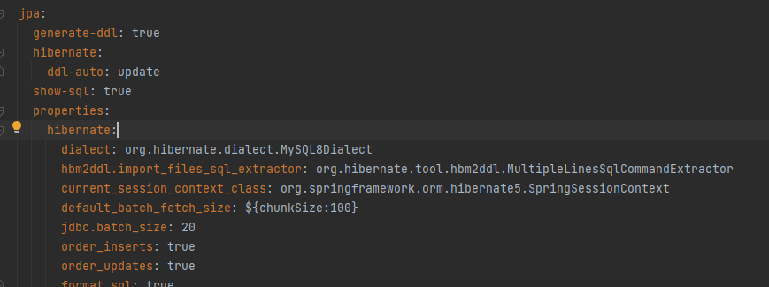


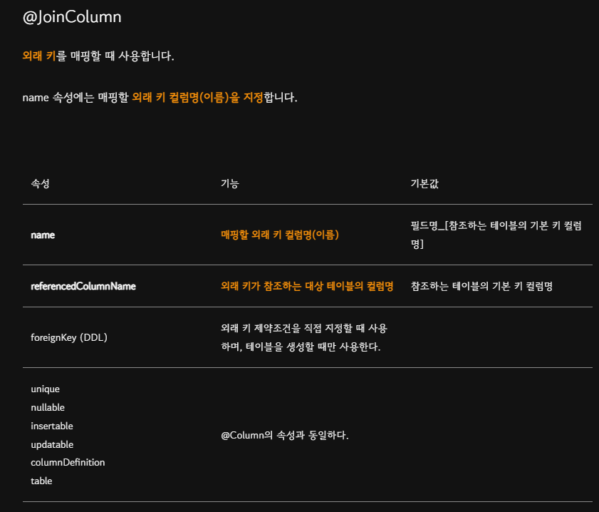

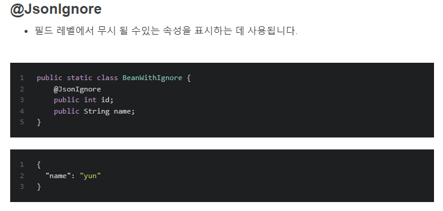


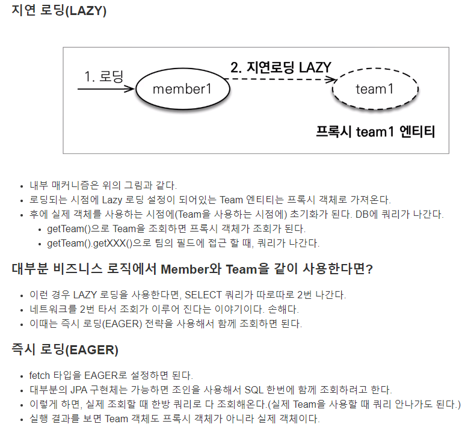

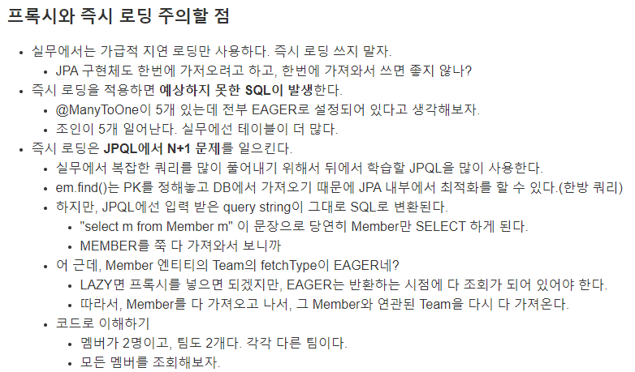

https://velog.io/@jin0849/JPA-%EC%A6%89%EC%8B%9C%EB%A1%9C%EB%94%A9EAGER%EA%B3%BC-%EC%A7%80%EC%97%B0%EB%A1%9C%EB%94%A9LAZY

---

### 📑 3

- 받아오는 데이터의 형식을 정해준다.
- DTO(Data Transfer Object) 데이터 전송 객체

```java
package com.cosmos.back.dto.request;

import lombok.AllArgsConstructor;
import lombok.Builder;
import lombok.Data;
import lombok.NoArgsConstructor;

import java.util.List;

@Data
@NoArgsConstructor
@AllArgsConstructor
@Builder
public class ReviewRequestDto {
    private Long userSeq;
    private Long placeId;
    private List<String> categories;
    private Integer score;
    private String contents;
}
```

---

### 📑 5

```java
package com.cosmos.back.repository.review;

import com.cosmos.back.model.Review;
import org.springframework.data.jpa.repository.JpaRepository;

public interface ReviewRepository extends JpaRepository<Review, Long> {
}

```

```java
package com.cosmos.back.repository.review;

import com.cosmos.back.model.ReviewCategory;
import org.springframework.data.jpa.repository.JpaRepository;

public interface ReviewCategoryRepository extends JpaRepository<ReviewCategory, Long> {
}

```

---

### 📑 6, 10


```java
package com.cosmos.back.controller;

import com.cosmos.back.dto.request.ReviewRequestDto;
import com.cosmos.back.service.ReviewService;
import io.swagger.v3.oas.annotations.Operation;
import io.swagger.v3.oas.annotations.tags.Tag;
import lombok.RequiredArgsConstructor;
import org.springframework.http.HttpStatus;
import org.springframework.http.ResponseEntity;
import org.springframework.web.bind.annotation.PostMapping;
import org.springframework.web.bind.annotation.RequestBody;
import org.springframework.web.bind.annotation.RequestMapping;
import org.springframework.web.bind.annotation.RestController;

@Tag(name = "review", description = "리뷰 API")
@RestController
@RequiredArgsConstructor
@RequestMapping("/api")
public class ReviewApiController {

    private final ReviewService reviewService;

    @Operation(summary = "리뷰 등록", description = "리뷰를 등록함")
    @PostMapping("/reviews")
    public ResponseEntity<Long> detailTour(@RequestBody ReviewRequestDto dto) {
        Long reviewId = reviewService.createReview(dto);

        return new ResponseEntity<>(reviewId, HttpStatus.OK);
    }
}

```

- Swagger 참고사항: https://jeonyoungho.github.io/posts/Open-API-3.0-Swagger-v3-%EC%83%81%EC%84%B8%EC%84%A4%EC%A0%95/

- RequestMapping 참고사항: https://mungto.tistory.com/436
- RestController: https://mangkyu.tistory.com/49

---

### 📑 7, 9


```java
package com.cosmos.back.service;

import com.cosmos.back.dto.request.ReviewRequestDto;
import com.cosmos.back.model.Review;
import com.cosmos.back.model.ReviewCategory;
import com.cosmos.back.model.User;
import com.cosmos.back.repository.UserRepository;
import com.cosmos.back.repository.review.ReviewCategoryRepository;
import com.cosmos.back.repository.review.ReviewRepository;
import lombok.RequiredArgsConstructor;
import org.springframework.stereotype.Service;
import org.springframework.transaction.annotation.Transactional;

import java.util.Optional;

@Service
@RequiredArgsConstructor
@Transactional(readOnly = true)
public class ReviewService {

    private final ReviewRepository reviewRepository;
    private final ReviewCategoryRepository reviewCategoryRepository;
    private final UserRepository userRepository;

    //리뷰 작성
    @Transactional
    public Long createReview(ReviewRequestDto dto) {
        Long userSeq = dto.getUserSeq();
        User user = userRepository.findById(userSeq).orElseThrow(() -> new IllegalArgumentException("no such data"));

        Review review = Review.createReviewObject(user, dto.getContents(), dto.getScore());

        Review saveReview = reviewRepository.save(review);

        for (String category: dto.getCategories()) {
            ReviewCategory reviewCategoryObject = ReviewCategory.createReviewCategoryObject(saveReview, category);
            reviewCategoryRepository.save(reviewCategoryObject);
        }
        return saveReview.getId();
    }
}

```

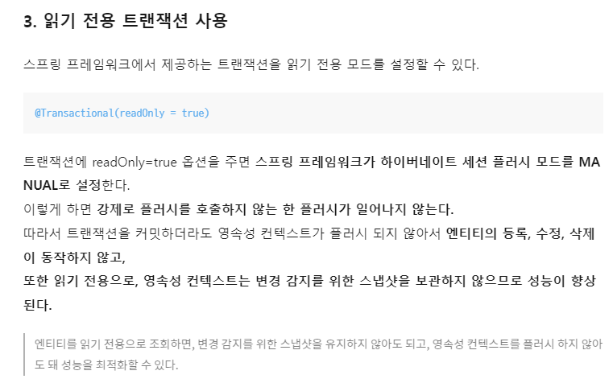

---

### 기타 배운 사항

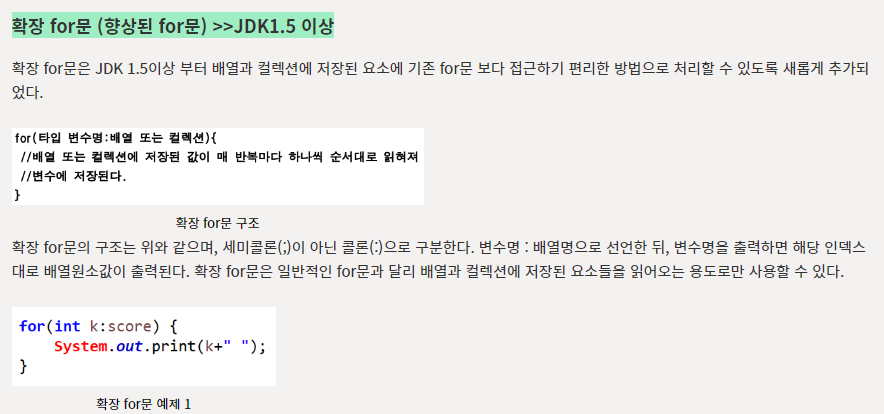

---

### ❓ 궁금한 점

- application.yml을 쓴 이유는?
- 연관 관계 사실상 의미없는 것 같다. add라고 했지만 아무 반응 없음. 지워도 상관없음.

- `JsonIgnore`는 user를 필드표출 시 제외시켜준다.

- `Repository`는 하나의 데이터 형식인가? JPA에서 해당 Entity를 DTO를 거쳐서 받아온다?! 원하는 개수만큼 받아오려면 `Service`에서 작업 필요?
- `RequiredArgsConstructor`한번 대충 설명 필요
- `Swagger`는 언제 어떻게 사용?


### 추가 학습 필요 사항

- DTO
- Lazy, Eagle

- IOC

- Swagger 참고사항: https://jeonyoungho.github.io/posts/Open-API-3.0-Swagger-v3-%EC%83%81%EC%84%B8%EC%84%A4%EC%A0%95/

- @RequestMapping 참고사항: https://mungto.tistory.com/436
- @RestController: https://mangkyu.tistory.com/49

- @Builder: https://pamyferret.tistory.com/67