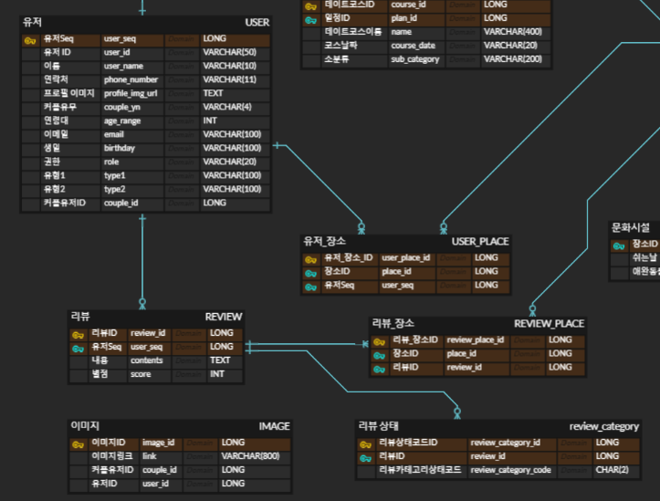
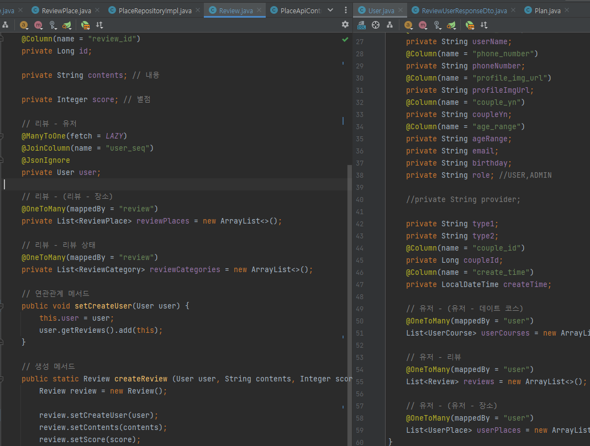
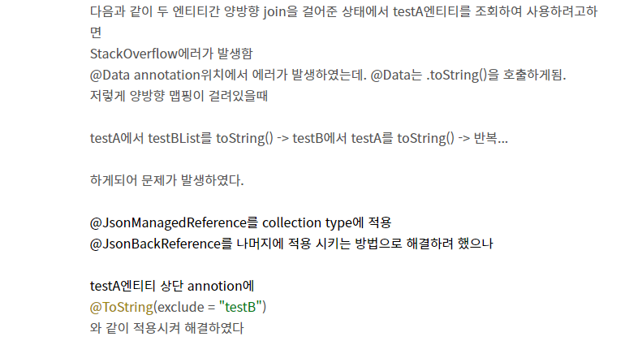

⛔ 문제는 `lombok`의 `@Data`사용에서 발생함.(양방향 관계에서)

- 유저와 리뷰를 불러올 시 유저의 `getReviews()`가 동작하는데 `@Data`내부에는 `ToString` 동작이 포함되어 있다. 그렇기 때문에 모든 필드에 대해 `Println`을 하게 되는데 이때 내부에 `Review`엔티티에 대한 것도 있어서 `Review`객체를 불러오게 된다. `Review`도 동일하게 `User`에 대한 객체를 불러오기 때문에 무한 루프로 인해 stackoverflow가 발생하게 된다.

✅ `@Data` 대시 `@Getter`와 `@Setter`를 넣음으로써 `ToString`이 호출되지 않게끔하여 해결하였다.

