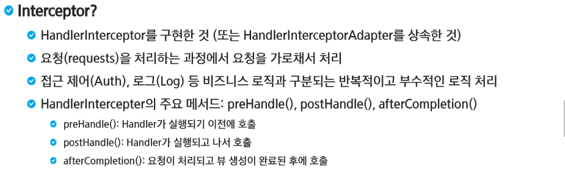
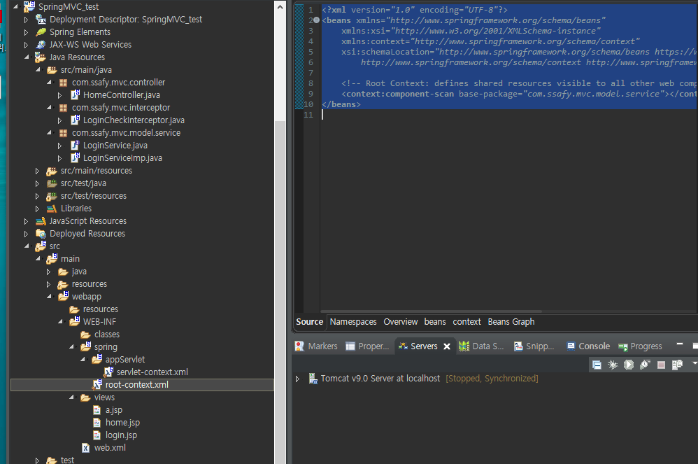
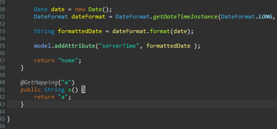
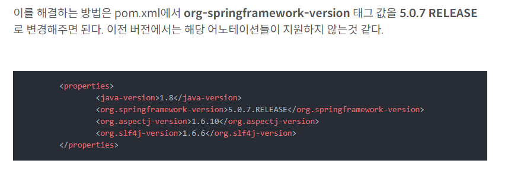
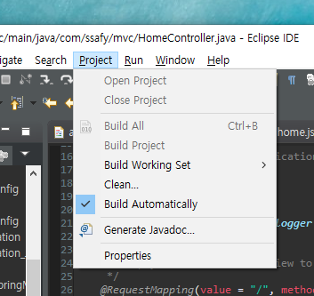

# Interceptor



> 게시판을 보려고하는데 인터셉터가 가로채서 로그인이 되어 있는지 안되어 있는지 확인하는 느낌


### 로그인 페이지 구현

- 로그인 폼

```jsp
<%@ page language="java" contentType="text/html; charset=UTF-8"
    pageEncoding="UTF-8"%>
<!DOCTYPE html>
<html>
<head>
<meta charset="UTF-8">
<title>Insert title here</title>
</head>
<body>
	<h1>로그인 페이지</h1>
	<form action="login" method="POST">
		아이디: <input type="text" name="id"><br>
		패스워드: <input type="password" name="pw">
		<button>로그인</button>
	</form>
</body>
</html>
```

- 로그인 인터페이스

```java
package com.ssafy.mvc.model.service;

public interface LoginService {
	boolean login(String id, String pw);
}
```

- 로그인 구현체

```java
package com.ssafy.mvc.model.service;

import org.springframework.stereotype.Service;

@Service
public class LoginServiceImp implements LoginService{

	@Override
	public boolean login(String id, String pw) {
		// DAO 갔다와야죠
		//아이디와 패스워드가 같으면 로그인 성공이야!!
		return id.equals(pw);
	}	
}
```

- 로그인 로직은 `root-context.xml`에 등록

```xml
<?xml version="1.0" encoding="UTF-8"?>
<beans xmlns="http://www.springframework.org/schema/beans"
	xmlns:xsi="http://www.w3.org/2001/XMLSchema-instance"
	xmlns:context="http://www.springframework.org/schema/context"
	xsi:schemaLocation="http://www.springframework.org/schema/beans https://www.springframework.org/schema/beans/spring-beans.xsd
		http://www.springframework.org/schema/context http://www.springframework.org/schema/context/spring-context-4.3.xsd">
	
	<!-- Root Context: defines shared resources visible to all other web components -->
	<context:component-scan base-package="com.ssafy.mvc.model.service"></context:component-scan>
</beans>

```



- 로그인 정보 세션 등록

```java
package com.ssafy.mvc.controller;

import java.text.DateFormat;
import java.util.Date;
import java.util.Locale;

import javax.servlet.http.HttpSession;

import org.slf4j.Logger;
import org.slf4j.LoggerFactory;
import org.springframework.beans.factory.annotation.Autowired;
import org.springframework.stereotype.Controller;
import org.springframework.ui.Model;
import org.springframework.web.bind.annotation.GetMapping;
import org.springframework.web.bind.annotation.PostMapping;
import org.springframework.web.bind.annotation.RequestMapping;
import org.springframework.web.bind.annotation.RequestMethod;

import com.ssafy.mvc.model.service.LoginService;

/**
 * Handles requests for the application home page.
 */
@Controller
public class HomeController {
	
	@Autowired
	private LoginService loginService;
	
	private static final Logger logger = LoggerFactory.getLogger(HomeController.class);
	
	/**
	 * Simply selects the home view to render by returning its name.
	 */
	@RequestMapping(value = "/", method = RequestMethod.GET)
	public String home(Locale locale, Model model) {
		logger.info("Welcome home! The client locale is {}.", locale);
		
		Date date = new Date();
		DateFormat dateFormat = DateFormat.getDateTimeInstance(DateFormat.LONG, DateFormat.LONG, locale);
		
		String formattedDate = dateFormat.format(date);
		
		model.addAttribute("serverTime", formattedDate );
		
		return "home";
	}
	
	@GetMapping("a")
	public String a() {
		// 로그인 했으면 session을 검사해서 return "a"라는 곳으로 
		// 로그인 하지 않았으면 return "redirect:/";
		
		return "a";
	}
	
	@GetMapping("login")
	public String loginForm() {
		return "login";
	}
	
	@PostMapping("login")
	public String login(HttpSession session, String id, String pw) {
		boolean result = loginService.login(id, pw);
		
		if(result) {
			session.setAttribute("loginUser", id);
			return "redirect:/";
		} else {
			return "redirect:/login";
		}
	}
	
	@GetMapping("logout")
	public String logout(HttpSession session) {
		session.invalidate();
		return "redirect:/";
	}
}
```

- `interceptor`로 로그인 검토

```java
package com.ssafy.mvc.interceptor;

import javax.servlet.http.HttpServletRequest;
import javax.servlet.http.HttpServletResponse;
import javax.servlet.http.HttpSession;

import org.springframework.web.servlet.HandlerInterceptor;

public class LoginCheckInterceptor implements HandlerInterceptor{
	@Override
	public boolean preHandle(HttpServletRequest request, HttpServletResponse response, Object handler)
			throws Exception {
		HttpSession session = request.getSession();
		
		if(session.getAttribute("loginUser") == null) {
			response.sendRedirect("login");
			return false;
		} else {
			return true;
		}
	}
}
```

- `bean`에 `interceptor` 등록

```xml
<beans:bean class="com.ssafy.mvc.interceptor.LoginCheckInterceptor" id="confirm"/>
	<interceptors>
		<interceptor>
			<mapping path="/*"/>
			<exclude-mapping path="/login"/>
			<exclude-mapping path="/"/>			
			<beans:ref bean="confirm"/>
		
		</interceptor>
	</interceptors>
```


> `interceptor`를 `servlet-context`에 등록해야 사용할 수 있다.
>
> 모든 경로를 등록하고 이건 봐줘라고 짤 수 있고, 여기 여기는 안되라고 할 수 있음


### ⛔오류

### ✅1. Getmapping 안됨



> `@Getmapping`이 되지 않는데 버전이 옛 버전으로 규정되어 있어서 그렇다



### ✅2. 서버 실행 시 JSP 업데이트 안됨



> `Build Automatically`를 실행해줘서 자동적으로 업데이트 되도록 한다. 아니면 계속 `Clean`해주고 서버를 실행시켜 주어야 한다.