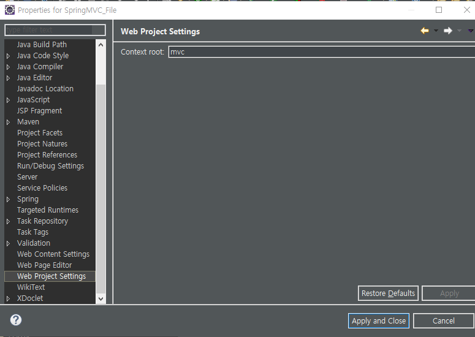
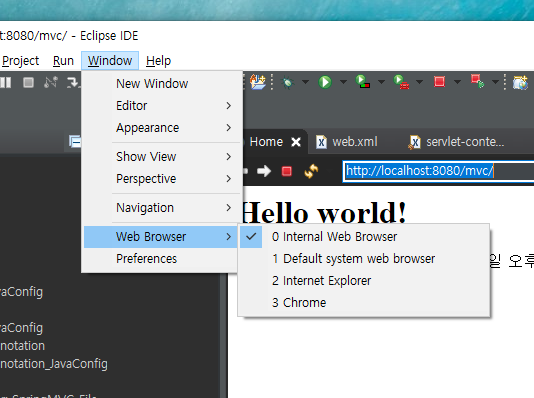
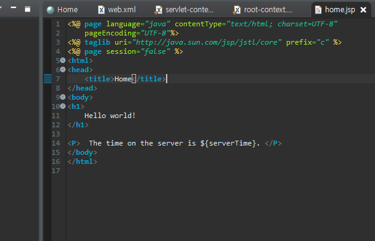
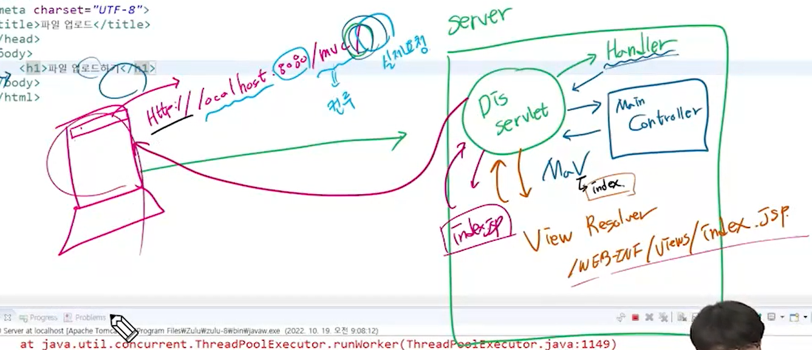
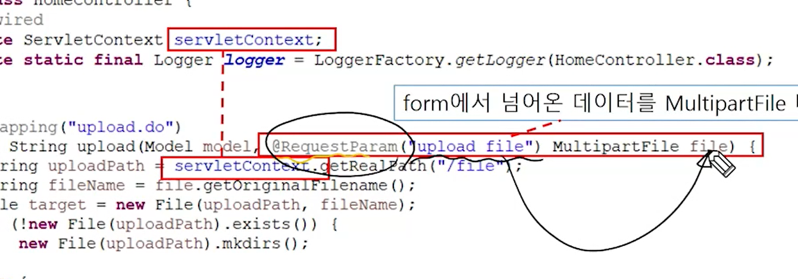
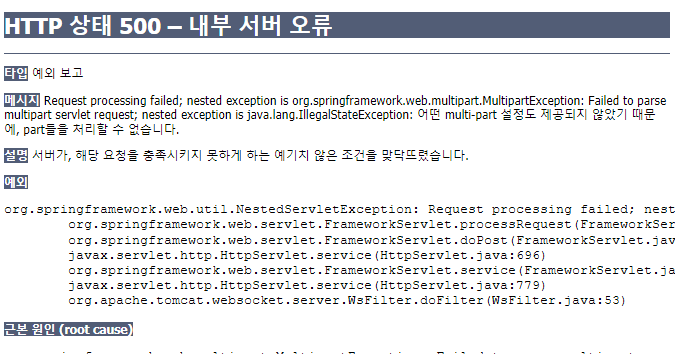
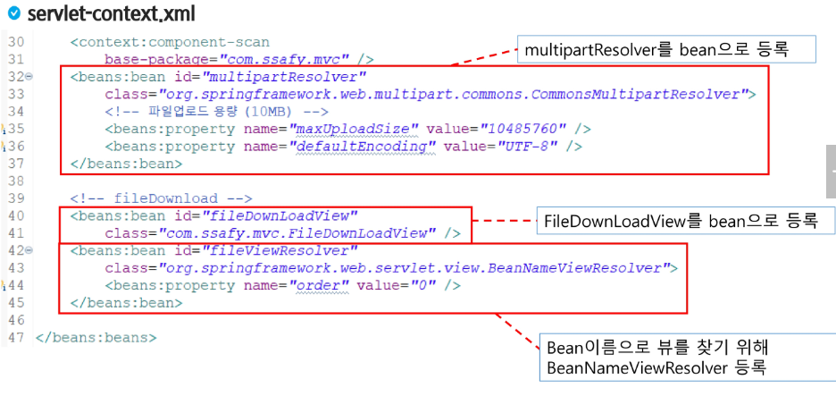
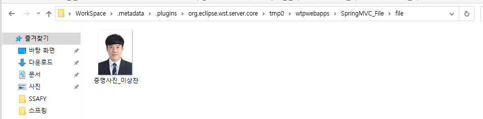
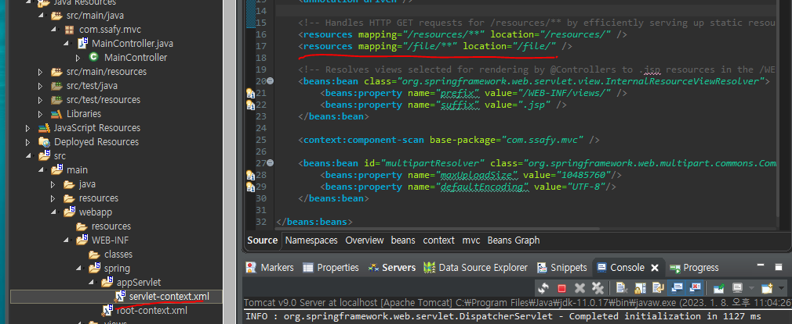
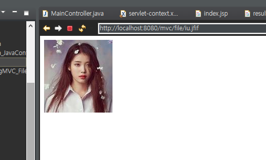

# File

- `Context root`확인 법
  - `property`에 `Web Project Settings`로 들어간다.



- 인터넷을 어디에 킬지 결정할 수 있다.



- 페이지를 `UTF-8`형식으로 사용하겠다는 설정을 해줘야 안 깨진다.




- 파일 업로드를 위한 라이브러리 추가
  - `mvn`홈페이지에 `file upload` 클릭 후 아파치 라이브러리 추가

```xml
		<!-- 파일 업로드 -->
		<dependency>
			<groupId>commons-fileupload</groupId>
			<artifactId>commons-fileupload</artifactId>
			<version>1.4</version>
		</dependency>
```



- 파일을 보낼 `HTML` 태그 만들 시 `post`방식으로 보내야 한다.
  - `get`방식은 `url`에 노출이 되고 크기에 제한이 있기 때문에 파일 전송에 적합하지 않음.
  - `post`는 용량에 제한이 없음(키, 값 형태로 날아감)
  - `enctype`을 반드시 `multipart/form-data`로 바꿔줘야 함.

```jsp
<%@ page language="java" contentType="text/html; charset=UTF-8"
    pageEncoding="UTF-8"%>
<!DOCTYPE html>
<html>
<head>
<meta charset="UTF-8">
<title>파일 업로드</title>
</head>
<body>
	<h1>파일 업로드 하기</h1>
	
	<form action="upload" method="post" enctype="multipart/form-data">
		<input type="file" name="upload_file">
		<input type="submit">
	</form>
</body>
</html>
```


- 결과 페이지에서 파일 데이터를 받을 때 넘어온 파라미터 `upload file`이 `file`이라고 명시해줘야한다.
  - 그게 싫다면 넘겨준 키 값을 넣어준다.




- 다음과 같은 에러는 `multi-part`에 대한 설정을 해주지 않아서 그렇다
  - `servlet-context`에서 `bean`을 등록한다.





> `xml`의 `property`는 `setter`라고 생각해주면 된다.


- 파일 받아서 저장하는 코드

```java
package com.ssafy.mvc;

import java.io.File;
import java.io.IOException;

import javax.servlet.ServletContext;

import org.springframework.beans.factory.annotation.Autowired;
import org.springframework.stereotype.Controller;
import org.springframework.ui.Model;
import org.springframework.util.FileCopyUtils;
import org.springframework.web.bind.annotation.GetMapping;
import org.springframework.web.bind.annotation.PostMapping;
import org.springframework.web.multipart.MultipartFile;

@Controller
public class MainController {
	
	@Autowired
	private ServletContext servletContext; 
	
	@GetMapping("/")
	public String showIndex() {
		return "index";
	}
	
	@PostMapping("upload")
	public String upload(MultipartFile upload_file, Model model) {
		
		String uploadPath = servletContext.getRealPath("/file");
		String fileName = upload_file.getOriginalFilename();
		
		File target = new File(uploadPath, fileName);
		
		//만약 file 이라는 경로가 없다면...만들어 주는 것이 먼저
		if(!new File(uploadPath).exists())
			new File(uploadPath).mkdir();
		
		try {
			FileCopyUtils.copy(upload_file.getBytes(), target);
		} catch (IOException e) {
			e.printStackTrace();
		}
		
		model.addAttribute("filename", fileName);
		
		return "result";
	}
}
```

> `java`에서 제공하는 `ServletContext`를 받아서 경로에 `/file`을 붙여준다. 파일 이름도 고유의 이름을 가져온 뒤에 그 두 가지를 `target`이라는 곳에 넣어준다. 만약 해당 경로에 폴더가 없다면 폴더를 만들어주고 받은 파일을 바이트로 복사해서 `target`에 넣어준다. 그리고 그냥 홈페이지를 띄우면 심심하니 파일 이름을 `model`에 넣어서 같이 보낸다.

- 파일은 프로젝트 내부가 아닌 톰켓에 저장된다.

```
C:\Users\SSAFY_SangChan\Desktop\WorkSpace\.metadata\.plugins\org.eclipse.wst.server.core\tmp0\wtpwebapps\SpringMVC_File\file
```





> `file`로 시작하는 모든 경로로부터 `file`로부터 찾겠다.



```jsp
<%@ page language="java" contentType="text/html; charset=UTF-8"
    pageEncoding="UTF-8"%>
<!DOCTYPE html>
<html>
<head>
<meta charset="UTF-8">
<title>결과창</title>
</head>
<body>
<!-- context루트는 바뀔 수도 있으니 변수에 담아서 사용하는 것이 좋음  -->
	<a href="/mvc/file/${fileName }">${fileName }</a>
	
</body>
</html>
```

> 서버에 등록된 사진이 보인다.


### 파일 다운로드 받기

```java
package com.ssafy.mvc;

import java.io.File;
import java.io.FileInputStream;
import java.io.IOException;
import java.io.OutputStream;
import java.net.URLEncoder;
import java.util.Map;

import javax.servlet.ServletContext;
import javax.servlet.http.HttpServletRequest;
import javax.servlet.http.HttpServletResponse;

import org.springframework.stereotype.Component;
import org.springframework.util.FileCopyUtils;
import org.springframework.web.servlet.view.AbstractView;

@Component
public class fileDownLoadView extends AbstractView {
	
	public fileDownLoadView() {
		setContentType("application/download; charset=UTF-8");
	}
	@Override
	protected void renderMergedOutputModel(Map<String, Object> model, HttpServletRequest request, HttpServletResponse response) throws Exception {
		System.out.println("얄루");
		ServletContext ctx = getServletContext();
		String realPath = ctx.getRealPath("file");
		
		Map<String, Object> fileInfo = (Map<String, Object>) model.get("downloadFile"); // 전송받은 모델(파일 정보)
		String filename = (String) fileInfo.get("fileName"); //파일 경로
		File file = new File(realPath, filename);
		
		response.setContentType(getContentType());
		response.setContentLength((int) file.length());
		
		String header = request.getHeader("User-Agent");
		boolean isIE = header.indexOf("MSIE") > -1 || header.indexOf("Trident") > -1;
		String fileName = null;
		// IE는 다르게 처리
		if (isIE) {
			fileName = URLEncoder.encode(filename, "UTF-8").replaceAll("\\+", "%20");
		} else {
			fileName = new String(filename.getBytes("UTF-8"), "ISO-8859-1");
		}
		
		response.setHeader("Content-Disposition", "attachment; filename=\"" + fileName + "\";");
		response.setHeader("Content-Transfer-Encoding", "binary");
		OutputStream out = response.getOutputStream();
		FileInputStream fis = null;
		try {
			fis = new FileInputStream(file);
			FileCopyUtils.copy(fis,  out);
			System.out.println("에오");
			
		} catch (Exception e) {
			e.printStackTrace();
		} finally {
			if(fis != null) {
				try {
					fis.close();
				} catch (IOException e) {
					e.printStackTrace();
				}
			}
		}
		out.flush();
	}
	
}
```

```xml
<?xml version="1.0" encoding="UTF-8"?>
<beans:beans xmlns="http://www.springframework.org/schema/mvc"
	xmlns:xsi="http://www.w3.org/2001/XMLSchema-instance"
	xmlns:beans="http://www.springframework.org/schema/beans"
	xmlns:context="http://www.springframework.org/schema/context"
	xsi:schemaLocation="http://www.springframework.org/schema/mvc https://www.springframework.org/schema/mvc/spring-mvc.xsd
		http://www.springframework.org/schema/beans https://www.springframework.org/schema/beans/spring-beans.xsd
		http://www.springframework.org/schema/context https://www.springframework.org/schema/context/spring-context.xsd">

	<!-- DispatcherServlet Context: defines this servlet's request-processing infrastructure -->
	
	<!-- Enables the Spring MVC @Controller programming model -->
	<annotation-driven />

	<!-- Handles HTTP GET requests for /resources/** by efficiently serving up static resources in the ${webappRoot}/resources directory -->
	<resources mapping="/resources/**" location="/resources/" />
	<resources mapping="/file/**" location="/file/" />

	<!-- Resolves views selected for rendering by @Controllers to .jsp resources in the /WEB-INF/views directory -->
	<beans:bean class="org.springframework.web.servlet.view.InternalResourceViewResolver">
		<beans:property name="prefix" value="/WEB-INF/views/" />
		<beans:property name="suffix" value=".jsp" />
	</beans:bean>
	
	<context:component-scan base-package="com.ssafy.mvc" />
	
	<beans:bean id="multipartResolver" class="org.springframework.web.multipart.commons.CommonsMultipartResolver">
		<beans:property name="maxUploadSize" value="10485760"/>
		<beans:property name="defaultEncoding" value="UTF-8"/>
	</beans:bean>
	
	<beans:bean class="org.springframework.web.servlet.view.BeanNameViewResolver">
		<beans:property name="order" value="0"></beans:property>
	</beans:bean>
</beans:beans>

```

```java
@GetMapping("download")
	public String download(Model model, String fileName) {
		Map<String, Object> fileInfo = new HashMap<String, Object>();
		fileInfo.put("fileName", fileName);
		model.addAttribute("downloadFile", fileInfo);
		
		
		return "fileDownLoadView";
	}
```

```jsp
<%@ page language="java" contentType="text/html; charset=UTF-8"
    pageEncoding="UTF-8"%>
<!DOCTYPE html>
<html>
<head>
<meta charset="UTF-8">
<title>결과창</title>
</head>
<body>
<!-- context루트는 바뀔 수도 있으니 변수에 담아서 사용하는 것이 좋음  -->
	<a href="download?fileName=${fileName}">${fileName }</a>
	
</body>
</html>
```

