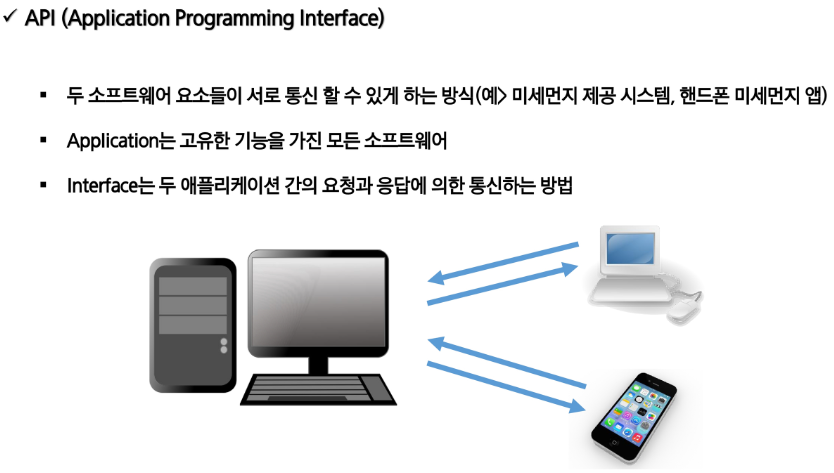
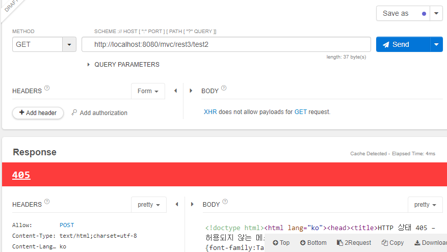

# REST API





> 데이터 형태를 알아서 `JSON`으로 바꿔줌.

- 실습예제1

```java
package com.ssafy.controller;

import java.util.List;
import java.util.ArrayList;
import java.util.HashMap;
import java.util.Map;

import org.springframework.stereotype.Controller;
import org.springframework.web.bind.annotation.GetMapping;
import org.springframework.web.bind.annotation.RequestMapping;
import org.springframework.web.bind.annotation.ResponseBody;

import com.ssafy.model.dto.Member;

@Controller
@RequestMapping("/rest1")
public class TestController1 {
	
	// http://localhost:8080/mvc/rest1/test1 - 404 에러 발생
	@GetMapping("/test1")
	public String test1() {
		return "hi rest";
	}
	
	// http://localhost:8080/mvc/rest1/test2 : ResponseBody를 붙이는 순간 JSP를 찾지 않고 반환값을 데이터로 넘김
	@GetMapping("/test2")
	@ResponseBody
	public String test2() {
		return "hi rest";
	}
	
	@GetMapping("/test3")
	@ResponseBody
	public Map<String, String> test3() {
		Map<String, String> data = new HashMap<String, String>();
		data.put("id", "ssafy");
		data.put("name", "이상찬");
		data.put("password", "1234");
		return data; // JSON으로 반환해줘
	}
	
	@GetMapping("/test4")
	@ResponseBody
	public Member test4() {
		Member m = new Member();
		m.setId("ssafy");
		m.setName("이상찬");
		m.setPassword("1234");
		
		return m;
	}
	
	@GetMapping("/test5")
	@ResponseBody
	public List<Member> test5() {
		List<Member> list = new ArrayList<Member>();
		for(int i = 0; i < 5; i ++) {
			Member m = new Member();
			m.setId("ssafy" + i);
			m.setName("이상찬" + i);
			m.setPassword("1234");
			list.add(m);
		}
		
		return list;
	}
}
```

- `@RestController`가 생기면 `@Responsebody`가 필요없다.

```java
package com.ssafy.controller;

import java.util.ArrayList;
import java.util.HashMap;
import java.util.List;
import java.util.Map;

import org.springframework.web.bind.annotation.GetMapping;
import org.springframework.web.bind.annotation.RequestMapping;
import org.springframework.web.bind.annotation.ResponseBody;
import org.springframework.web.bind.annotation.RestController;

import com.ssafy.model.dto.Member;

@RestController
@RequestMapping("/rest2")
public class TestController2 {
	
	// http://localhost:8080/mvc/rest2/test1 - 404 에러 발생
	@GetMapping("/test1")
	public String test1() {
		return "hi rest";
	}
	
	// http://localhost:8080/mvc/rest2/test2 : ResponseBody를 붙이는 순간 JSP를 찾지 않고 반환값을 데이터로 넘김
	@GetMapping("/test2")
	public String test2() {
		return "hi rest";
	}
	
	@GetMapping("/test3")
	public Map<String, String> test3() {
		Map<String, String> data = new HashMap<String, String>();
		data.put("id", "ssafy");
		data.put("name", "이상찬");
		data.put("password", "1234");
		return data; // JSON으로 반환해줘
	}
	
	@GetMapping("/test4")
	public Member test4() {
		Member m = new Member();
		m.setId("ssafy");
		m.setName("이상찬");
		m.setPassword("1234");
		
		return m;
	}
	
	@GetMapping("/test5")
	public List<Member> test5() {
		List<Member> list = new ArrayList<Member>();
		for(int i = 0; i < 5; i ++) {
			Member m = new Member();
			m.setId("ssafy" + i);
			m.setName("이상찬" + i);
			m.setPassword("1234");
			list.add(m);
		}
		
		return list;
	}
}
```



> `HTTP Method`타입이 다르면 `405`에러가 발생한다.

- `GET`, `POST`, `PUT`, `DELETE` 방식

```java
package com.ssafy.controller;

import org.springframework.web.bind.annotation.DeleteMapping;
import org.springframework.web.bind.annotation.GetMapping;
import org.springframework.web.bind.annotation.PostMapping;
import org.springframework.web.bind.annotation.PutMapping;
import org.springframework.web.bind.annotation.RequestMapping;
import org.springframework.web.bind.annotation.RestController;

@RestController
@RequestMapping("/rest3")
public class TestController3 {
	
	@GetMapping("/test1")
	public String test1() {
		return "GET";
	}
	
	@PostMapping("/test2")
	public String test2() {
		return "POST";
	}
	
	@PutMapping("/test3")
	public String test3() {
		return "PUT";
	}
	
	@DeleteMapping("/test4")
	public String test4() {
		return "DELETE";
	}	
}
```


- `PathVariable`

```java
package com.ssafy.controller;

import org.springframework.web.bind.annotation.GetMapping;
import org.springframework.web.bind.annotation.PathVariable;
import org.springframework.web.bind.annotation.RequestMapping;
import org.springframework.web.bind.annotation.RestController;

@RestController
@RequestMapping("/rest4")
public class TestController4 {
	
//	@PathVariable
//	http://localhost:8080/rest4/board/1
//	http://localhost:8080/rest4/board/2
//	http://localhost:8080/rest4/board/999
//	@GetMapping("/board/{id}")
//	public String test1(@PathVariable int id) {
//		return "PathVariable : " + id;
//	}
	@GetMapping("/board/{id}")
	public String test1(@PathVariable("id") int no) {
		return "PathVariable : " + no;
	}
	
}
```

- `json`형태의 값을 바구니에 넣을 때는 `@RequestBody`를 사용한다
  - `json`형태의 데이터를 받아서 사용하고 싶을 때
- 기본적으로는 `form`형태이다.


- `header`와 `body`와 `status`를 모두 건드리고 싶을 때 `ResponseEntity`사용

```java
	// ResponseEntity :응답하려는 데이터 + 응답코드 + 응답헤더 조작까지...
	// ResponseEntity<T>: T는 Body에 들어갈 데이터 타입
	@GetMapping("/test4")
	public ResponseEntity<String> test4() {
		HttpHeaders headers = new HttpHeaders();
		headers.add("auth", "admine");
		
		return new ResponseEntity<String>("OK", headers, HttpStatus.OK);
	}
	
```


