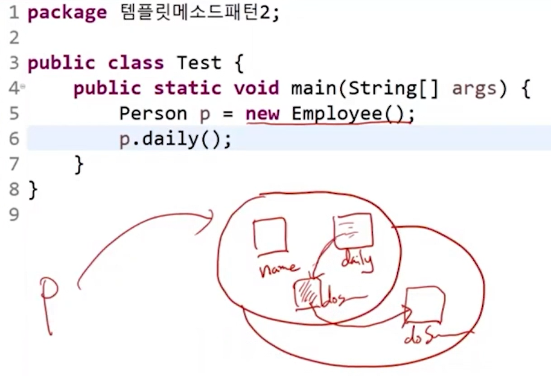
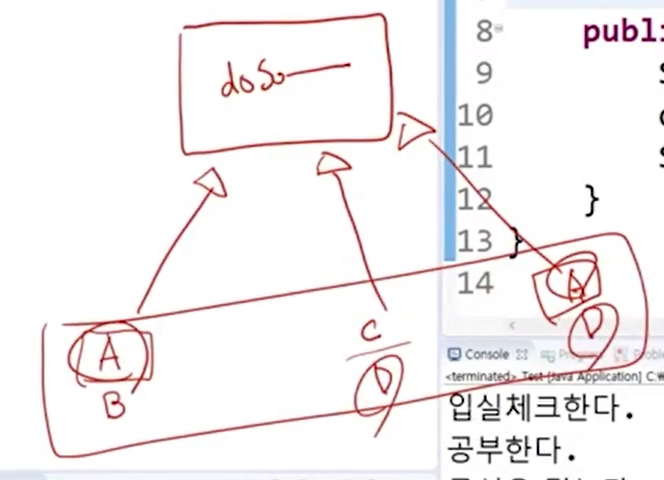
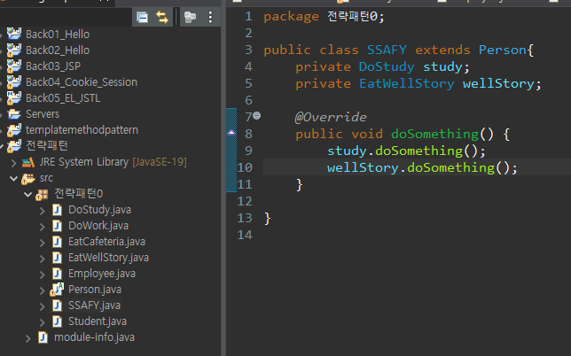
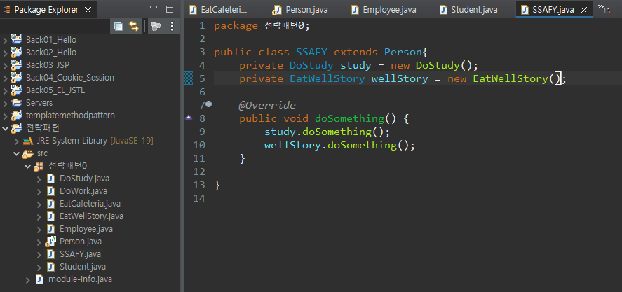

# Template Method Pattern

- 클래스
  - 관련있는 상태와 동작을 묶어서 만든 사용자 정의 자료형

- 추상클래스
  - `new`를 활용해 객체를 만들 수 없다.
  - 미완성 설계도이다
  - 추상 메서드가 포함되어 있는 것

- 변수나 함수 단위는 부모 클래스에서 추상화를 통해 해결이 가능함
- 내용물은 부모에서 abstract한 메소드를 선언하면서 구조 자체는 공통으로 잡고 안에 있는 내용만 서로 다르게 구성이 되어질 수 있다.

```java
//Person
package templatemethodpattern1;

public abstract class Person {
	private String name;
	public abstract void doSomething();
}

//Student
package templatemethodpattern1;

public class Student extends Person{

	@Override
	public void doSomething() {
		System.out.println("입실체크한다.");
		System.out.println("공부한다.");
		System.out.println("급식을 먹는다.");
		System.out.println("퇴실체크한다.");
	}

}

//Employee
package templatemethodpattern1;

public class Employee extends Person{

	@Override
	public void doSomething() {
		System.out.println("입실체크한다.");
		System.out.println("소와 같이 일을 한다.");
		System.out.println("웰스토리를 먹는다.");
		System.out.println("퇴실체크한다.");
	}

}
```


- 템플릿 메소드 패턴이란?
  - 어떤 하나의 템플릿메소드 안에서 추상 메소드를 호출하고 추상 메서드의 구체적인 동작을 자식 클래스에서 결정할 수 있도록 열어주는 역할
  - 공통 구조를 코드 단위로 묶어내는 하나의 방법

- 자식클래스의 객체를 생성하면 부모를 먼저 생성한다. `name`, `daily`, `doSomething`(추상 메소드)에 이어서 자식 메소드의 `doSomething`을 재정의함
  - 동적 바인딩에 의해서 자식이 실행이 된다.



```java
//Person
package templatemethodpattern2;

public abstract class Person {
	private String name;
	
	public abstract void doSomething();
	
	//전 후 작업을 포함하는 템플릿메소드를 생성
	public void daily() {
		System.out.println("입실체크한다");
		doSomething();
		System.out.println("퇴실체크한다");
	}
}

//SSAFY
package templatemethodpattern2;

public class Student extends Person{

	@Override
	public void doSomething() {
		System.out.println("공부를 한다");
		System.out.println("급식을 먹는다");
	}

}

//Employee
package templatemethodpattern2;

public class Employee extends Person{

	@Override
	public void doSomething() {
		System.out.println("소와 같이 일을 한다.");
		System.out.println("웰스토리를 먹는다.");
	}
	
}
```



> 템플릿메서드는 수직적 구조에서는 뽑아낼 수 있지만, 수평적 구조에서는 뽑아내기가 힘들다. 더 이상 상속으로 해결할 수 없다.



> 클래스가 많아서 복잡해졌지만, 수정 시에는 간단하게 할 수 있다.



> `SSAFY`는 `DoStudy`에 의존하고, `EatWellStory`에 의존한다. 만약 두 개가 변하면 `SSAFY`도 영향을 받는다.