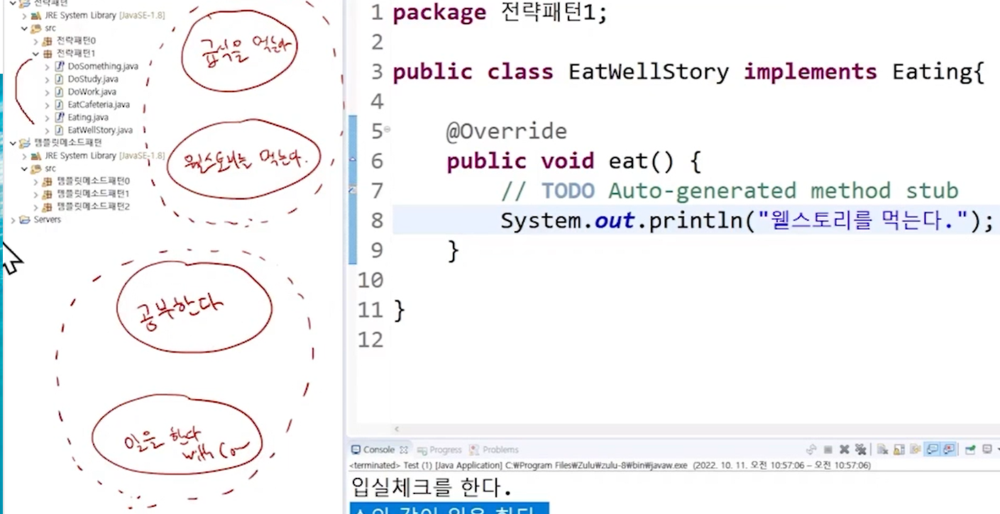
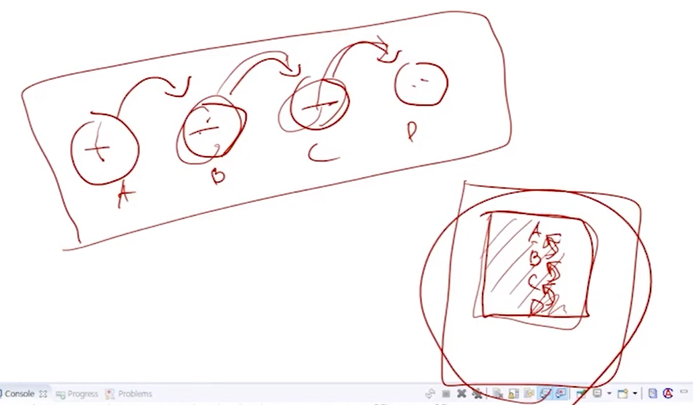

# Stratedgy Pattern

- 전략 패턴
  - 나누어진 전략들을 필요한 상황에 조합해서 사용하는 것을 전략패턴이라고 한다.
  - 느슨한 결합
  - 


```java
package 전략패턴0;

public class Employee extends Person{
	private DoWork work = new DoWork();
	private EatWellStory wellStory = new EatWellStory();
	
	@Override
	public void doSomething() {
		work.doSomething();
		wellStory.doSomething();
	}

}
```


- 제어의 역전 실습

```java
package 전략패턴0;

public class Test {
	public static void main(String[] args) {
		// work에 대한 의존성이 Employee에서 Test로 이관딤
		// 이것이 Ioc(제어의 역전)
		DoWork work = new DoWork();
		// Test가 work를 Employee에 넣어줌
		// 이것이 DI(의존성 주입)
		Person p = new Employee(work);
		p.daily();
	}
}

package 전략패턴0;

public class Employee extends Person{
	private DoWork work;
	private EatWellStory wellStory = new EatWellStory();
	
	public Employee(DoWork work) {
		this.work = work;
	}
	
	@Override
	public void doSomething() {
		work.doSomething();
		wellStory.doSomething();
	}
}
```


- 모든 객체를 한 곳에서 만들어서 관리
  - 객체 관리 컨테이너(스프링의 본질)
  - 제어의 역전 역전 역전들을 활용해서
- DI에는 두 가지가 존재
  - `Constructor Injection`: 생성자에 객체 주입
  - `Property Injection/ Setter Injection`: 설정자에 객체 주입

```java
package 전략패턴0;

public class Employee extends Person{
	
	// 의존성: 객체생성의존성, 타입의존성
	// 객체생성의존성: IoC함으로써 탈출 가능
	// 타입의존성: Interface를 활용함으로써 느슨한 결합으로 해소가능.
	private DoWork work;
	private EatWellStory wellStory = new EatWellStory();
	
	// 생성자에 객체를 넣어주면 Constructor Injection
	public Employee(DoWork work) {
		this.work = work;
	}
	
	// 설정자에 객체를 넣어주면 Property Injection/setter Injection
	public void setEatWellStory(EatWellStory wellStory) {
		this.wellStory = wellStory;
	}
	
	@Override
	public void doSomething() {
		work.doSomething();
		wellStory.doSomething();
	}
}
```


- 만약, `Injection`받는 인자가 인터페이스라면, `Interface`를 `Implements`하는 모든 객체로 열린다.




> 아까는 클래스로 모두 나뉘어 있었는데, 현재는 `Eating`이라는 규약, `DoSomething`이라는 규약 내에서 클래스가 정의되어 진다.

- 어떻게 먹고 어떻게 할지는 내가 설정하는 것이 아니라 동적으로 `setter`에 의해서 결정 받겠다.

```java
package 전략패턴1;

public class Person {
	private String name;
	private DoSomething doSomething;
	private Eating eating;
	
	// 해당 매개변수에는 Dowork나 DoStudy가 올 수 있다.
	public void setDoSomething(DoSomething doSomething) {
		this.doSomething = doSomething;
	}
	public void setEating(Eating eating) {
		this.eating = eating;
	}
	
	public void daily() {
		System.out.println("입실체크를 한다");
        // ***************************************************
        // 여기에 누가 들어올지는 내가 아니라 다른 녀석이 대신 결정해준다
        // 왜냐하면 제어가 반전될 거니까
        // 다른 객체가 직접 객체를 만들어준다.
		doSomething.doSomething();
		eating.eat();
		System.out.println("퇴실체크를 한다");
	}
}
```

```java
package 전략패턴1;

public class Test {
	public static void main(String[] args) {
		// 객체를 만들고, 의존관계를 연결하는 작업을 스프링 프레임워크에서 모두 책임진다.
		Dowork work = new Dowork();
		DoStudy study = new DoStudy();
		EatWellStory wellStory = new EatWellStory();
		EatCafeteria cafeteria = new EatCafeteria();
		// Employee
		// 같은 클래스이지만 객체별로 적절한 전략을 선택할 수 있게 만듦.
		Person employee = new Person();
		employee.setDoSomething(work);
		employee.setEating(wellStory);
		
		Person student = new Person();
		student.setDoSomething(study);
		student.setEating(cafeteria);
		
		Person ssafy = new Person();
		ssafy.setDoSomething(study);
		ssafy.setEating(wellStory);
	}
}
```

- 스프링 프레임워크 특징은 객체 관리 컨테이너이다.
  - 단순히 의존성에 관련한 설정만 하지 실제 의존성 생성은 프레임워크가 담당
  - 제어 역전을 통한 객체 제어도 프레임 워크가 담당.

- 스프링 컨테이너가 나오기 전에는 객체를 만들어주는 담당 클래스를 만들어줬다.



> 타고 따라 들어가는 것이 아니라 한 곳에서 모두 확인할 수 있어서 관리가 수월해진다.

- 스프링 컨테이너를 빌드하는 것부터 객체를 어떻게 등록하는지 객체 간의 의존관계는 어떻게 하는지 오후에 진행